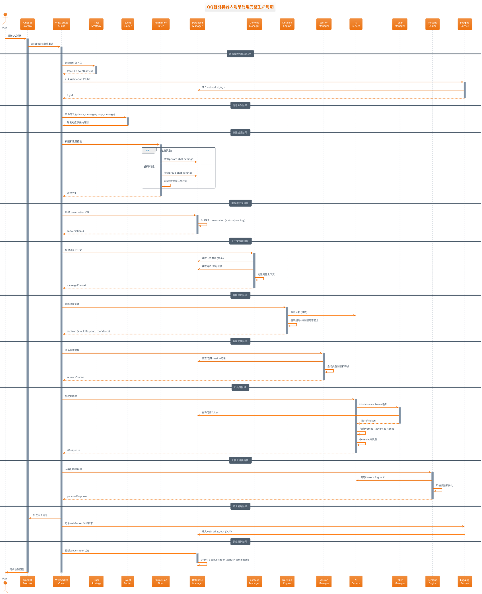
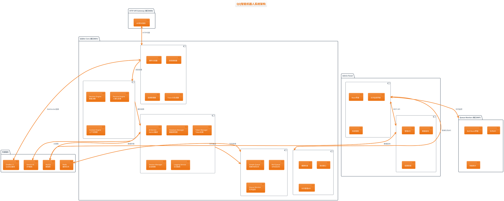
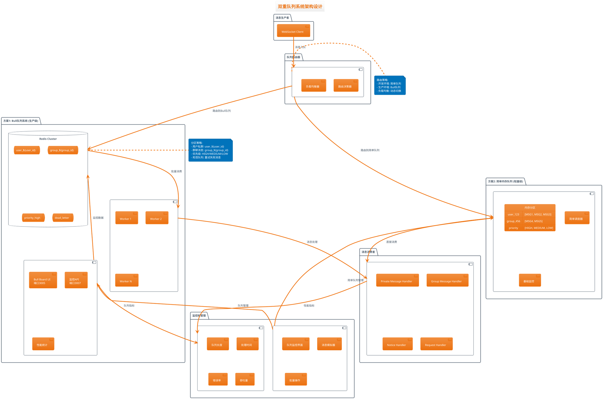
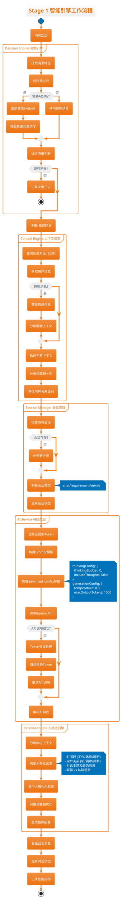

# 🎯 QQ智能机器人消息处理架构 - PlantUML详细文档

## 📋 文档概述

本文档使用PlantUML图表详细描述QQ智能机器人的消息处理架构、组件关系和数据流向。涵盖从消息接收到回复发送的完整生命周期。

---

## 🔄 1. 消息处理完整生命周期序列图



---

## 🏗️ 2. 系统架构组件图



---

## 📊 3. 双重队列系统架构图



---

## 🧠 4. Stage 1 智能引擎工作流程图



---

## 💾 5. 数据流和存储架构图

```plantuml
@startuml 数据流和存储架构
!theme aws-orange
title 数据流和存储架构

package "数据源" {
  [WebSocket消息] as WSMsg
  [AI API响应] as AIResp
  [用户交互] as UserInt
}

package "数据处理层" {
  component "数据转换器" as Transform {
    [消息格式标准化]
    [Trace ID注入]
    [时间戳标准化]
  }

  component "数据验证器" as Validator {
    [Schema验证]
    [数据完整性检查]
    [安全过滤]
  }
}

package "MySQL数据库" {
  database "核心业务表" as CoreTables {
    table "conversations" as ConvTable {
      id (PK)
      trace_id (INDEX)
      user_id
      message_type
      status
      ai_response
      response_time
      model_name
      metadata (JSON)
    }

    table "websocket_logs" as WSLogTable {
      id (PK)
      trace_id (INDEX)
      direction (IN/OUT)
      message_type
      status
      processing_time
      raw_data (JSON)
    }
  }

  database "配置管理表" as ConfigTables {
    table "agent_prompts" as PromptsTable {
      id (PK)
      agent_type
      model_name
      advanced_config (JSON)
      allowed_token_ids (JSON)
    }

    table "api_tokens" as TokensTable {
      id (PK)
      project_name
      model_blacklist (JSON)
      is_healthy
      last_used_at
    }
  }

  database "人类化处理表" as HumanLikeTables {
    table "message_arrivals" as ArrivalsTable {
      id (PK)
      trace_id
      user_id
      message_content
      arrival_time
    }

    table "message_consumptions" as ConsumptionsTable {
      id (PK)
      batch_id
      conversation_id
      consumption_time
      batch_size
    }

    table "aggregation_windows" as WindowsTable {
      id (PK)
      user_id
      window_start
      window_end
      message_count
    }

    table "life_rhythm_logs" as RhythmTable {
      id (PK)
      check_time
      current_hour
      probability_used
      decision_made
    }
  }

  database "会话管理表" as SessionTables {
    table "sessions" as SessionTable {
      id (PK)
      user_id
      session_type
      last_activity
      metadata (JSON)
    }

    table "session_transitions" as TransitionTable {
      id (PK)
      session_id
      from_type
      to_type
      reason
    }
  }
}

package "缓存层" {
  database "Redis" as RedisCache {
    [Token缓存]
    [会话状态]
    [上下文缓存]
    [队列数据]
  }
}

package "数据视图和统计" {
  component "统计视图" as StatsViews {
    [human_like_processing_stats]
    [source_processing_stats]
    [hourly_activity_stats]
  }

  component "存储过程" as StoredProcs {
    [CleanOldHumanLikeData]
    [GenerateStatistics]
  }
}

' 数据流向
WSMsg --> Transform
AIResp --> Transform
UserInt --> Transform

Transform --> Validator
Validator --> CoreTables
Validator --> ConfigTables
Validator --> HumanLikeTables
Validator --> SessionTables

CoreTables --> RedisCache : 热数据缓存
CoreTables --> StatsViews : 统计分析
HumanLikeTables --> StatsViews : 人类化统计

StatsViews --> StoredProcs : 定时清理

note right of ConvTable
  trace_id字段实现:
  - WebSocket事件追踪
  - AI处理链路追踪
  - 端到端性能分析
end note

note right of TokensTable
  model_blacklist格式:
  {
    "gemini-2.5-flash": null,
    "gemini-1.5-pro": "2025-09-21T17:00:00Z"
  }
end note

note right of PromptsTable
  advanced_config格式:
  {
    "thinkingConfig": {
      "thinkingBudget": 0,
      "includeThoughts": false
    },
    "generationConfig": {
      "temperature": 0.8,
      "maxOutputTokens": 1000
    }
  }
end note

@enduml
```

---

## 🔧 6. 错误处理和恢复机制图

```plantuml
@startuml 错误处理和恢复机制
!theme aws-orange
title 错误处理和恢复机制

start

:消息处理开始;

partition "WebSocket连接错误" {
  if (WebSocket断开?) then (是)
    :触发重连机制;
    :指数退避策略;
    :最大重试次数检查;

    if (重连成功?) then (否)
      :记录连接失败;
      :发送告警通知;
      stop
    endif
  endif
}

partition "数据库错误处理" {
  :执行数据库操作;

  if (连接池满?) then (是)
    :等待连接释放;
    :连接超时检查;
  endif

  if (SQL执行失败?) then (是)
    :事务回滚;
    :记录错误日志;
    :释放数据库连接;

    if (可重试错误?) then (是)
      :延迟重试;
    else (否)
      :标记为失败;
      :人工干预告警;
    endif
  endif
}

partition "AI服务错误处理" {
  :调用AI API;

  if (Token错误?) then (是)
    if (401 Unauthorized?) then (是)
      :Token黑名单 (永久);
    elseif (403 Forbidden?) then (是)
      :Token黑名单 (永久);
    elseif (429 Rate Limit?) then (是)
      :Token黑名单 (5分钟);
    endif

    :自动Token轮换;
    :重试API调用;

    if (所有Token失效?) then (是)
      :服务降级模式;
      :使用缓存回复;
    endif
  endif

  if (网络超时?) then (是)
    :增加超时时间;
    :重试机制;
  endif
}

partition "队列错误处理" {
  if (队列满?) then (是)
    :消息丢弃策略;
    :高优先级保留;
  endif

  if (消费者异常?) then (是)
    :消息重新入队;
    :死信队列处理;
    :重启消费者;
  endif
}

partition "系统级错误处理" {
  if (内存不足?) then (是)
    :清理缓存;
    :垃圾回收;
    :服务重启;
  endif

  if (磁盘空间不足?) then (是)
    :日志清理;
    :数据归档;
    :告警通知;
  endif
}

:错误恢复完成;

partition "错误记录和监控" {
  :记录错误日志;
  :更新错误统计;
  :发送监控指标;

  if (严重错误?) then (是)
    :发送告警通知;
    :触发故障转移;
  endif
}

stop

note right
  错误恢复策略:
  1. 指数退避重试
  2. 熔断器模式
  3. 服务降级
  4. 优雅降级
  5. 自动故障转移
end note

@enduml
```



---

## 🎯 7. 人类化处理事件分离架构图

```plantuml
@startuml 人类化处理事件分离架构
!theme aws-orange
title 人类化处理事件分离架构

start

:消息到达;

partition "事件到达阶段" {
  :记录message_arrivals;
  note right: 消息到达 ≠ 消息处理

  :检查聚合窗口;

  if (窗口存在?) then (否)
    :创建新聚合窗口;
    :设置窗口参数;
    note right
      window_start: now()
      window_end: now() + 5000ms
      user_id: ${user_id}
    end note
  endif

  :消息加入窗口;
  :更新窗口统计;
}

partition "生活节奏检查" {
  :获取当前时间;
  :确定时间段;

  if (工作时间 8-18点?) then (是)
    :使用工作时间概率 (0.7);
  elseif (休息时间 18-23点?) then (是)
    :使用休息时间概率 (0.4);
  else (睡眠时间 23-8点)
    :使用睡眠时间概率 (0.05);
  endif

  :生成随机数判断;
  :记录life_rhythm_logs;

  if (通过概率检查?) then (否)
    :跳过本次处理;
    stop
  endif
}

partition "聚合窗口触发检查" {
  :检查窗口条件;

  if (窗口时间到达?) then (是)
    :触发窗口处理;
  elseif (消息数量达到上限?) then (是)
    :触发窗口处理;
  elseif (高优先级消息?) then (是)
    :立即触发处理;
  else (继续等待)
    stop
  endif
}

partition "批量消息消费阶段" {
  :提取窗口内所有消息;
  :创建批处理任务;

  :记录message_consumptions;
  note right
    batch_id: UUID
    batch_size: 消息数量
    consumption_time: now()
  end note

  :智能消息合并;
  note right
    - 相同用户连续消息合并
    - 话题相关性分析
    - 重要性优先级排序
  end note
}

partition "智能批处理" {
  :构建批处理上下文;
  :生成综合回复;

  if (多条消息?) then (是)
    :智能内容总结;
    :统一主题回复;
  else (单条消息)
    :正常AI处理;
  endif

  :应用人格化处理;
  :生成最终回复;
}

:更新conversations表;
note right
  is_aggregated: true
  batch_size: N
  aggregation_window_id: UUID
  trigger_reason: 'time_based'/'count_based'/'priority'
end note

:发送回复消息;

stop

note right of "聚合窗口触发检查"
  触发条件优先级:
  1. 高优先级消息 (立即)
  2. 窗口时间到达 (5秒)
  3. 消息数量上限 (100条)
  4. 生活节奏概率检查
end note

note left of "智能批处理"
  人类化特性:
  - 消息聚合处理
  - 延迟响应模拟
  - 生活节奏遵循
  - 批量内容理解
  - 自然对话流
end note

@enduml
```

---

## 📊 8. 监控和指标收集架构图

```plantuml
@startuml 监控和指标收集架构
!theme aws-orange
title 监控和指标收集架构

package "数据源" {
  [QQBot Core\n核心服务] as Core
  [Queue Monitor\n队列监控] as QueueMon
  [Admin Panel\n管理面板] as Admin
  [MySQL Database\n数据库] as DB
}

package "指标收集器" {
  component "性能指标" as PerfMetrics {
    [消息处理时间]
    [AI API响应时间]
    [数据库查询耗时]
    [内存使用情况]
    [CPU使用率]
  }

  component "业务指标" as BizMetrics {
    [消息处理数量]
    [AI调用次数]
    [Token使用统计]
    [错误率统计]
    [用户活跃度]
  }

  component "队列指标" as QueueMetrics {
    [队列长度]
    [处理吞吐量]
    [等待时间]
    [重试次数]
    [失败率]
  }

  component "系统指标" as SysMetrics {
    [WebSocket连接数]
    [数据库连接池状态]
    [服务健康状态]
    [磁盘使用率]
    [网络延迟]
  }
}

package "数据存储" {
  database "时序数据库" as TSDB {
    [性能时序数据]
    [业务时序数据]
    [告警历史]
  }

  database "MySQL统计表" as StatsTables {
    table "daily_stats" as DailyStats
    table "hourly_activity" as HourlyActivity
    table "error_logs" as ErrorLogs
    table "performance_logs" as PerfLogs
  }
}

package "监控界面" {
  component "Admin Dashboard" as Dashboard {
    [实时状态面板]
    [性能图表]
    [队列监控界面]
    [错误日志查看]
  }

  component "Queue Monitor UI" as QueueUI {
    [Bull Board界面]
    [队列详细信息]
    [作业重试管理]
    [性能统计图表]
  }
}

package "告警系统" {
  component "告警规则引擎" as AlertEngine {
    [阈值监控]
    [异常检测]
    [趋势分析]
    [智能告警]
  }

  component "通知渠道" as Notification {
    [邮件通知]
    [企业微信]
    [短信告警]
    [日志记录]
  }
}

' 数据流向
Core --> PerfMetrics : 性能数据
Core --> BizMetrics : 业务数据
QueueMon --> QueueMetrics : 队列数据
Admin --> SysMetrics : 系统数据

PerfMetrics --> TSDB : 时序存储
BizMetrics --> StatsTables : 统计存储
QueueMetrics --> TSDB : 队列时序
SysMetrics --> StatsTables : 系统统计

TSDB --> Dashboard : 数据查询
StatsTables --> Dashboard : 统计查询
QueueMetrics --> QueueUI : 队列展示

Dashboard --> AlertEngine : 告警规则
QueueUI --> AlertEngine : 队列告警
AlertEngine --> Notification : 告警通知

note right of AlertEngine
  告警规则示例:
  - 消息处理时间 > 5秒
  - AI API错误率 > 10%
  - 队列积压 > 1000条
  - 内存使用率 > 80%
  - Token健康度 < 50%
end note

note right of Dashboard
  监控面板功能:
  - 实时消息处理状态
  - 性能趋势图表
  - 错误率统计
  - Token使用情况
  - 队列状态概览
end note

@enduml
```

---

## 🎯 总结

本PlantUML文档全面描述了QQ智能机器人的消息处理架构，包含：

### 📋 涵盖内容
1. **完整生命周期**: 从消息接收到回复发送的详细序列图
2. **系统架构**: 4模块微服务架构的组件关系图
3. **队列系统**: 双重队列(Bull+简单队列)的设计架构
4. **智能引擎**: Stage 1三大引擎的协同工作流程
5. **数据架构**: 数据库表结构和数据流向分析
6. **错误处理**: 完整的错误恢复和容错机制
7. **人类化处理**: 事件分离和聚合窗口的创新架构
8. **监控体系**: 全方位的监控指标和告警系统

### 🎯 架构特点
- **事件驱动**: 基于WebSocket的实时消息处理
- **智能决策**: Stage 1引擎提供上下文感知的智能回复
- **双重队列**: 支持轻量级和生产级的队列解决方案
- **完整追踪**: Trace ID实现端到端的消息链路追踪
- **人类化处理**: 创新的事件分离和聚合窗口机制
- **容错设计**: 完善的错误处理和自动恢复能力

这个架构已经具备了企业级应用的所有特性，可以支持从开发测试到生产部署的各种场景需求。

---

## 📋 文档信息

- **文档名称**: `ARCHITECTURE_PLANTUML.md`
- **创建时间**: 2025-09-21
- **版本**: v1.0
- **作者**: QQ智能机器人开发团队
- **文档类型**: 技术架构说明文档
- **PlantUML版本**: 最新版本兼容

### 使用说明

1. **在线预览**: 可以使用PlantUML在线编辑器预览图表
2. **本地渲染**: 使用支持PlantUML的编辑器(如VS Code + PlantUML扩展)
3. **导出图片**: 可以导出为PNG、SVG等格式用于文档展示
4. **版本控制**: 图表源码可以纳入Git版本控制

### 维护说明

- 当系统架构发生重大变更时，需要更新对应的PlantUML图表
- 建议定期review图表内容，确保与实际实现保持一致
- 新增功能模块时，应该同步更新相关的架构图表