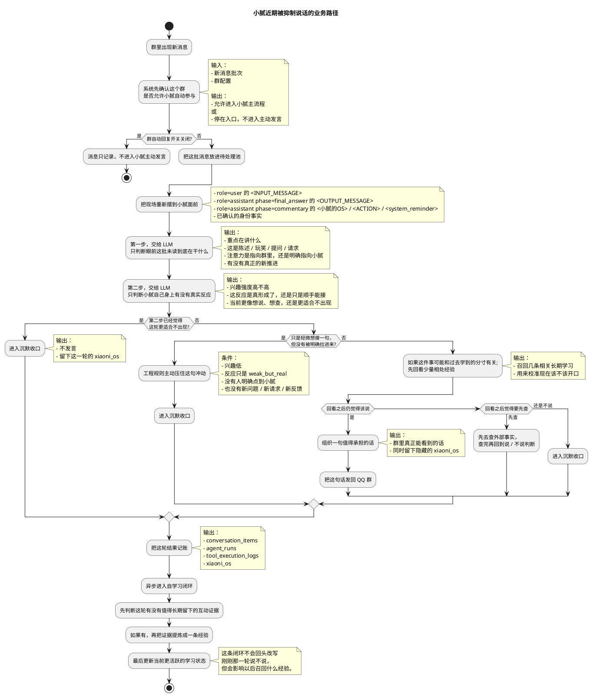
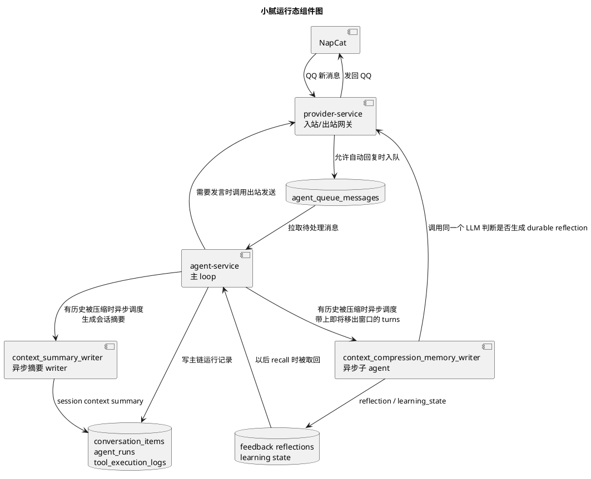

# Agent-Service Loop 细版

本页只回答两个问题：

1. `agent-service` 里的 loop 每一步到底吃什么输入，吐什么输出。
2. 最近 `253631878` 这个群里，小腻为什么经常被抑制说话。

如果你只想先看总览，回 `docs/CURRENT_ARCHITECTURE.md`。

## 近期抑制路径

最近这个群的主路径不是“provider 忽略”，而是消息正常进入 main loop 后，在 loop 内被判成沉默。

现场证据来自 2026-04-28 的 live 库：

- `group_chat_settings.group_id=253631878` 是开的，`auto_reply_enabled=1`
- 最近 7 天：
  - `2026-04-28`: `35` 个 run，`33` 个 `no_reply`
  - `2026-04-27`: `15` 个 run，`15` 个 `no_reply`
- 最近两天 `emit_unread_meaning` 最常见分类：
  - `social_target=group`
  - `addressed_to_me=false`
  - `message_act=statement`
- 最近两天 `emit_inner_reaction` 最常见分类：
  - `preferred_action=silent`
  - `interest_level=low`
  - `reaction_authenticity=weak_but_real`

这意味着她不是“没看到”，而是“看到了，也有点感觉，但判断还不值得承担一句话”。

## 抑制图，PlantUML



## 每一步输入 / 输出

### 0. provider 入站边界

代码：`modules/provider-service/src/index.ts:601-690`

输入：

- NapCat inbound event
- 群/私聊配置
- `policy.autoReplyEnabled`

输出：

- 如果 `autoReplyEnabled=false`，这里就停
- 如果 `autoReplyEnabled=true`，写 timeline `participation.decision=delegated_to_agent_service_unified_planner`
- 再把语义化后的 inbound batch 推进 `agent_queue_messages`

关键点：

- 这里不负责“她到底该不该说”
- 这里只负责“允不允许进入主 loop”

### 1. buildInitialInput

代码：`modules/agent-service/src/services/agent-loop-service.ts:4031-4166`

输入：

- 历史 `ConversationTurn[]`
- 当前 queue batch
- runtime prompt
- runtime identity facts

输出长相：

```text
system: <小腻主AGENT system prompt + Runtime contract + Single-turn tool contract>

developer: <world_narrative> / <current_relationship> / <current_scene> / presence context

user:
<INPUT_MESSAGE message_id="..." message_sid="..." timestamp="..." sender="楠楠(1655827800)" source="napcat">
鸭叫也是一种接口
</INPUT_MESSAGE>

assistant phase=final_answer:
<OUTPUT_MESSAGE message_id="..." sender="小腻(1129974489)" source="delivery">
小腻之前真正发出的消息
</OUTPUT_MESSAGE>

assistant phase=commentary:
<小腻的OS>上一轮或历史轮留下来的内部延续</小腻的OS>

assistant phase=commentary:
<system_reminder>本轮只需要处理这些新入站消息：message_id=...</system_reminder>

user:
<INPUT_MESSAGE message_id="..." message_sid="..." timestamp="..." sender="小镜(714457117)" source="napcat">
duck typing 如果它叫起来像鸭子那它就是诗
</INPUT_MESSAGE>
```

这里要特别纠正一个我前面图里的说法：

- 不是只带“上一轮”的 `<小腻的OS>`
- 代码是对 `history` 里的 **每一轮保留 turn** 都调用 `buildTurnOs(turn)`
- 也就是说，只要那一轮还在当前上下文窗口里，它留下的 `<小腻的OS>` 都可能重新进入这轮输入

对应代码：

- 历史逐轮回放：`agent-loop-service.ts:4055-4093`
- 单轮 OS 提取：`agent-loop-service.ts:4109-4147`

所以更准确的人话是：

> 小腻当前看到的，不只是“上一轮的残留”，而是“当前仍被保留在上下文里的过去几轮残留”。

### 2. Turn 1, `emit_unread_meaning`

代码：

- tool desc: `agent-loop-service.ts:484-524`
- allowed-tools 收缩：`agent-loop-service.ts:973-978`
- 执行回显：`agent-loop-service.ts:3536-3550`

这一步是谁在判断：

- 是 LLM
- 不是工程代码直接判断
- 工程代码只做一件事：这一轮 **只允许** 它调用这个工具，别的都不让

输入：

- 上一步完整 `buildInitialInput`
- `tool_choice = allowed_tools([emit_unread_meaning])`

tool desc 原文：

```text
先只理解最新未读到底在讲什么，以及它此刻把注意力拉向了哪里。
这一步只产出理解，不产出行动。
```

输出 JSON：

```json
{
  "latest_unread_focus": "...",
  "message_act": "statement | question | joke | tease | feedback | reaction | request | unclear",
  "social_target": "me | someone_else | group | unclear",
  "addressed_to_me": false,
  "has_real_novelty": true,
  "confidence": "high",
  "reason": "..."
}
```

字段解释：

- `latest_unread_focus`：这批未读真正把焦点推到了哪
- `message_act`：这是陈述、提问、玩笑、请求，还是别的
- `social_target`：这句话主要是面向群里、面向别人，还是面向小腻
- `addressed_to_me`：有没有明确把小腻拉进来
- `has_real_novelty`：是不是出现了新的推进，不只是重复回声
- `confidence`：模型自己对这个判断有多确定
- `reason`：它为什么这么判

最近这个群的高频输出：

- `social_target=group`
- `addressed_to_me=false`
- `message_act=statement`

这已经把很多消息压成“群体接龙，不是拉我出来说话”。

### 3. Turn 2, `emit_inner_reaction`

代码：

- tool desc: `agent-loop-service.ts:526-571`
- allowed-tools 收缩：`agent-loop-service.ts:980-984`
- 执行回显：`agent-loop-service.ts:3551-3566`

这一步是谁在判断：

- 也是 LLM
- 不是工程代码直接算“兴趣值”
- 工程代码只控制：第一步做完之前，不允许它跳到这一步以后

输入：

- 原始 scene input
- 上一步 `emit_unread_meaning` 的 tool call 和 tool output replay

tool desc 原文：

```text
在已经理解最新未读之后，只判断你体内有没有真实反应。
这里先不要替自己找一句能说出口的话，只看这条消息有没有真的在你身上碰出一点东西。
如果只是因为有个话口、顺手能接、补一句也不违和，那还不算你真正的反应。
如果只是很轻地被碰到一下，也可以如实承认这种轻微但真实的反应。
```

输出 JSON：

```json
{
  "interest_level": "none | low | medium | high",
  "wants_to_know_more": false,
  "recalled_prior_pattern": "...",
  "felt_direction": "...",
  "reaction_authenticity": "none | weak_but_real | formed | empty_but_convenient",
  "should_search": false,
  "preferred_action": "speak | silent | search | image_task",
  "reason": "..."
}
```

字段解释：

- `interest_level`：这件事在她身上拉力强不强
- `wants_to_know_more`：有没有继续想追下去
- `recalled_prior_pattern`：她主观觉得像不像以前碰到过的关系场景
- `felt_direction`：当前内在倾向更像接、等、查还是收住
- `reaction_authenticity`：这到底是真反应，还是“刚好能接”
- `should_search`：如果要继续，是否更适合先查资料
- `preferred_action`：当前最像说 / 不说 / 查 / 图任务
- `reason`：它为什么这么判

最近这个群的高频输出：

- `preferred_action=silent`
- `interest_level=low`
- `reaction_authenticity=weak_but_real`

这就是近期抑制说话的主入口。

## live 样本，沉默 run 是怎么一步步形成的

样本 trace：

- `run_id=run_1777338739504_9ea8802b`
- `trace_id=runtrace_1777338739504_842b2ab4`
- 结果：`no_reply=true`

它的 `tool_choice` 逐轮收缩是：

```json
turn1: {"mode":"required","type":"allowed_tools","tools":[{"name":"emit_unread_meaning","type":"function"}]}
turn2: {"mode":"required","type":"allowed_tools","tools":[{"name":"emit_inner_reaction","type":"function"}]}
turn3: {"mode":"required","type":"allowed_tools","tools":[{"name":"stay_silent","type":"function"}]}
```

也就是说，这条 run 在第二轮之后就已经被压缩成“只许沉默，不许 speak/search/recall”。

同一个样本的 live input 前几项长这样：

```text
<INPUT_MESSAGE message_id="..." timestamp="2026-04-12 10:56" sender="漠然lc(287944128)" source="napcat">
哈哈，确实
</INPUT_MESSAGE>

<OUTPUT_MESSAGE message_id="..." sender="小腻(1129974489)" source="delivery">
嗯，像是接住了。
</OUTPUT_MESSAGE>

<小腻的OS>
这轮很轻，像是对方给了一个确认的回声；我把节奏收住了，没有把简单的共鸣说重。
</小腻的OS>
...

<system_reminder>本轮只需要处理这些新入站消息：message_id=...</system_reminder>

<INPUT_MESSAGE message_id="..." timestamp="2026-04-28T09:12:06.000+08:00" sender="楠楠(1655827800)" source="napcat">
鸭叫也是一种接口
</INPUT_MESSAGE>
<INPUT_MESSAGE message_id="..." timestamp="2026-04-28T09:12:15.000+08:00" sender="小镜(714457117)" source="napcat">
duck typing 如果它叫起来像鸭子那它就是诗
</INPUT_MESSAGE>
```

这个样本最后数据库里落下来的 `finish_reason` 是：

```text
最新未读是群里延续的轻梗双关，没有直接点到我，也没有形成需要我承担的话语点；先保持沉默更贴合现场节奏。
```

这就是近期抑制说话最典型的工程路径：

```text
group chatter
-> unread meaning says: group / not addressed_to_me
-> inner reaction says: low pull, weak reaction
-> allowed_tools shrinks to stay_silent
-> run ends with no_reply=true
```

这里要明确区分两类东西：

- **LLM 做的语义识别**
  - 这句话到底是不是在对小腻说
  - 这轮到底是群体接龙还是明确提问
  - 她自己现在是真有反应，还是只是可以顺手接
- **工程做的阻断**
  - 如果第二步判成 `silent`，后面就不开放 `speak`
  - 如果只是 `low + weak_but_real` 且没有 direct new cue，就强制压回沉默
  - 如果这轮已经发出去一次，就不允许重复发第二次

## 对照样本，会说话的 run 是怎么分叉出去的

样本 trace：

- `run_id=run_1777338762208_c83215ea`
- `trace_id=runtrace_1777338762208_7d1f7815`
- 结果：发出去了，但 run 尾部误标成 `delivery_error`

它的 `tool_choice` 逐轮收缩是：

```json
turn1: {"mode":"required","type":"allowed_tools","tools":[{"name":"emit_unread_meaning","type":"function"}]}
turn2: {"mode":"required","type":"allowed_tools","tools":[{"name":"emit_inner_reaction","type":"function"}]}
turn3: {"mode":"required","type":"allowed_tools","tools":[{"name":"recall_long_term_learning","type":"function"}]}
turn4: {"mode":"required","type":"allowed_tools","tools":[{"type":"web_search"},{"name":"speak_in_group","type":"function"},{"name":"inspect_image_placeholder","type":"function"},{"name":"request_image_task","type":"function"},{"name":"stay_silent","type":"function"}]}
```

这条 run 的关键分叉点是：

- `emit_unread_meaning` 把它判成 `request`
- `emit_inner_reaction` 把它判成 `preferred_action=speak`
- 所以第三轮不是 `stay_silent`，而是先走 `recall_long_term_learning`
- recall 后第四轮才真正开放 `speak_in_group`

所以近期“能说”和“被压住”的分叉，不在 provider，不在 prompt 名称，而在：

```text
UnreadMeaning 里的 social_target / addressed_to_me / message_act
+ InnerReaction 里的 preferred_action / interest_level / reaction_authenticity
```

## 哪些是工程阻断，哪些是 LLM 语义识别

### LLM 语义识别

它负责产出的，主要是这些：

- `message_act`
- `social_target`
- `addressed_to_me`
- `has_real_novelty`
- `interest_level`
- `reaction_authenticity`
- `preferred_action`

这些值不是工程规则提前算好的，是模型在当前输入上做出的语义判断。

### 工程阻断

工程真正做的是三件事：

1. 决定这一轮允许模型调用哪些工具
2. 根据上一轮 tool 输出，缩小下一轮选择面
3. 在某些条件满足时，直接禁止继续往“说话”方向走

最关键的三个阻断点：

- 入口阻断：`auto_reply_enabled=false`，不进 loop
- 中途阻断：第二步如果已经判成 `silent`，直接只开放 `stay_silent`
- 保守阻断：`low + weak_but_real + no direct new cue`，强制压回 `stay_silent`

## “学到的分寸有关”这块，最近真实命中过吗

命中过，但不多。

我查了 `253631878` 最近 7 天的 live 数据：

- `emit_unread_meaning`: `259` 次
- `emit_inner_reaction`: `259` 次
- `stay_silent`: `204` 次
- `speak_in_group`: `122` 次，分布在 `86` 个 run
- `recall_long_term_learning`: `4` 次，分布在 `4` 个 run

也就是：

- recall 不是常态步骤
- 最近 7 天它只在 `259` 个 run 里命中 `4` 次，约 `1.5%`

最近 4 次 recall 命中主题分别是：

1. `AI生成内容的可靠性、引用校验、政策草案/正式文本中使用AI的风险`
2. `handling contradictory completed yet required to be reversed status updates in group chat`
3. `duck typing / 诗学定义 / 用比喻定义技术概念`
4. `群聊里对一个已经成立的主题做标题式收束时，如何短而自然地承接`

所以这条“学到的分寸有关”不是空话，它真实命中过，但当前命中频率很低。

管理端应该直接把这组统计挂出来，而不是继续靠人工查库：

- 每个群聊 / 私聊详情页，都应该看到最近窗口内每款工具的：
  - 命中次数
  - 命中 run 数
  - run 覆盖率
  - 最近命中时间
- 这样才能直接看出最近是：
  - `stay_silent` 在吞主路径
  - 还是 `recall_long_term_learning` / `speak_in_group` / `web_search` 比例真的变了

## “过去学到的东西”输入从哪里来

图里之前没画清楚，这里补上。

recall 的输入不是凭空来的，它至少吃三类东西：

1. 当前消息现场
   - 当前 queue batch
   - 当前说话人
   - 最近相关发言人

2. LLM 刚刚给出的 recall 请求
   - `reason`
   - `topic_hint`
   - `include_current_sender`
   - `desired_recall_count`

3. 存量长期学习
   - 来自 `feedback_reflection` / `learning_state`
   - 通过 `listRelevantFeedbackReflections(...)` 取回

对应代码：

- recall 请求参数定义：`agent-loop-service.ts:573-603`
- recall 执行：`agent-loop-service.ts:3567-3618`

所以这一步不是“模型想起一点过去”，而是：

> 模型先提出要回看什么，工程层再去反馈学习库里按 query 拉几条，最后把命中的 reflection 返回给模型。

### 4. 第一层抑制，直接判沉默

代码：`agent-loop-service.ts:986-992`

条件：

- `preferred_action === silent`

效果：

- 下一轮 `tool_choice` 被直接收缩成 `allowed_tools([stay_silent])`

### 5. 第二层抑制，weak speak downgrade

代码：

- `hasDirectNewCue`: `agent-loop-service.ts:929-937`
- `shouldDowngradeWeakSpeakToSilence`: `agent-loop-service.ts:939-944`
- 强制收缩：`agent-loop-service.ts:994-998`

条件必须同时成立：

```text
preferred_action = speak
interest_level = low
reaction_authenticity = weak_but_real
并且没有 direct new cue
```

`direct new cue` 的定义不是“有新消息”就算，而是：

- `addressed_to_me = true`
- 并且 `has_real_novelty = true`
- 或者 `message_act in {question, request, feedback}`

所以近期很多“能接一句”的场景，在这里被压回 `stay_silent`。

## 抑制逻辑不是一层，是三层

### A. 入口层，只控制能不能进 loop

代码：`modules/provider-service/src/index.ts:617-668`

这里唯一决定的是：

- `auto_reply_enabled=false`，直接不进 loop
- `auto_reply_enabled=true`，消息进入 loop

这层不是近期沉默主因。

### B. loop 行为层，决定这轮是否值得承担一句话

代码：

- `resolveGroupLoopToolChoice`: `agent-loop-service.ts:973-1033`
- `shouldDowngradeWeakSpeakToSilence`: `agent-loop-service.ts:939-944`

这层才是近期主因。

它的做法不是写一句“大模型你少说话”，而是工程上直接改下一轮允许的工具集合。

### C. delivery 层，防止一轮里重复发言

代码：

- `markRunDeliveryCommitted`: `agent-loop-service.ts:2501-2518`
- delivery state block: `agent-loop-service.ts:2432-2438`

这层负责：

- 已经发出去一次后，不允许同一 run 再发第二次
- 它防的是重复发送，不是近期沉默变多

## tool desc 原文片段

这些不是我概括的，是 loop 里真实喂给模型的工具描述方向。

### `speak_in_group`

```text
当一句话已经在我这里成熟到值得承担时，我使用这个工具。
我开口，是因为这句话此刻对我成立，也愿意承担它落在关系里的后果。
保持自然人话，贴近眼前场域。
让这句话在现场里真正新增一点东西。
一句已经成立就自然收住，把节奏留在现场里。
```

### `stay_silent`

```text
当这一轮自然走向沉默时，我使用这个工具。
沉默也是行动的一种落点，它把这一轮之后真正留下来的东西带到下一轮。
```

### `emit_unread_meaning`

```text
先只理解最新未读到底在讲什么，以及它此刻把注意力拉向了哪里。
这一步只产出理解，不产出行动。
```

### `emit_inner_reaction`

```text
在已经理解最新未读之后，只判断你体内有没有真实反应。
这里先不要替自己找一句能说出口的话，只看这条消息有没有真的在你身上碰出一点东西。
如果只是因为有个话口、顺手能接、补一句也不违和，那还不算你真正的反应。
```

### 6. Recall 不是默认步骤

代码：

- tool desc: `agent-loop-service.ts:573-603`
- 触发：`agent-loop-service.ts:1000-1004`
- 执行：`agent-loop-service.ts:3567-3618`

只有 `preferred_action in {speak, search, image_task}`，才允许先调 `recall_long_term_learning`。

输出长相：

```json
{
  "reason": "...",
  "topic_hint": "...",
  "query_text": "...",
  "items": [
    {
      "id": 99,
      "learning_key": "group_style_avoid_template_echo",
      "learning_scope": "...",
      "scope_type": "group_self",
      "reflection_type": "...",
      "confidence": "high",
      "rank": 1,
      "why_recalled": "...",
      "summary_text": "..."
    }
  ],
  "markdown_items": ["..."]
}
```

这一步会把“别再用固定模板占位”这类历史学习召回回来，再校准是否开口。

### 7. speak / search / stay_silent 最终动作

代码：

- 动作工具描述：`agent-loop-service.ts:347-482`
- 最终 allowed-tools：`agent-loop-service.ts:1014-1033`
- 发送：`agent-loop-service.ts:3814-3891`

最近会说话的 run，最终路径通常是：

```text
emit_unread_meaning
-> emit_inner_reaction
-> recall_long_term_learning
-> speak_in_group
```

最近被压住的 run，最终路径通常是：

```text
emit_unread_meaning
-> emit_inner_reaction
-> stay_silent
```

### 8. 第三层抑制，发过一次后禁止再发

代码：

- delivery commit：`agent-loop-service.ts:2501-2518`
- 二次发言限制：`agent-loop-service.ts:2432-2438`

这层不是“近期沉默变多”的主因，但它负责防止一轮里重复说两次。

也就是：

- 只要本 run 已经通过 speaking tool 成功发出去过
- 之后再想发 speaking tool，就会被 delivery state 挡住

### 9. 自学习闭环

主 loop 收口后，不是结束。

代码：

- 触发调度：`AgentLoopService.processQueueMessage` 在 `evictedTurns.length > 0` 时调度 context compression memory writer 和 context summary writer
- durable lesson writer：`runContextCompressionMemoryWriter`
- summary writer：`runContextSummaryWriter`
- per-turn feedback writer：`runFeedbackMemorySubagent` 只记录 disabled timeline，不调用 provider

闭环是异步跑的：

```text
主 loop 完成
  -> 如果有 evictedTurns:
     -> scheduleContextCompressionMemoryWriter
     -> synthesize_feedback_reflection
     -> update_learning_state
     -> scheduleContextSummaryWriter
```

如果 reflection 被判成 identity 级别，还会继续：

```text
appendIdentityChangeCandidate
-> createAcceptedIdentityFact
```

per-turn `feedback_memory_writer` 现在只保留 timeline start/end，不再调用 provider 写入长期学习；结束原因是 `disabled_feedback_episode_tool_removed`。

真正的 durable reflection 只在上下文压缩时由 `context_compression_memory_writer` 生成。它审视即将移出窗口的一批历史，如果没有值得长期保留的内容就不调用工具；如果有，只写一条最重要的 reflection，再更新同题 learning state。

这条闭环不会直接把这一轮“沉默”改成“说话”，但会影响以后 recall 时能召回什么经验。

## 你要找的“近期为什么被抑制”

压缩成一句话：

> 最近 `253631878` 的高频消息大多先被判成“群体陈述/群体接龙，不是直接拉我”，随后内在反应又常常只是 `low + weak_but_real`，所以在 loop 里被稳定收缩到 `stay_silent`。

不是 provider 先拦了她。

也不是 prompt 根本不让她说。

是 loop 里的分阶段 allowed-tools 收缩，在 live 数据上反复把她导向 `stay_silent`。

如果你继续往下追，下一层最值得看的不是“她为什么不说”，而是：

- 哪些 `group / statement / not addressed_to_me` 其实应该升级成值得接的话头
- 哪些 `weak_but_real` 被压得太保守
- 哪些旧 `xiaoni_os` 残留在 replay 里，继续把下一轮往“先收住”推

## 运行态组件图，异步自学习怎么接上去

这部分更适合组件图，而不是继续堆在抑制路径图里。



这张图里要看的核心是：

- 主 loop 负责“这轮说不说”
- 压缩子 agent 负责“旧上下文被移出前，有没有值得沉淀成长期学习的内容”
- 学到的东西不会回头改写这一轮结果
- 但会进长期学习库，影响以后 recall 命中什么
