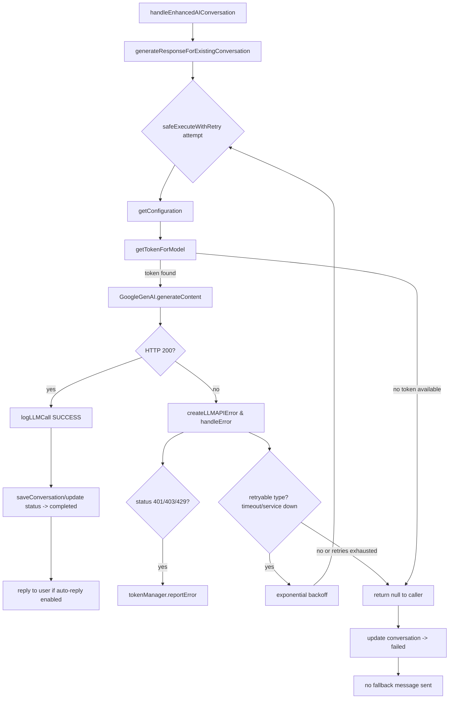
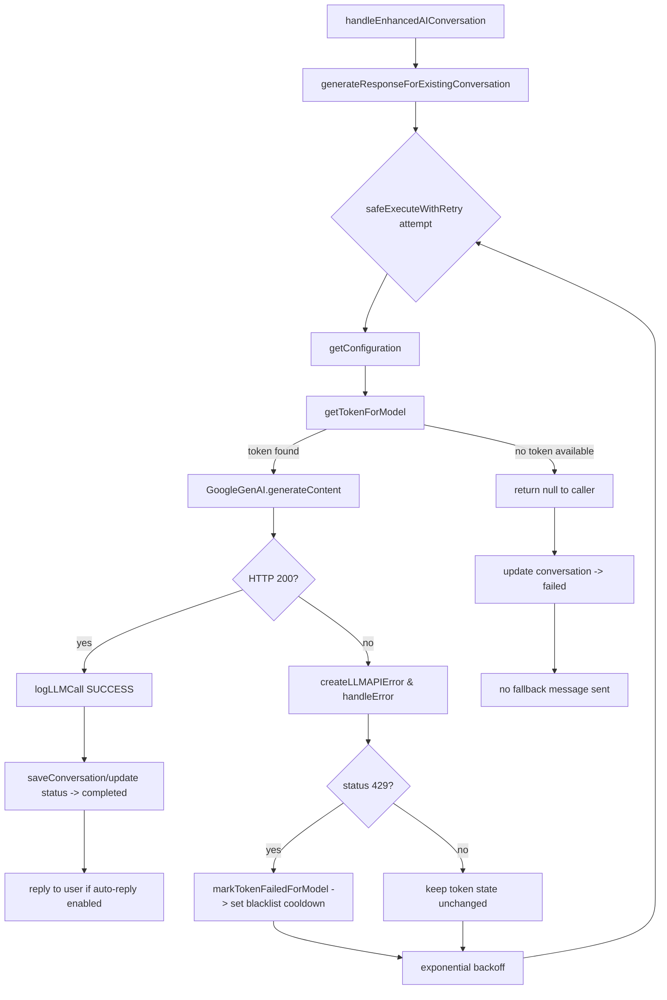

# GenAI Call & Token Handling Flow

Illustrates how a message travels through the AI service, how tokens are selected, and what happens when Google GenAI returns non-200 responses.

## Notes
- `getTokenForModel` queries `api_tokens`, skipping rows marked by `blacklisted_until`, daily limit, or model-specific blacklist; each retry repeats this lookup, allowing rotation when other tokens are healthy.
- `reportError` increments `error_count` and sets `blacklisted_until` when the threshold is reached, which should prevent reuse until the cooldown expires. Current implementation passes `config.model.name` instead of the token string, so blacklist updates are not persisted—this bug means the same token may be retried repeatedly.
- `safeExecuteWithRetry` retries up to three times only for retryable error types timeout, service unavailable, network issues. Non-retryable errors 401/403/429/400 exit early.
- After all retries fail or when no token is available, the AI layer returns `null`; upstream marks the conversation as `failed` and does not send a fallback message to the user.
- Daily resets `resetDailyUsageIfNeeded` and blacklist cleanup `cleanupBlacklist` run before token selection to re-enable tokens whose limits or cooldowns have expired.

## Proposed Token Rotation Upgrade 429-Aware

### 429 handling add-ons

- 在 `createLLMAPIError` 之后立即判断是否为 429。命中时调用 `markTokenFailedForModel`（或修复后的 `reportError`）把当前 token 的错误计数和 `blacklisted_until`/`model_blacklist` 设置好，让它在冷却期内不再被选中。
- 完成标记后仍沿用原有退避逻辑；下一轮 `safeExecuteWithRetry`/`getTokenForModel` 会因为冷却字段生效而自动跳过这把 key，转向其他 token。
- 如果所有 token 都被打入冷却或耗尽额度，`getTokenForModel` 会返回空值，调用方收到 `null` 并把会话标记为 `failed`。
- 非 429 的可重试错误保持原样：退避后再次取号；因为没有黑名单标记，可能拿到同一 token。
- 成功调用后建议执行 `reportSuccess` 清理 token 的错误计数，确保冷却期过后它能够恢复为健康状态。
