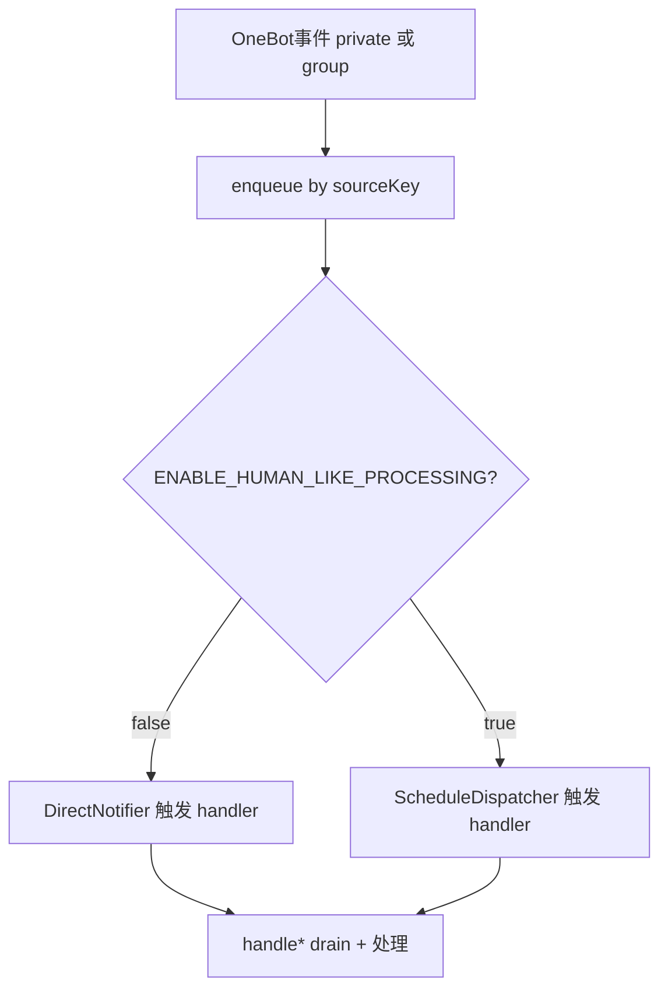
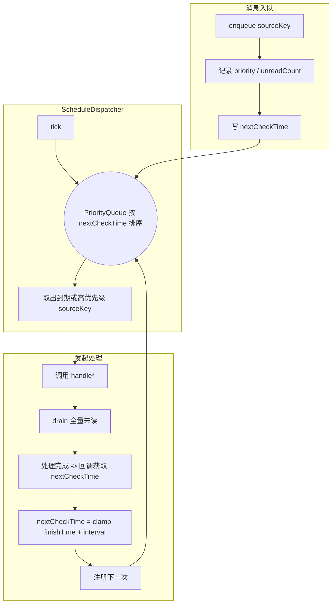

# Human-Like Message Processor 集成方案

本方案基于 `modules/qqbot-core` (OneBot WebSocket → handler → AI pipeline) 的现有实现，总结人类化消息处理流程与后续优化空间。

## 背景与目标
- 所有消息统一进入队列，以用户或群组为单位集中处理未读。
- `ENABLE_HUMAN_LIKE_PROCESSING=true` 时由调度器控制查看节奏；`false` 时直接处理，保持低延迟。
- 直连与调度本质相同：都是触发统一的 handler，handler 内完成 drain → 上下文 → 生成回复。

## 队列划分
- 私聊：`sourceKey = user_${user_id}`；群聊：`sourceKey = group_${group_id}`。
- `MessageQueueService` 维护 `Map<sourceKey, Queue<QueuedMessage>>`，`drain(sourceKey)` 一次取出并清空该队列。
- handler 处理完成后负责更新会话数据和下一次调度时间。

## 共享消息流

## 运行模式改造点
- 现有 `handlePrivateMessage` / `handleGroupMessage` 中直接处理 WebSocket 消息，需要改造为通过 `drain(sourceKey)` 获取批量未读。
- 直连模式：保留原 WebSocket 监听，但 enqueue 后立即触发 handler，不再直接处理单条消息。
- 拟人模式：新增调度器，根据配置周期触发 handler；原聚合窗口逻辑可移除。

## 调度与优先级

- `nextCheckTime` = `finishTime + configuredInterval`，然后套用 `nextCheckTime = max(nextCheckTime, now + MIN_INTERVAL)` 和 `nextCheckTime = min(nextCheckTime, now + MAX_INTERVAL)`。
- 含 @、管理员命令或未读超阈值 → 先设为 `now`，再走上述夹取。

## 批次追踪与调试
- drain 后生成 `batchId`，写入 `conversation_batches`（记录触发方式、消息数量、耗时等）。
- `message_consumptions` 保存触发原因与处理耗时，失败时记录错误信息。
- `DebugService` 提供批次查询能力，便于在调试接口或 Admin Panel 中展示链路。

## 重点模块
1. `MessageQueueService`：负责消息入队、优先级与统计。
2. `DirectNotifier` / `ScheduleDispatcher`：分别处理直连与拟人化节奏。
3. `QQBot.handle*Batch`：批次处理逻辑，同时写入批次与消费表。
4. `DebugService`：支撑联表查询批次信息。
5. 配置：`ENABLE_HUMAN_LIKE_PROCESSING` 控制模式；调度参数可通过环境变量配置。

## 后续优化方向
- 可评估接入事件分离组件（`HumanLikeMessageProcessor` 等），实现更细粒度的到达/消费拆分。
- 若需持久化队列或多实例部署，可替换 `PartitionedMessageQueue` 的存储实现。
- Admin Panel 可继续补充队列与批次监控页面。

## 验收与自测建议
1. **直连模式回归**：`ENABLE_HUMAN_LIKE_PROCESSING=false` 时消息应立即响应；批次记录需要标记 `trigger_type=direct`。
2. **拟人模式验证**：开启拟人模式后，普通消息按间隔批量处理，含 @ 消息立即处理，日志与批次记录符合预期。
3. **批次日志与调试**：在两种模式下查询 `debug` 接口，确认批次状态、耗时、错误信息正确。
4. **稳定性检查**：高频消息验证无重复/漏处理；切换模式后观察日志确保逻辑切换正常。
