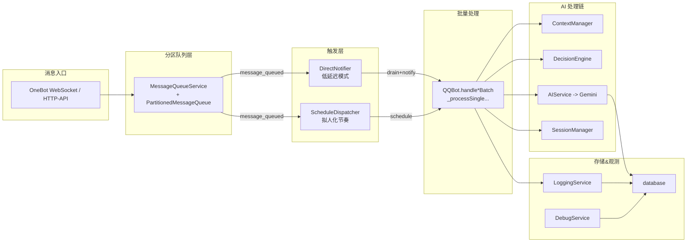
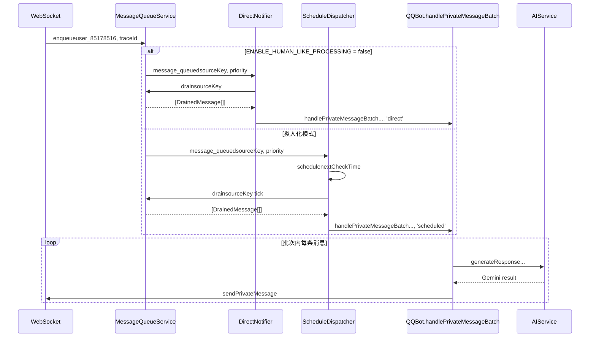

# Human-Like Processor & LLM 调度架构（当前实现）

> 本文在 `docs/HUMAN_LIKE_PROCESSOR_FLOW.md` 的基础上，总结目前仓库中已经落地的人类化消息节奏与 LLM 调用链路。重点覆盖 `modules/qqbot-core/src` 目录下的最新实现，便于了解整体架构、模块分工与数据流向。

## 1. 顶层组件关系

- WebSocket/HTTP 消息统一通过 `MessageQueueService.enqueue` 入队，并根据 user/group 形成 `sourceKey` 分区。
- `ENABLE_HUMAN_LIKE_PROCESSING=false` 时，`DirectNotifier` 立即 `drain` + 调用批处理；为 true 时由 `ScheduleDispatcher` 按 `nextCheckTime` 周期触发。
- `QQBot` 作为批处理 handler，遍历批次内消息逐条执行 `_processSinglePrivateMessage` / `_processSingleGroupMessage`，沿用了原 Stage-1 AI 流程。

## 2. 私聊消息时序（直连 vs 拟人化）

关键差异：
- 直连模式下 drain → 处理同步进行，延迟最低。
- 拟人模式下 `ScheduleDispatcher` 维护 `Map<sourceKey, ScheduleEntry>` 并基于 `scanInterval`/`minInterval`/`maxInterval` 控制节奏；高优先级（授权用户、@机器人、管理员命令）会立即处理。

## 3. 核心模块说明

| 模块 | 位置 | 说明 |
| --- | --- | --- |
| `MessageQueueService` | `modules/qqbot-core/src/services/message-queue-service.ts` | 基于 `PartitionedMessageQueue` 管理消息分区、优先级和 drain，公开 `enqueue`/`drain`/`getUnreadCount` 等接口。 |
| `PartitionedMessageQueue` | `modules/qqbot-core/src/services/message-queue.ts` | 纯内存分区队列，按优先级排序消息，支持统计与定期清理。 |
| `DirectNotifier` | `modules/qqbot-core/src/services/direct-notifier.ts` | 直连模式：收到通知立即调用 `BatchHandler`。 |
| `ScheduleDispatcher` | `modules/qqbot-core/src/services/schedule-dispatcher.ts` | 拟人化模式：维护 `scheduleQueue`，tick 循环触发处理并计算下一次唤醒时间。 |
| `QQBot` | `modules/qqbot-core/src/index.ts` | 作为 `BatchHandler` 实现，桥接 Stage-1 AI 流程、会话管理、群管命令与消息发送。 |
| `AIService` | `modules/qqbot-core/src/services/ai-service.ts` | 统一的 Gemini 调用入口，包含日志埋点和 `llm_call_logs` 写入；当前主要使用 `generateContent` REST 调用。 |
| `LoggingService` & `DebugService` | `modules/qqbot-core/src/services` | 记录消息到达、批处理、LLM 调用、错误信息，供 Admin Panel 时间线与调试页查看。 |

## 4. 批处理内单条消息流程

以 `_processSinglePrivateMessage` 为例：

1. 记录 `conversation`（状态 `pending` → `processing` → `completed/failed`）。
2. 调用 `ContextManager.buildMessageContext` 拉取最近历史与用户信息。
3. `DecisionEngine.analyzeMessage` 判断是否需要回复，不回复时写入 `filtered_*` 状态后返回。
4. 更新 session `SessionManager.processIncomingMessage` 并执行群管命令检测。
5. `handleEnhancedAIConversation` 通过 `AIService` 调用 Gemini，使用 prompt agent 完成风格化；响应写入数据库、日志、最终通过 `WebSocketClient` 发送。
6. 失败会更新 `conversation` 状态为 `failed` 并记录错误。

群聊路径 `_processSingleGroupMessage` 逻辑类似，但增加了 @机器人、群配置与净化消息等步骤。

## 5. 数据与观测

- **数据库表**：
  - `conversations`：每条消息对应的会话记录，包含 traceId、batchId、状态、错误原因等。
  - `message_consumptions`：由批处理逻辑写入批次信息（批次 ID、来源、耗时、状态）。
  - `session_traces` / `llm_call_logs`：`LoggingService` & `AIService` 写入的 LLM 调用、流程埋点。
  - `group_chat_settings` / `private_chat_settings`：群聊/私聊启用状态控制。
- **日志与监控**：`logger` 模块输出结构化日志；`LoggingService.logEventStart/End` 记录可视化时间线，Admin Panel 对应页面可查看批次、LLM 调用链、错误。

## 6. 配置开关

| 环境变量 | 作用 |
| --- | --- |
| `ENABLE_HUMAN_LIKE_PROCESSING` | true 时启用 `ScheduleDispatcher`，false 时走 `DirectNotifier`。 |
| `HUMAN_LIKE_SCAN_INTERVAL`/`MIN_INTERVAL`/`MAX_INTERVAL`/`TICK_INTERVAL` | 控制调度器节奏。 |
| `AI_MODEL_NAME`、`GEMINI_API_KEY` 等 | `AIService` 的模型与鉴权配置。 |
| `AUTHORIZED_USER_ID` | 高优先级识别与群管命令权限。 |

## 7. 扩展建议（基于当前实现）

- 如果后续要引入工具调用（search/invoke），可在 `AIService` 返回后追加函数调用解析，但当前版本尚未落地。
- 如需队列持久化或多实例部署，可考虑给 `PartitionedMessageQueue` 增加外部存储/Redis 方案，并扩展 `MessageQueueService` 接口。
- Admin Panel 已能查看批次和对话事件，后续可以补充 message queue 监控页（展示 `getStats/getScheduleQueue`）。

---

此文档与原 `HUMAN_LIKE_PROCESSOR_FLOW.md` 共同描述了“消息拟人化节奏 + Stage-1 AI pipeline”的现状，实现同学在维护/迭代时可直接参考对应模块与数据流向。
