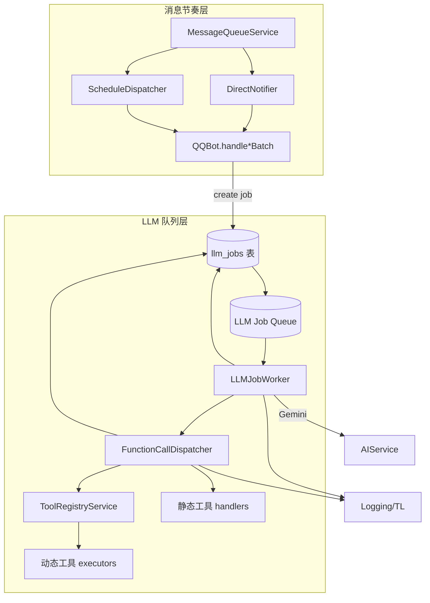
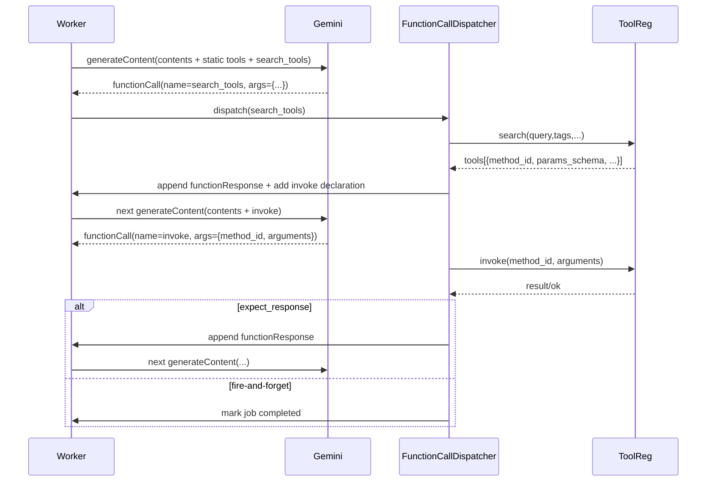

# LLM 工具编排落地方案（结合当前实现）

> 本文基于现有 `modules/qqbot-core` 架构，给出可直接落地的 LLM 工具调用方案，涵盖消息节奏、队列与调度、静态/动态工具分类以及配套的存储、调试与上线计划。

## 1. 范围与目标

- 保留现有消息队列与调度链：`MessageQueueService` → `DirectNotifier/ScheduleDispatcher` → `QQBot.handle*Batch` → Stage-1 AI pipeline。
- 在现有 `AIService` 基础上扩展 Gemini 函数调用能力，统一支持：
  - **静态工具**：开局即暴露给 LLM，可选“回传型 / 侧效应型”。
  - **动态工具**：通过 `search_tools` 发现，再用统一 `invoke(method_id, args)` 执行。
- 引入异步 LLM Job 队列，避免业务线程等待多轮函数调用。
- 打通 Admin Panel 的工具管理、调用链可视化，便于运维排障。

## 2. 现状速览（已实现部分）

| 模块 | 文件 | 作用 |
| --- | --- | --- |
| 消息分区/Drain | `services/message-queue.ts`、`message-queue-service.ts` | 按 user/group 入队，提供 drain + 优先级。 |
| 调度 | `services/direct-notifier.ts`、`schedule-dispatcher.ts` | 控制直连与调度节奏。 |
| 批处理入口 | `index.ts` (`QQBot.handle*Batch`) | 遍历批次逐条执行 `_processSingle...`。 |
| Stage-1 AI | `services/context-manager.ts`、`engines/decision-engine.ts`、`services/ai-service.ts` | 现以 Gemini REST 调用为主，记录 `llm_call_logs`。 |
| 观测 | `services/logging-service.ts`、`debug-service.ts` | 写入 conversations、message_consumptions 等表。 |

这些模块在本方案中保持不变，仅在 `_processSingle*` → `handleEnhancedAIConversation` 链路附近增加 LLM Job 与工具执行。

## 3. 目标架构



### 关键点
1. `_processSingle*` 不再直接调用 `AIService.generateResponse`，而是写 `llm_jobs` 状态并入队，等待 `LLMJobWorker` 处理。
2. `AIService` 拆分为两部分：
   - `generatePayload`：根据 `UnifiedLLMConfig` 组装请求（含静态工具 + `search_tools`），写入日志即可。
   - `executeRequest`：由 Worker 调用，解析函数调用闭环。
3. `FunctionCallDispatcher` 统一解析 Gemini `functionCall`：
   - **静态工具**：直接执行 handler，根据 `mode` 决定是否将结果作为 `functionResponse`。
   - **`search_tools`**：调用 `ToolRegistryService.search`，返回工具元数据并在下一轮 payload 中追加 `invoke` 声明。
   - **`invoke`**：根据 `method_id` 路由动态工具，`expect_response` 逻辑同静态工具。

## 4. 工具分类与声明

### 4.1 静态工具

- 存放于 `modules/qqbot-core/src/tools/static-tools.ts`，结构示例：
  ```ts
  export interface StaticTool {
    name: string;
    description: string;
    parameters: JSONSchema;
    mode: 'returnable' | 'fire-and-forget';
    handler: (ctx: ToolContext) => Promise<ToolResult>;
  }
  ```
- 首次请求即注入 `functionDeclarations`。
- `mode=returnable`：执行结果包装成 `functionResponse` 回 LLM；`mode=fire-and-forget`：执行完即结束或写日志。

### 4.2 动态工具

- 新表 `llm_tools`（`method_id`、`description`、`params_schema`、`tags`、`side_effect`、`enabled`、`version` 等）。
- `ToolRegistryService` 提供：
  - `search(query, tags, sideEffect, maxResults)` → 返回工具列表。
  - `invoke(methodId, args, traceId)` → 执行真实业务逻辑。
- `search_tools` 声明示例（在 `AIService.generatePayload` 中常驻）：
  ```json
  {
    "name": "search_tools",
    "description": "当你想完成某个任务...返回工具候选",
    "parameters": {
      "type": "object",
      "properties": {
        "query": { "type": "string", "description": "需求描述" },
        "tags": { "type": "array", "items": { "type": "string" }, "description": "可选标签" },
        "side_effect": { "type": "boolean" },
        "max_results": { "type": "integer", "default": 3 }
      },
      "required": ["query", "side_effect" ]
    }
  }
  ```
- 当 `search_tools` 返回后，在下一轮 payload 中动态追加通用 `invoke` 声明，并附上工具列表（包含 `method_id` 和 `params_schema`）。

## 5. 时序：search → invoke



## 6. 数据模型与迁移

1. **`llm_jobs` 表**：追踪异步执行状态。
   - 字段示例：`id`, `trace_id`, `status(pending/calling/awaiting_tool/completed/failed)`, `contents_json`, `retry_count`, `pending_tool`, `error_message`, `next_retry_at`, `created_at`, `updated_at`。
2. **`llm_tools` 表**：动态工具仓库。
3. **`tool_execution_logs`**（可选）：记录每次工具调用的输入/输出、耗时、结果，便于审计。
4. 更新现有 `timeline_events`、`llm_call_logs` schema，增加工具相关字段（如 `tool_name`, `method_id`, `execution_mode`）。

## 7. Admin Panel 扩展

- **工具管理**：
  - 新增 CRUD 接口（`modules/admin-panel/backend/src/routes/tools.ts`）及前端维护页面。
  - 支持搜索、启用/禁用、查看参数 schema、试调用。
- **时间线/调试**：
  - 展示 LLM Job 状态、search/invoke 调用链、结果/错误。
  - Fire-and-forget 工具在时间线上标注“已执行，无文本回传”。

## 8. 实施步骤

1. **准备阶段**
   - 新建 `llm_jobs`、`llm_tools` 迁移脚本。
   - 补充静态工具清单、角色 prompt（强调“陌生能力先搜索”）。
2. **服务改造**
   - 拆分 `AIService`：`generatePayload` + `executeRequest`。
   - 实现 `ToolRegistryService`、`FunctionCallDispatcher`、`LLMJobWorker`。
   - 在 `_processSingle*` 中替换直接调用 LLM 为“写 job + 入队”。
   - 队列可初期复用现有 `scripts/simple-queue`，后续可接入更成熟的消息系统。
3. **接口与观测**
   - 扩充 LoggingService/DebugService：记录 job 状态变更、工具执行。
   - Admin Panel 新增工具管理、LLM Job 时间线 UI。
4. **测试与验收**
   - 单测：静态工具执行、search→invoke 流程、fire-and-forget 行为。
   - 集成测试：模拟消息 → 队列 → LLM Job → 工具 → 最终回复。
   - 监控：LLM Job 队列堆积、工具失败率、Gemini 请求耗时。
5. **上线策略**
   - 先启用静态工具 + LLM Job 队列，确保主流程稳定。
   - 再逐步开放动态工具（按标签/权限控制），收集日志。
   - 最后向运营团队开放 Admin Panel 工具管理。

## 9. 风险与对策

| 风险 | 对策 |
| --- | --- |
| 长链路失败导致消息滞留 | LLM Job 状态机 + Retry + Dead-letter 设计，异常报警。 |
| 工具参数不匹配 | 引入 JSON Schema 校验，Admin Panel 验证参数。 |
| Fire-and-forget 工具失控 | 加权限校验 + 审计日志 + 手动确认机制。 |
| 队列单点 | 允许替换底层实现（RabbitMQ, Redis Stream 等），接口保持抽象。 |

---

本方案以当前项目的分层结构为基础：保留已落地的消息队列与调度链，将 LLM 调用迁移至异步化队列，并引入可扩展的工具发现与执行体系。后续迭代可按“数据表 → 服务组件 → UI & 监控”的顺序逐步落地，保障开发和运维的可观测性与回滚能力。
