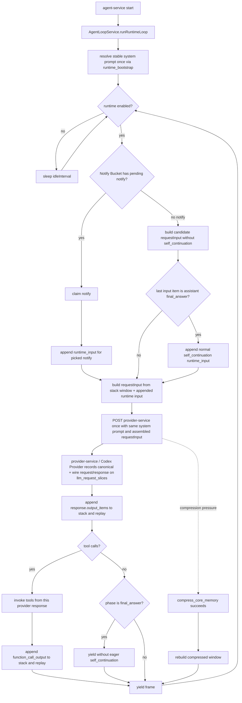

# Xiaoni Agent Stack Ledger

本文档是小腻主 loop、LLM 请求组装、行动流和 trace detail 的目标架构。
它描述本轮底层重构要落地的事实源；迁移完成前，旧表可以继续作为兼容投影或
provider evidence，但不能再被写成新的概念来源。

## Core Model

小腻不是一组离散客服请求，而是一条连续 agent loop。工程上只有一个主 runtime
入口：`AgentLoopService.runRuntimeLoop()`。`agent-service` 的 `index.ts` 只负责启动
这个 runtime，不再拥有 queue polling / queue claim 语义；Notify Bucket 的 pick
发生在 runtime loop 内部。空闲时不再合成 autonomous queue notify。没有 notify
时，runtime loop 按同一套 stack window 组装一份候选 request；只有这份候选
request 真正最后一个 input item 是 `assistant final_answer`，才追加普通
`self_continuation` developer reminder。尾项不是 `final_answer` 时不追加 reminder，
直接用候选 request 发起本次模型 slice。成功处理一个真实 slice 后没有固定 interval，
下一轮立即回到主 `while` 顶部先 pick notify。

```text
system prompt
developer prompt
agent_stack_items[0..n]
  -> agent-service assemble canonical request
  -> provider-service / Codex Provider post provider and record llm_request_slices[n]
  -> append response.output_items
  -> agent-service backfill slice stack indexes only
  -> append function_call_output for each invoked tool
  -> yield to the next runtime loop iteration
```

`final_answer` 不是主 runtime 的终止条件。它只是模型本 slice 没有更多工具调用的
输出形态；当前 frame 只记录这个 `final_answer` 并 yield 回
`AgentLoopService.runRuntimeLoop()` 主 `while` 顶部。下一次 runtime iteration 会先重新
pick notify；只有没有 notify 且候选 requestInput 末尾仍是 `assistant final_answer` 时，
runtime 才追加普通 `self_continuation` runtime input 作为下一步行动提示。不要为了
`final_answer` 额外制造专用 prompt reminder，也不要在同一个 frame 里内部连打下一次模型。

当前实现边界：



目标伪代码：

```ts
async function runXiaoniRuntime() {
  const runtimePrompt = await resolveStableRuntimePromptOnce()
  const stableDeveloperHead = buildStableDeveloperHeadOnce()

  while (xiaoni_alive) {
    await waitUntilRuntimeEnabled()
    const notify = await pickNotify()
    const currentRuntimeInput = notify ? renderNotifyAsRuntimeInput(notify) : null

    let requestInput = buildRequestInputFromStackWindow({
      runtimePrompt,
      stableDeveloperHead,
      currentRuntimeInput
    })

    const appendLoopInputItems = (items) => {
      appendStackItems(items)
      requestInput.push(...items)
    }

    if (!notify && isAssistantFinalAnswer(last(requestInput))) {
      const reminder = buildSelfContinuationDeveloperReminder()
      appendLoopInputItems([reminder])
    }

    const response = provider_service_post_llm_and_record_slice({
      instructions: runtimePrompt.systemPrompt,
      input: requestInput
    })

    appendLoopInputItems(response.output_items)
    backfillSliceStackIndexes(response.llm_request_slice_id)

    const toolCalls = parse_tool_calls(response.output_items)
    if (toolCalls.length > 0) {
      for (const call of toolCalls) {
        const result = invoke(call)
        appendLoopInputItems([function_call_output(call.id, result)])
      }
    }

    // no fixed sleep/poll interval between successful frames
    continue
  }
}
```

## Runtime Boundaries

这些边界只在本文维护。不要再为同一套 runtime 另起架构说明页。

### Notify Bucket And QQ Inbox

`Notify Bucket` 是概念桶，当前持久化承载是 `agent_queue_messages`。它只表示
“有一个门铃等待主 runtime pick”，不表示小腻长期占用这条通知，也不是 QQ app
未读列表。QQ 正文始终先落 `agent_inbound_messages`；小腻只有主动使用
`$qq-usage` 时，才通过 `agent-service /api/internal/qq-usage` 读取 inbox/window。

聊天对象的 IM 入口 `is_enabled=0` 是 provider-service 侧硬开关：QQ 正文仍写入
inbox，但不会写 `phone_notification` 到 Notify Bucket，因此不会因为这条 QQ 消息
唤醒主 loop。`auto_reply_enabled` 只保留为兼容/派生字段，不再是独立投递开关。

### Prompt-Facing Runtime Input

`phone_notification`、`image_task_notification`、普通 `system_reminder`、无 notify
场景追加的 `self_continuation` 都是当前输入，不是 QQ 正文，也不是 assistant 历史。
它们可以作为 `agent_stack_items.item_kind=runtime_input` 记录本轮事实，但不得写入
`conversation_items` 或 `conversations.user_message`。

`lease_release`、`lease_release_reason`、token usage、runtime frame yield detail 等字段
只属于工程审计和 trace 解释，不能投影成 prompt-facing assistant commentary。历史上
曾经把无可见发言的 lease detail 包装成 `<xiaoni_os>`；当前契约禁止这类合成。
后续 request 里能出现的 `<xiaoni_os>` 只能来自模型显式写入的
`raw_response.xiaoni_os`，并且仍要经过 spoken-turn / tactical-state 过滤。

当前 prompt-facing reminder 模板只维护在 `docs/xiaoni_prompt/`，索引看
`docs/remind.md`。不要在本文、README 或其它文档复制模板正文。

### Image Vision Fork

`inspect_image_placeholder` 不是 provider-service 的无上下文图片摘要器。当前实现复用
小腻主 agent 上下文发起一次 no-persist vision fork：请求里可以短暂携带图片 base64，
但 base64 不进入长期 replay、traffic 骨架或 `agent_stack_items`。主 loop 后续只继承
文本观察：

```xml
<image id="...">含义是: ...</image>
```

如果之后需要重新看同一张图，模型应再次调用 `inspect_image_placeholder(image_id)`。

### Tool Callback Boundaries

`recover_energy` 是普通工具执行，但不再由 tool handler 内同步等待固定时长。模型主动调用
`recover_energy` 且工程接受时，工程创建持久化 recovery session；醒来、被打断或 clock 到点后，
仍把 `<system_reminder>` 文本作为同一个 tool call 的 `function_call_output.output`
返回。工程拒绝休息时，也立即通过同一个 tool call 返回拒绝原因。不要写
`release_lease` tool result，也不要 enqueue 恢复用 `self_continuation` notify。

runtime 因精力透支自动强制休息时没有原始 tool call，不能伪造
`function_call_output`；醒来后通过 runtime_input `<system_reminder>` 恢复。`recover_energy`
的 tool 参数、clock、恢复曲线、旁路唤醒计数和最大恢复时间统一看
`docs/XIAONI_RECOVER_ENERGY_DESIGN.md`。

## Tables

所有共享读写必须收口到 `packages/persistence`，并优先用 Prisma schema /
Prisma Client 表达。业务模块只调用 persistence helper，不直接拼 SQL。

### `agent_stack_items`

追加式事实源。每个模型可回放 item、工具输出、当前输入提醒、可见出站和必要状态
事件都在这里拥有稳定顺序。

| Field | Meaning |
| --- | --- |
| `id` | 稳定 id。 |
| `identity_key` | 小腻主 loop 使用 `xiaoni`。 |
| `stack_index` | 同一 identity 下单调递增顺序。 |
| `item_kind` | `runtime_input`、`assistant_output`、`function_call`、`function_call_output`、`visible_delivery`、`state_event`、`memory_event` 等。 |
| `role` | OpenAI request role，或内部投影 role。 |
| `phase` | 模型输出 phase，例如 `commentary` / `final_answer`。非模型 item 可为空。 |
| `provider_item_id` | provider 返回的 item id，若存在则保留。 |
| `tool_call_id` | function call / output 的稳定关联 id。 |
| `content` | 可回放 payload。只保存 provider 可接受的 output item 或 runtime 定义的结构化 item。 |
| `visibility` | `model_visible`、`trace_only`、`operator_only` 等。 |
| `source_type` / `source_id` | 来源表和来源 id，便于迁移期 join。 |
| `created_at` | 追加时间。 |

`system_prompt` 和稳定 developer prompt 不作为普通行动卡写入 stack；它们属于 request
assembly 固定前缀。`phone_notification`、`image_task_notification`、
无 notify 场景追加的 `self_continuation`、`core_memory_pressure` 这类 reminder 只属于当前输入，可写入
stack 作为本轮 `runtime_input`，但不能写成 QQ 正文或 assistant 历史。

### `llm_request_slices`

每次真实 LLM 请求都记录为一个 slice。slice 不是小腻的认知边界，只是审计和 trace
边界。

完整 request / response 记录的所有权在 `provider-service`。`agent-service` 负责组装
provider-neutral canonical request，并把 `run_id`、`agent_turn`、本次读取的 stack
范围传给 `provider-service /api/internal/agent/execute`；`provider-service` 调用
Codex/OpenAI provider 后，由 provider-service 内的记录入口把 `canonical_request`、
`wire_request`、`canonical_response`、`wire_response`、`raw_response`、usage 和 provider
metadata 写入 `llm_request_slices`。`agent-service` 收到模型输出后只追加
`agent_stack_items`，再回填该 slice 的 `output_start_index` / `output_end_index` 等
stack link 字段；它不再写完整 request / response payload。

| Field | Meaning |
| --- | --- |
| `id` | slice id。 |
| `identity_key` | `xiaoni`。 |
| `input_start_index` / `input_end_index` | 本次 request 读取的 stack 闭区间。 |
| `canonical_request` | `agent-service` 组装、`provider-service` 落库的 provider-neutral request。 |
| `wire_request` | Codex/OpenAI provider 实际发出的请求，敏感字段需脱敏或隔离存储。 |
| `wire_response` | Codex/OpenAI provider 实际收到的响应。 |
| `raw_response` | provider 原始响应。 |
| `output_items` | 模型可回放输出 item。 |
| `status` | `completed`、`failed`、`cancelled`。 |
| `token_usage` | provider 返回的 usage。 |
| `trace_id` / `run_id` | 工程 trace / delivery join key。 |
| `created_at` / `completed_at` | 请求时间。 |

Raw Trace 的 LLM span detail 应直接展示 `canonical_request`、`wire_request`、
`raw_response` 和本次 slice 覆盖的 stack item 范围。

`llm_request_slices` 是完整 provider evidence，不是后续上下文 replay。后续请求要
吃到哪些模型可见 item 由 runtime replay / stack window 决定；其中无 notify 场景追加的
普通 `self_continuation` 必须进入本轮 request，不能只保留 assistant output 和 reasoning。

### `tool_executions`

每个工具调用都有独立执行记录，并通过 `tool_call_id` 回连 stack。

| Field | Meaning |
| --- | --- |
| `id` | tool execution id。 |
| `llm_request_slice_id` | 产生 tool call 的 LLM slice。 |
| `tool_call_id` | OpenAI function call id。 |
| `tool_name` | 工具名。 |
| `arguments` | 模型给出的参数。 |
| `result` | runtime 回传给模型的 `function_call_output.output`。模型主动调用 `recover_energy` 后成功休息、被打断、clock 醒来或被工程拒绝时，也必须作为同一个 tool call 的 `function_call_output` 返回；不得通过 `release_lease` 之类字段吞掉 callback 或另起恢复 notify。runtime 强制休息没有原始 tool call，醒来后走 runtime_input system reminder。 |
| `status` | `completed`、`failed`、`timeout`。 |
| `side_effect` | 是否产生 QQ 发言、读 inbox、文件写入、任务入队等副作用。 |
| `created_at` / `completed_at` | 执行时间。 |

工具结果进入下一轮 request 的唯一形态是 stack 中的
`function_call_output(call.id, result)`，而不是重新由日志拼一个近似文本。

### `stack_compactions`

当 stack 过长时，压缩是一个显式事件，而不是悄悄改写历史。

| Field | Meaning |
| --- | --- |
| `id` | compaction id。 |
| `identity_key` | `xiaoni`。 |
| `compacted_start_index` / `compacted_end_index` | 被压缩的 stack 范围。 |
| `summary_stack_item_id` | 写回 stack 的摘要 item。 |
| `method` | `compress_core_memory` 或未来官方 compaction。 |
| `created_at` | 压缩时间。 |

## Request Assembly

每轮请求由固定前缀和 stack 窗口组成：

```text
request =
  fixed system prompt
  fixed developer prompt
  developer <CAPABILITIES>
  pressure/state developer blocks if needed
  stack window from agent_stack_items
```

规则：

- 只 append 模型可回放输出，不 append 整个 provider envelope。
- `system prompt` 按 `AgentLoopService` 生命周期稳定解析一次；`runRuntimeLoop()`
  进入主 `while` 前用 `runtime_bootstrap` 预热，普通 notify 不会把 prompt 文件
  重新读一遍。稳定 developer 能力头属于固定前缀，不是 queue message 的一部分。
- `AgentLoopService.runRuntimeLoop()` 是 queue/notify 的唯一消费入口；不存在可公开调用的
  旧式单条 queue message 处理兼容入口。单轮 iteration 只是 service 内部实现细节。
- 单次 runtime iteration 只发起一个 provider model slice；slice 内只追加模型 output
  和同一响应产生的 tool output。`final_answer` 后不在当前 frame 追加
  `self_continuation`；下一轮如果没有 notify，先组装未追加 self continuation 的候选
  requestInput，只有最后一个 input item 仍是 `assistant final_answer`，才在新 request
  中追加；否则不追加 reminder，直接用候选 request 发起本次模型 slice。只有上下文压缩这类 P0 窗口收缩可以重组 request window。
- `current_input` / reminder 是当前感官输入，不是 QQ 正文，也不是 assistant 历史。
- QQ 正文只在模型主动用 `$qq-usage` 后，作为工具结果或可见 transcript 进入 stack。
- `conversation_items` 可以在迁移期继续作为 transcript 投影，但不再是主 loop
  request assembly 的概念事实源。没有 `conversation_items` 时，不得从
  `conversations.user_message` / `conversations.ai_response` 回退合成历史 input；
  缺失结构化 transcript 就只保留明确可回放的 `responses_replay_items`、stack window
  和当前 runtime input。
- `xiaoni:global` 仍是主 loop 的 identity / prompt cache / summary key；
  `qq:direct:*` / `qq:group:*` 只做投递目标和 QQ app 未读游标 metadata。

## Activity Stream Projection

管理端“小腻行动流”是 stack/tool/life/media/task 事实的投影，不是 provider 请求列表。

应该生成卡片：

- `runtime_input`：真实 notify、无 notify final_answer 后的 self continuation、记忆压力等当前输入。
- `function_call`：模型请求工具。
- `function_call_output` / `tool_executions`：工具实际执行结果。
- `visible_delivery`：QQ 发言、图片发送等外界可见动作。
- `state_event` / `life_event`：休息、精力变化、看到消息、图片任务完成等重要状态。

不应该生成普通行动卡：

- system prompt / developer prompt 固定前缀。
- provider request 本身。
- token usage、retry metadata、lease acquire/release 等纯工程审计事件。
- 没有外部可见动作的普通 `final_answer`。

provider request / response evidence 直接来自 `llm_request_slices.wire_request` 和
`llm_request_slices.wire_response`。event search 可以搜 LLM slice / stack item / tool
execution，但结果必须回到相关 LLM slice、stack item 或行动卡上下文展示。

## Trace Detail

点击行动流卡片时，trace 聚焦真实事实源：

```text
function_call card
  -> agent_stack_items(function_call)
  -> provider-service records llm_request_slices
  -> provider wire payload on llm_request_slices

tool result card
  -> tool_executions
  -> agent_stack_items(function_call_output)

visible delivery card
  -> delivery / conversation projection
  -> source stack item or tool execution
```

如果 provider evidence 缺失，Trace 不伪造 provider payload；仍展示 stack、LLM slice
和 tool execution 自身证据。

## Migration Plan

1. 文档和 API contract 先收口到本文，停止把 provider replay 或旧 transcript ledger
   描述成行动流事实源。
2. 在 `packages/persistence` 增加 Prisma schema 和 helper：`agent_stack_items`、
   `llm_request_slices`、`tool_executions`、`stack_compactions`。
3. `agent-service` 主 loop 写 stack ledger；旧 runtime LLM/tool audit 表和 provider
   replay ledger 已删除，schema ensure 会 drop 对应遗留表。
4. 管理端行动流和 trace detail 改读 stack ledger；provider request / response
   evidence 只从 `llm_request_slices` 读取。
5. 清理旧 provider-first / run-first 查询和误导性文档，删除不再使用的兼容路径。

## Verification

重构落地后至少覆盖：

```bash
npm --prefix modules/agent-service test
npm --prefix modules/admin-panel/backend test -- --runTestsByPath src/__tests__/trace-span-builder.test.ts src/__tests__/agent-runtime-routes.test.ts
node --test packages/persistence/__tests__/*.test.js
```

关键断言：

- 一个 LLM response 的 output items 按顺序追加到 `agent_stack_items`。
- tool call 和 `function_call_output` 用同一个 `tool_call_id` 回连。
- 没有 Notify Bucket row 时，runtime loop 先组装候选 requestInput；尾项是
  `assistant final_answer` 才追加 `self_continuation`，尾项不是 `final_answer` 时不追加
  reminder，直接用候选 request 发起本次模型 slice。它不会写入或结算
  `agent_queue_messages`，也不会伪造当前 QQ 输入。
- `final_answer` 后没有工具调用时不产生 final-answer 专用 reminder，也不提前写入
  `responses_replay_items`；下一轮如果没有 Notify Bucket row 可 pick，且候选 requestInput
  最后一个 input item 仍是 `assistant final_answer`，才追加普通 `self_continuation`
  developer reminder，后续模型请求能真实看到它。
- `recover_energy` 不写 `release_lease` tool result，不 enqueue 恢复用
  `self_continuation` notify；模型主动调用后的成功休息、被打断、clock 醒来和工程拒绝
  都必须作为该 tool call 的 `function_call_output` 进入 replay。runtime 强制休息没有
  tool call，醒来后追加 runtime_input system reminder。
- 单个 runtime iteration / frame 只允许一次 provider model slice；工具结果或
  `final_answer` 后必须 yield 回主 `while` 顶部重新 pick notify；成功帧之间没有
  固定 sleep/poll interval。
- 行动流不会把 provider request、token usage 或 lease 事件当成普通行动卡。
- Trace detail 能从行动卡回到 stack item、LLM slice、tool execution 和可选
  provider evidence。
- `buildInitialInput` 不会从 `lease_release` / `lease_release_reason` 合成
  `<xiaoni_os>`，也不会从空 `conversation_items` 的旧 `conversations.user_message` /
  `conversations.ai_response` 字段合成历史 prompt input。
