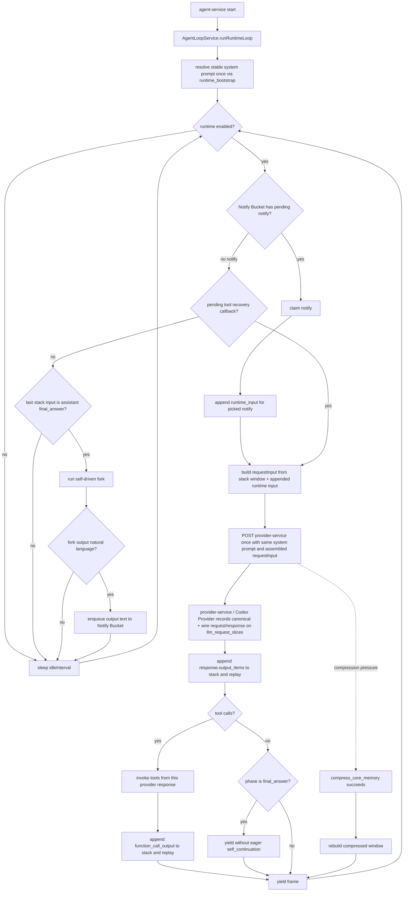

# Xiaoni Agent Stack Ledger

本文档是小腻主 loop、LLM 请求组装、行动流和 trace detail 的当前事实源。
旧 `llm_call_logs`、`tool_execution_logs` 和 provider replay ledger 已移除；
当前排障、管理面和文档都必须从本页描述的 stack / slice / tool / life / fork
事实出发。

## Core Model

小腻不是一组离散客服请求，而是一条连续 agent loop。工程上只有一个主 runtime
入口：`AgentLoopService.runRuntimeLoop()`。`agent-service` 的 `index.ts` 只负责启动
这个 runtime，不再拥有 queue polling / queue claim 语义；Notify Bucket 的 pick
发生在 runtime loop 内部。主 agent 阻塞在 Notify Bucket 上：没有 notify 时不继续
发起普通主模型 slice。claim 不到 notify 时，只有已存在的工具恢复回调可以继续；如果
当前 stack 的最后可回放输入仍停在 `assistant final_answer`，runtime 会启动一个
no-persist 的自驱动（self-driven）fork（工程名；对小腻而言是潜意识）。fork 看到主 agent 当前上下文，并在请求尾部追加
`docs/xiaoni_prompt/self_continuation_reminder.md` 作为 developer message；它的最终产出
必须是一段自然语言。fork 可以多轮运行，并可用受限工具（当前是 `exec_command`，以及
配置开启时的 `web_search`）先寻找“还没做完的事 / 可继续 seed / 可找的乐子”。工程只把
最终自然语言原样投递回 `agent_queue_messages`，主 agent 后续仍必须从 Notify Bucket
claim 到这条 row 后才会继续。

```text
system prompt
developer prompt
agent_stack_items[0..n]
  -> agent-service assemble canonical request
  -> provider-service / Codex Provider post provider and record llm_request_slices[n]
  -> append response.output_items
  -> agent-service backfill slice stack indexes only
  -> append function_call_output for each invoked tool
  -> yield to the next runtime loop iteration
```

`final_answer` 不是主 runtime 的终止条件。它只是模型本 slice 没有更多工具调用的
输出形态；当前 frame 只记录这个 `final_answer` 并 yield 回
`AgentLoopService.runRuntimeLoop()` 主 `while` 顶部。下一次 runtime iteration 会先重新
pick notify。claim 不到 notify 且没有恢复回调时，主 agent 不直接收到
`self_continuation`；runtime 只会在尾项仍是 `assistant final_answer` 时运行自驱动 fork，
由 fork 决定是否产出一段新的自然语言刺激。fork 无输出、失败或选择休息时只记录 fork run，
不投递 notify，也不调用主 agent。

当前实现边界：



目标伪代码：

```ts
async function runXiaoniRuntime() {
  const runtimePrompt = await resolveStableRuntimePromptOnce()
  const stableDeveloperHead = buildStableDeveloperHeadOnce()

  while (xiaoni_alive) {
    await waitUntilRuntimeEnabled()
    const notify = await claimNextQueueMessage()

    if (!notify) {
      if (hasPendingToolRecoveryCallback()) {
        await resumeToolRecoveryCallback()
        continue
      }

      const candidateInput = buildRequestInputFromStackWindow({
        runtimePrompt,
        stableDeveloperHead,
        currentRuntimeInput: null
      })

      if (isAssistantFinalAnswer(last(candidateInput))) {
        startSubconsciousAgentForkInBackground({
          baseInput: candidateInput,
          developerTail: readSelfContinuationReminder(),
          tools: [exec_command, maybe(web_search)],
          maxExecCommandCalls: 5,
          maxModelSlices: 6,
          completion: "first assistant final_answer"
        })
      }

      await sleepIdleInterval()
      continue
    }

    const currentRuntimeInput = renderNotifyAsRuntimeInput(notify)
    const requestInput = buildRequestInputFromStackWindow({
      runtimePrompt,
      stableDeveloperHead,
      currentRuntimeInput
    })

    const appendLoopInputItems = (items) => {
      appendStackItems(items)
      requestInput.push(...items)
    }

    const response = provider_service_post_llm_and_record_slice({
      instructions: runtimePrompt.systemPrompt,
      input: requestInput
    })

    appendLoopInputItems(response.output_items)
    backfillSliceStackIndexes(response.llm_request_slice_id)

    const toolCalls = parse_tool_calls(response.output_items)
    if (toolCalls.length > 0) {
      for (const call of toolCalls) {
        const result = invoke(call)
        appendLoopInputItems([function_call_output(call.id, result)])
      }
    }

    // no fixed sleep/poll interval between successful frames
    continue
  }
}
```

## Runtime Boundaries

这些边界只在本文维护。不要再为同一套 runtime 另起架构说明页。

### Notify Bucket And QQ Inbox

`Notify Bucket` 是概念桶，当前持久化承载是 `agent_queue_messages`。它只表示
“有一个门铃等待主 runtime pick”，不表示小腻长期占用这条通知，也不是 QQ app
未读列表。QQ 正文始终先落 `agent_inbound_messages`；小腻只有主动使用
`$qq-usage` 时，才通过 `agent-service /api/internal/qq-usage` 读取 inbox/window。

聊天对象的 IM 入口 `is_enabled=0` 是 provider-service 侧硬开关：QQ 正文仍写入
inbox，但不会写 `phone_notification` 到 Notify Bucket，因此不会因为这条 QQ 消息
唤醒主 loop。群聊的 `notification_mode=mentions_only` 是更窄的注意力阈值：普通群消息
继续写入 inbox，但不写 `phone_notification`；群 @ 仍可唤醒。`auto_reply_enabled`
只保留为兼容/派生字段，不再是独立投递开关。

`attention_lease` 是 QQ inbox 之上的工程侧短期余光窗口，不是长期订阅。只有
`$qq-usage` 明确聚焦、滚动或跳转到某个会话后，才可续期该 `session_key` 的
attention lease；`open_inbox` 只表示看列表，不给所有会话开 lease。窗口内该会话
有新入站消息时，工程只可按 lease 状态 enqueue `system_reminder` 短摘要；
普通新消息不能续期，QQ 正文仍只能由模型再次主动使用 `$qq-usage` 读取。
`is_enabled=0` 必须同时禁止 `phone_notification` 和 `attention_lease` reminder；
群聊 `notification_mode=mentions_only` 也必须禁止普通群消息的 `attention_lease` reminder。

### Prompt-Facing Runtime Input

`phone_notification`、`attention_lease`、`image_task_notification`、普通
`system_reminder` 都是当前输入，不是 QQ 正文，也不是 assistant 历史。无 notify
场景不再给主 agent 直接追加 `self_continuation`；旧的 self-continuation 策略只作为
自驱动 fork 尾部 developer message，fork 产出的自然语言再以普通 `system_reminder`
notify 被主 agent claim。
它们可以作为 `agent_stack_items.item_kind=runtime_input` 记录本轮事实，但不得写入
`conversation_items` 或 `conversations.user_message`。

`lease_release`、`lease_release_reason`、token usage、runtime frame yield detail 等字段
只属于工程审计和 trace 解释，不能投影成 prompt-facing assistant commentary。历史上
曾经把无可见发言的 lease detail 包装成 `<xiaoni_os>`；当前契约禁止这类合成。
后续 request 里能出现的 `<xiaoni_os>` 只能来自模型显式写入的
`raw_response.xiaoni_os`，并且仍要经过 spoken-turn / tactical-state 过滤。

当前 prompt-facing reminder 模板只维护在 `docs/xiaoni_prompt/`，索引看
`docs/remind.md`。不要在本文、README 或其它文档复制模板正文。

### Image Vision Fork

`inspect_image_placeholder` 不是 provider-service 的无上下文图片摘要器。当前实现复用
小腻主 agent 上下文发起一次 no-persist image vision fork：请求里可以短暂携带图片
base64，但 base64 不进入长期 replay、traffic 骨架或 `agent_stack_items`。fork 自己的
run / item / slice / tool 记录写入 `image_vision_fork_*` 表，LLM 用量进入 usage timeline。
fork 的成功标准不是 provider `final_answer` 文本，而是模型用 `exec_command` 写入工程指定的
Markdown 观察文件：

```text
/xiaoni-runtime/image-vision/observations/<image_id>.md
```

fork 只允许执行 `exec_command`；如果模型请求其它业务工具，工程返回
`docs/xiaoni_prompt/image_vision_unsupported_tool_output.md` 形态的 corrective tool output，
不执行该工具。`final_answer` 只表示工程此时检查文件；文件缺失或为空时追加 retry reminder，
最多重试 10 次。主 loop 后续只继承文本观察：

```xml
<image id="...">含义是: ...</image>
```

如果之后需要重新看同一张图，模型应再次调用 `inspect_image_placeholder(image_id)`。
已有观察文件会被注入给 fork 作为先前记录，模型应基于当前图片 bytes 修正或补充，而不是把
旧文本当成不可变真相。

### Self-Driven Agent Fork（自驱动 fork）

自驱动（self-driven）fork 是空 Notify Bucket 后的刺激生成器，不是主 agent 的旁路输入通道。
（工程上称自驱动 fork；对小腻而言仍是潜意识，见 `system_prompt.md` 的 `<xiaoni_plan>`。
持久化层表名、`source`/`kind` 仍保留 `subconscious_agent_fork*` 不变。）
触发条件必须同时满足：`claimNextQueueMessage()` 没有消息、没有待处理工具恢复回调、
当前 stack 尾项仍是 `assistant final_answer`。fork 复用主 agent 当前上下文，但在请求尾部
追加 `docs/xiaoni_prompt/self_continuation_reminder.md` 作为 developer message。普通主
agent 不再直接看到这个 reminder。

fork 可以是多轮：模型可先调用受限 `exec_command`（最多 5 次；以及配置开启时的
`web_search`）去查看当前仓库、运行时痕迹或待办线索，再把工具结果带回下一轮 fork 请求。
内部 provider slice 安全上限是 6，只是为了允许最多 5 次工具试探后还有一次
`final_answer` 收口；这不是主 agent 的 turn 上限。
fork 不因普通 commentary 完成；runtime 等到第一个 assistant `final_answer` 后立刻结束
fork，并把这个 `final_answer` 的自然语言作为产品输出。fork 输出契约仍然只是自然语言，
不是 JSON schema。`source`、`kind`、`metadata`、`forkRunId`、`traceId`、`sliceId`
只能作为 DB row / trace / Raw Trace 的隐藏审计字段，不得进入模型必须遵守的输出格式。
输出非空时，工程用 `docs/xiaoni_prompt/subconscious_agent_notify.md` 渲染 prompt-facing
notify body，原始 `final_answer` 留在隐藏 metadata / ledger；主 agent 下一轮必须从
Notify Bucket claim 到这条 row 后才会继续，并把它作为 user-facing notify stimulus
处理。fork 无输出、失败、达到轮数上限或选择休息时，只记录 `subconscious_agent_fork_*`
ledger，不投递 notify，也不调用主 agent。

### Image Tasks

`request_image_task` 是异步任务。主 loop 收到排队结果时只知道 task id 和 pending 状态；
此时使用 `docs/xiaoni_prompt/image_task_pending.md` 防止模型盲猜成品路径。任务完成后
task worker 写入 `image_task_notification` notify，主 loop pick 后才把图片 id、本地路径
和目标说明渲染给模型。图片 bytes、trace/run、原始 prompt 和 provider 参数留在 DB/trace，
不进入 prompt-facing reminder。

### Tool Callback Boundaries

`recover_energy` 是普通工具执行，但不再由 tool handler 内同步等待固定时长。模型主动调用
`recover_energy` 且工程接受时，工程创建持久化 recovery session；醒来、被打断或 clock 到点后，
仍把 `<system_reminder>` 文本作为同一个 tool call 的 `function_call_output.output`
返回。工程拒绝休息时，也立即通过同一个 tool call 返回拒绝原因。不要写
`release_lease` tool result，也不要 enqueue 恢复用 `self_continuation` notify。

runtime 因精力透支自动强制休息时没有原始 tool call，不能伪造
`function_call_output`；醒来后通过 runtime_input `<system_reminder>` 恢复。`recover_energy`
的 tool 参数、clock、恢复曲线、旁路唤醒计数和最大恢复时间统一看
`docs/XIAONI_RECOVER_ENERGY_DESIGN.md`。

## Tables

所有共享读写必须收口到 `packages/persistence`，并优先用 Prisma schema /
Prisma Client 表达。业务模块只调用 persistence helper，不直接拼 SQL。

### `agent_stack_items`

追加式事实源。每个模型可回放 item、工具输出、当前输入提醒、可见出站和必要状态
事件都在这里拥有稳定顺序。

| Field | Meaning |
| --- | --- |
| `id` | 稳定 id。 |
| `identity_key` | 小腻主 loop 使用 `xiaoni`。 |
| `stack_index` | 同一 identity 下单调递增顺序。 |
| `item_kind` | `runtime_input`、`assistant_output`、`function_call`、`function_call_output`、`visible_delivery`、`state_event`、`memory_event` 等。 |
| `role` | OpenAI request role，或内部投影 role。 |
| `phase` | 模型输出 phase，例如 `commentary` / `final_answer`。非模型 item 可为空。 |
| `provider_item_id` | provider 返回的 item id，若存在则保留。 |
| `tool_call_id` | function call / output 的稳定关联 id。 |
| `content` | 可回放 payload。只保存 provider 可接受的 output item 或 runtime 定义的结构化 item。 |
| `visibility` | `model_visible`、`trace_only`、`operator_only` 等。 |
| `source_type` / `source_id` | 来源表和来源 id，便于兼容投影 join。 |
| `created_at` | 追加时间。 |

`system_prompt` 和稳定 developer prompt 不作为普通行动卡写入 stack；它们属于 request
assembly 固定前缀。`phone_notification`、`image_task_notification`、
自驱动 fork 投递回来的 `system_reminder`、`core_memory_pressure` 这类 reminder
只属于当前输入，可写入 stack 作为本轮 `runtime_input`，但不能写成 QQ 正文或
assistant 历史。

### `llm_request_slices`

每次真实 LLM 请求都记录为一个 slice。slice 不是小腻的认知边界，只是审计和 trace
边界。

完整 request / response 记录的所有权在 `provider-service`。`agent-service` 负责组装
provider-neutral canonical request，并把 `run_id`、`agent_turn`、本次读取的 stack
范围传给 `provider-service /api/internal/agent/execute`；`provider-service` 调用
Codex/OpenAI provider 后，由 provider-service 内的记录入口把 `canonical_request`、
`wire_request`、`canonical_response`、`wire_response`、`raw_response`、usage 和 provider
metadata 写入 `llm_request_slices`。`agent-service` 收到模型输出后只追加
`agent_stack_items`，再回填该 slice 的 `output_start_index` / `output_end_index` 等
stack link 字段；它不再写完整 request / response payload。

| Field | Meaning |
| --- | --- |
| `id` | slice id。 |
| `identity_key` | `xiaoni`。 |
| `input_start_index` / `input_end_index` | 本次 request 读取的 stack 闭区间。 |
| `canonical_request` | `agent-service` 组装、`provider-service` 落库的 provider-neutral request。 |
| `wire_request` | Codex/OpenAI provider 实际发出的请求，敏感字段需脱敏或隔离存储。 |
| `wire_response` | Codex/OpenAI provider 实际收到的响应。 |
| `raw_response` | provider 原始响应。 |
| `output_items` | 模型可回放输出 item。 |
| `status` | `completed`、`failed`、`cancelled`。 |
| `token_usage` | provider 返回的 usage。 |
| `trace_id` / `run_id` | 工程 trace / delivery join key。 |
| `created_at` / `completed_at` | 请求时间。 |

Raw Trace 的 LLM span detail 应直接展示 `canonical_request`、`wire_request`、
`raw_response` 和本次 slice 覆盖的 stack item 范围。

`llm_request_slices` 是完整 provider evidence，不是后续上下文 replay。后续请求要
吃到哪些模型可见 item 由 runtime replay / stack window 决定；其中自驱动 fork 产出的
自然语言必须先成为 Notify Bucket row，再被主 agent claim 为本轮 `runtime_input`，
不能作为隐藏旁路直接塞进主 request。

### `tool_executions`

每个工具调用都有独立执行记录，并通过 `tool_call_id` 回连 stack。

| Field | Meaning |
| --- | --- |
| `id` | tool execution id。 |
| `llm_request_slice_id` | 产生 tool call 的 LLM slice。 |
| `tool_call_id` | OpenAI function call id。 |
| `tool_name` | 工具名。 |
| `arguments` | 模型给出的参数。 |
| `result` | runtime 回传给模型的 `function_call_output.output`。模型主动调用 `recover_energy` 后成功休息、被打断、clock 醒来或被工程拒绝时，也必须作为同一个 tool call 的 `function_call_output` 返回；不得通过 `release_lease` 之类字段吞掉 callback 或另起恢复 notify。runtime 强制休息没有原始 tool call，醒来后走 runtime_input system reminder。 |
| `status` | `completed`、`failed`、`timeout`。 |
| `side_effect` | 是否产生 QQ 发言、读 inbox、文件写入、任务入队等副作用。 |
| `created_at` / `completed_at` | 执行时间。 |

工具结果进入下一轮 request 的唯一形态是 stack 中的
`function_call_output(call.id, result)`，而不是重新由日志拼一个近似文本。

### `stack_compactions`

当 stack 过长时，压缩是一个显式事件，而不是悄悄改写历史。

| Field | Meaning |
| --- | --- |
| `id` | compaction id。 |
| `identity_key` | `xiaoni`。 |
| `compacted_start_index` / `compacted_end_index` | 被压缩的 stack 范围。 |
| `summary_stack_item_id` | 写回 stack 的摘要 item。 |
| `method` | `compress_core_memory` 或未来官方 compaction。 |
| `created_at` | 压缩时间。 |

### Fork Ledgers

后台 fork 不是主 loop 的新心智边界，但必须可审计、可在行动流中展示、可计入用量。

| Table family | Purpose |
| --- | --- |
| `core_memory_compression_fork_runs/items/slices/tool_executions` | 上下文压力触发的记忆压缩 fork。fork 可重试；如果模型没有调用 `compress_core_memory` 而返回 `final_answer`，工程会按 retry reminder 再跑，成功后把 text 写入未来 `<xiaoni_status>`。 |
| `image_vision_fork_runs/items/slices` | 图片理解 fork。保存 no-persist vision 请求的文字栈、输出和 usage；base64 不进入主 stack。 |
| `subconscious_agent_fork_runs/items/slices/tool_executions` | 空 Notify Bucket 且主 stack 停在 `final_answer` 时触发的自驱动 fork。保存多轮 fork 输入、自然语言输出、受限工具调用、provider wire payload、usage，并关联后续投递到 Notify Bucket 的 queue id。 |
| `codex_provider_usage_events` | Codex provider 侧生成图、修图、prompt assistant、sleep cache heartbeat 等非主 loop provider 用量事件。 |

LLM usage observatory 会合并主 `llm_request_slices`、compression fork、image vision fork、
自驱动 fork 和 Codex provider usage。call bucket 太密时会自动下采样到 hour/day/month；搜索 overlay
只用于定位证据，不改变主事实源。

### Time Semantics

PostgreSQL 结构化时间字段使用 `TIMESTAMPTZ(3)` 存 Instant。共享序列化逻辑在
`packages/persistence/time.js`：面向小腻上下文和管理端 API 输出时统一格式化为
Asia/Shanghai / UTC+08。涉及 action stream、life projection、recover energy 和 usage
timeline 的新时间字段必须复用该层，避免把存储 Instant 误展示成其他时区。

## 压缩存活面（一句话心智模型）

**冻结态必活，栈上会话态看 cutoff。** 压缩(STW 切换)之后：凡进了 `agent_session_context_windows` 冻结列的（`context_summary` 近况、`diary_index_snapshot` 日记菜单、`people_index_snapshot` 人物菜单）和磁盘上她自写的文件（日记正文、people 档案、identity-anchor），必然回来；只活在上下文里、落在 `read_cutoff` 之下的会话细节，必然从在场消失，只能靠她主动翻文件或被动召回浮回。（对照 Claude Code 官方对 compact 的表述「磁盘态必活/会话态必死」，同一条公理。）

**门只护正常路径，兜底护活性。** 菜单验收（300 行/20KB/单行 300B）与近况胶囊验收（300–8000 字）都在 `commit_memory.py` 的正常提交路径上——不达标拒收、退回重写。压缩 fork 轮数耗尽走引擎硬兜底提交时，这些门全部被绕过：那一刻用验收换「压缩必然完成」。超限菜单最终由引擎展示端兜底（快照超 25KB 整块换成指引，绝不渲染部分菜单）；近况引擎侧有意不设截断——身份摘要只能在写入层把关，不能被机械剪。

## Request Assembly

每轮请求由固定前缀和 stack 窗口组成：

```text
request =
  fixed system prompt
  fixed developer prompt
  developer <CAPABILITIES>
  pressure/state developer blocks if needed
  stack window from agent_stack_items
```

规则：

- 只 append 模型可回放输出，不 append 整个 provider envelope。
- `system prompt` 按 `AgentLoopService` 生命周期稳定解析一次；`runRuntimeLoop()`
  进入主 `while` 前用 `runtime_bootstrap` 预热，普通 notify 不会把 prompt 文件
  重新读一遍。稳定 developer 能力头属于固定前缀，不是 queue message 的一部分。
- `AgentLoopService.runRuntimeLoop()` 是 queue/notify 的唯一消费入口；不存在可公开调用的
  旧式单条 queue message 处理兼容入口。单轮 iteration 只是 service 内部实现细节。
- 单次 runtime iteration 只发起一个 provider model slice；slice 内只追加模型 output
  和同一响应产生的 tool output。`final_answer` 后不在当前 frame 追加
  `self_continuation`；下一轮如果没有 notify，主 agent 不发起普通 slice。只有没有
  待处理工具恢复回调且候选 requestInput 最后一个 input item 仍是
  `assistant final_answer`，才运行自驱动 fork。fork 产出自然语言后写入 Notify Bucket，
  主 agent 下一轮按普通 notify 消费。只有上下文压缩这类 P0 窗口收缩可以重组 request window。
- `current_input` / reminder 是当前感官输入，不是 QQ 正文，也不是 assistant 历史。
- QQ 正文只在模型主动用 `$qq-usage` 后，作为工具结果或可见 transcript 进入 stack。
- `conversation_items` 可以继续作为 transcript 兼容投影，但不再是主 loop
  request assembly 的概念事实源。没有 `conversation_items` 时，不得从
  `conversations.user_message` / `conversations.ai_response` 回退合成历史 input；
  缺失结构化 transcript 就只保留明确可回放的 `responses_replay_items`、stack window
  和当前 runtime input。
- `xiaoni:global` 仍是主 loop 的 identity / prompt cache / summary key；
  `qq:direct:*` / `qq:group:*` 只做投递目标和 QQ app 未读游标 metadata。

## Activity Stream Projection

管理端“小腻行动流”是 stack/tool/life/media/task 事实的投影，不是 provider 请求列表。

应该生成卡片：

- `runtime_input`：真实 notify、自驱动 fork 投递的 `system_reminder`、记忆压力等当前输入。
- `function_call`：模型请求工具。
- `function_call_output` / `tool_executions`：工具实际执行结果。
- `visible_delivery`：QQ 发言、图片发送等外界可见动作。
- `state_event` / `life_event`：休息、精力变化、看到消息、图片任务完成等重要状态。

不应该生成普通行动卡：

- system prompt / developer prompt 固定前缀。
- provider request 本身。
- token usage、retry metadata、lease acquire/release 等纯工程审计事件。
- 没有外部可见动作的普通 `final_answer`。

provider request / response evidence 直接来自 `llm_request_slices.wire_request` 和
`llm_request_slices.wire_response`。event search 可以搜 LLM slice / stack item / tool
execution，但结果必须回到相关 LLM slice、stack item 或行动卡上下文展示。

## Trace Detail

点击行动流卡片时，trace 聚焦真实事实源：

```text
function_call card
  -> agent_stack_items(function_call)
  -> provider-service records llm_request_slices
  -> provider wire payload on llm_request_slices

tool result card
  -> tool_executions
  -> agent_stack_items(function_call_output)

visible delivery card
  -> delivery / conversation projection
  -> source stack item or tool execution
```

如果 provider evidence 缺失，Trace 不伪造 provider payload；仍展示 stack、LLM slice
和 tool execution 自身证据。

## Current Status

- `agent-service` 主 loop 已写入 stack ledger；`agent-service/index.ts` 只启动 runtime。
- `provider-service` / Codex Provider 负责记录完整 canonical / wire request / response。
- sleep cache heartbeat 只记录为 `codex_provider_usage_events`，不写主
  `llm_request_slices`，也不追加到 `agent_stack_items`。本机手动入口
  `POST /api/internal/runtime/cache-heartbeat` 只触发同一 no-persist fork 并返回 usage 摘要。
- 管理端行动流和 Raw Trace 从 stack item、LLM slice、tool execution、life/media/task
  和 fork facts 投影，不再以 provider replay 或 run 列表为主卡片。
- 旧 runtime LLM/tool audit 表和 provider replay ledger 已移除，schema ensure 会 drop
  对应遗留表。不要新增读取或文档引用。
- `conversation_items` 仍可作为 transcript 兼容投影，但不是主 request assembly 的事实源。

## Verification

重构落地后至少覆盖：

```bash
npm --prefix modules/agent-service test
npm --prefix modules/admin-panel/backend test -- --runTestsByPath src/__tests__/trace-span-builder.test.ts src/__tests__/agent-runtime-routes.test.ts
node --test packages/persistence/__tests__/*.test.js
```

关键断言：

- 一个 LLM response 的 output items 按顺序追加到 `agent_stack_items`。
- tool call 和 `function_call_output` 用同一个 `tool_call_id` 回连。
- 没有 Notify Bucket row 时，主 agent 不继续发起普通模型 slice；如果有待处理工具恢复
  回调则先恢复回调，否则只有尾项是 `assistant final_answer` 才启动自驱动 fork。
- 自驱动 fork 输出非空自然语言后，原文被写入 `agent_queue_messages`；主 agent 只能在
  下一轮通过 queue claim 消费这条内部 notify。
- 自驱动 fork 可以多轮使用受限工具查找 seed；只有最终自然语言会进入 Notify。工具结果
  只在 fork 内部 replay 和 ledger 中流转。
- 自驱动 fork 输出为空、失败、达到轮数上限或选择休息时，只记录 fork run，不投递 notify，
  不调用主 agent。
- `final_answer` 后没有工具调用时不产生 final-answer 专用 reminder，也不提前写入
  `responses_replay_items`；下一轮如果没有 Notify Bucket row 可 pick，且候选 requestInput
  最后一个 input item 仍是 `assistant final_answer`，只能通过自驱动 fork 生成新的
  notify 刺激。
- `recover_energy` 不写 `release_lease` tool result，不 enqueue 恢复用
  `self_continuation` notify；模型主动调用后的成功休息、被打断、clock 醒来和工程拒绝
  都必须作为该 tool call 的 `function_call_output` 进入 replay。runtime 强制休息没有
  tool call，醒来后追加 runtime_input system reminder。
- 单个 runtime iteration / frame 只允许一次 provider model slice；工具结果或
  `final_answer` 后必须 yield 回主 `while` 顶部重新 pick notify；成功帧之间没有
  固定 sleep/poll interval。
- 行动流不会把 provider request、token usage 或 lease 事件当成普通行动卡。
- Trace detail 能从行动卡回到 stack item、LLM slice、tool execution 和可选
  provider evidence。
- `buildInitialInput` 不会从 `lease_release` / `lease_release_reason` 合成
  `<xiaoni_os>`，也不会从空 `conversation_items` 的旧 `conversations.user_message` /
  `conversations.ai_response` 字段合成历史 prompt input。
