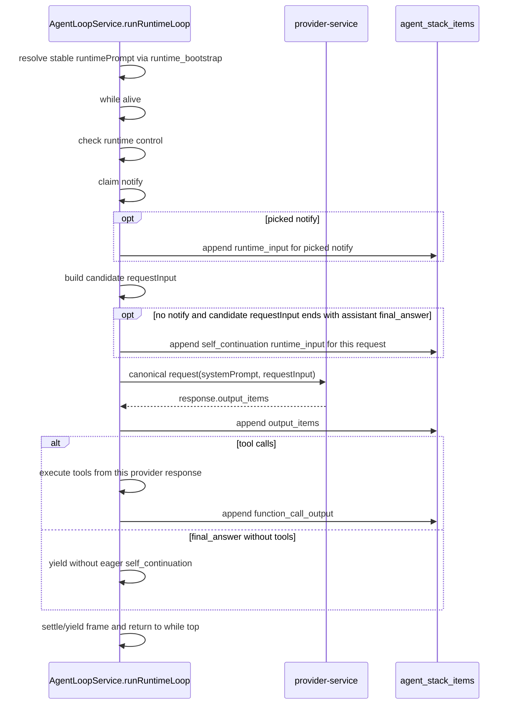

# Xiaoni Notify Runtime Architecture

这份文档说明小腻当前 runtime loop、Notify Bucket、QQ inbox 和工程工具之间的边界。
当前以本文、`docs/XIAONI_AGENT_STACK_LEDGER.md` 和活跃代码为准。

## 当前契约

`Notify Bucket` 是概念桶，不是一张新的业务表。当前持久化承载是 `agent_queue_messages`，收口在 `packages/persistence/agent-queue.js`。它只表示“门铃等待被 pick”，不表示小腻正在被这条通知长期占用。所有来源只能写入这个桶，只有 `agent-service` 主 loop 消费它。

QQ 正文不在 Notify Bucket。QQ 入站正文存在 `agent_inbound_messages`，收口在 `packages/persistence/inbound-inbox.js` 和 `packages/persistence/qq-usage.js`。小腻只有在模型主动选择 `$qq-usage` 时，才通过 `agent-service /api/internal/qq-usage` 读取 inbox/window。

聊天对象的 IM 入口 `is_enabled` 是 provider-service 侧硬边界。`is_enabled=false` 时，QQ 正文仍写入 `agent_inbound_messages`，但不写 `phone_notification` 到 Notify Bucket，也就不会因为这条 QQ 消息唤醒主 loop。`auto_reply_enabled` 只保留为兼容/派生字段，不再是独立投递开关。

主 loop 由 `agent-service` 承载，但 `index.ts` 只负责启动
`AgentLoopService.runRuntimeLoop()`。runtime 自己持有 `while alive` 循环：
它在 loop 内部从 Notify Bucket pick notify。没有 notify 时，runtime 先用当前
stack/window 组装一份未追加 `self_continuation` 的候选 request，并检查这份候选
request 真正最后一个 input item。只有尾项是 `assistant final_answer`，才追加普通
`self_continuation` developer reminder；尾项不是 `final_answer` 时不追加 reminder，
直接用候选 request 发起本次模型 slice。成功处理一个真实 slice 后不做固定 poll
interval；下一轮立即回到主 `while` 顶部先 pick notify。notify 是门铃，不是认知边界，
也不是 prompt 重新组装边界。

一次 runtime loop iteration 的主链路是：

```text
AgentLoopService.runRuntimeLoop()
  -> resolve stable system prompt once from runtime_bootstrap before the main while
  -> check runtime control
  -> claim one notify from Notify Bucket
  -> append picked notify as runtime_input when a notify exists
  -> reuse stable system prompt resolved before the main while
  -> build candidate requestInput from append-only stack window + optional current runtime input
  -> if no notify and candidate requestInput ends with assistant final_answer: append normal self_continuation developer input
  -> record llm_request_slices input range
  -> POST provider-service /api/internal/agent/execute
  -> provider-service codex-provider / OpenAI
  -> append response.output_items into agent_stack_items
  -> if function_call: dispatch tools and append function_call_output
     (recover_energy waits inside the tool handler, or returns rejection immediately)
  -> if final_answer and no tool: yield; do not eagerly append self_continuation
  -> next loop first tries to pick notify
  -> settle/yield this frame, then immediately return to the top of the main while
```

`system prompt` 是 runtime service 生命周期内的稳定前缀：`AgentLoopService`
启动 runtime loop 时用 `runtime_bootstrap` 在主 `while` 前解析一次，后续 notify
不会重新读取 prompt 文件。稳定 developer 能力头是固定 request head；后续 iteration 的
请求只追加上一次 response output、tool output 或 runtime reminder。P0 上下文压缩完成后可以
重组窗口，因为那是显式压缩。



目标事实源见 `docs/XIAONI_AGENT_STACK_LEDGER.md`。迁移期旧 transcript、LLM/tool
审计表可以继续作为兼容投影或审计来源，但不要再把它们写成小腻连续认知的概念来源。

## 写入 Notify Bucket

| 来源 | 写入内容 | 当前代码入口 |
| --- | --- | --- |
| NapCat QQ message | `is_enabled=true` 时写 `phone_notification`，只含通知摘要，不含 QQ 正文。 | `modules/provider-service/src/services/inbound-agent-trigger-service.ts` |
| image task completion | `image_task_completed` completion notify，下一轮仍由主 loop pick。 | `modules/agent-service/src/services/agent-task-worker-service.ts` |
| future presence / system reminder | 仍应写同一个 bucket。 | `packages/persistence/agent-queue.js` |

写入方不直接塞 prompt，也不直接改小腻当前认知。它们只把事件放进同一个 bucket，
等待 `AgentLoopService.runRuntimeLoop()` 在 runtime loop 内 pick。事件一旦
被 pick，就从 `pending` 变成 `consumed`：门铃已经进入当前处理事务，后续 runtime iteration
不再重新渲染这条事件为当前输入。没有门铃时的候选 continuation 检查不是 notify，
不会写入或结算 `agent_queue_messages`；如果候选 request 尾项不是 `assistant final_answer`，
就不追加 `self_continuation`，直接用候选 request 发起本次模型 slice。

## QQ Inbox

QQ 入站链路分成两步：

```text
NapCat
  -> provider-service normalize inbound
  -> persist QQ body into agent_inbound_messages
  -> if is_enabled=true: enqueue phone_notification into Notify Bucket
  -> if is_enabled=false: timeline skip, no Notify Bucket row
```

`agent_inbound_messages` 是 QQ app 的正文 inbox/window。`phone_notification` 是状态栏通知。小腻看到通知，不等于已经打开 QQ 正文。

`$qq-usage` 当前走：

```text
exec_command runs qq-usage script
  -> agent-service /api/internal/qq-usage
  -> RuntimeStore
  -> packages/persistence/qq-usage.js
  -> agent_inbound_messages
```

这条链路不是 provider-service API。provider-service 负责写入 inbox 和 QQ 出站，agent-service 负责把 `$qq-usage` 作为小腻动作执行并记录 visit/seen life events。

## 模型请求与响应

Step 7 的模型请求不是 agent-service 直连 OpenAI。当前链路是：

```text
agent-service
  -> provider-service /api/internal/agent/execute
  -> codex-provider
  -> OpenAI
  -> codex-provider parse response
  -> agent-service action dispatch
```

`final_answer` / `function_call` / assistant message 都是模型响应内容。响应解析后由 `agent-service` 决定后续动作。历史 transcript 仍保持原始 phase：存下来的 `commentary` / `final_answer` 怎么样，回放和渲染就怎么样。

`final_answer` 的目标消费策略是连续推进 runtime，而不是终止主 loop。它只结束当前
provider slice / frame：

```text
canonical_response
  -> final_answer
  -> no function_call
  -> append response output items
  -> do not append final-answer-specific reminder
  -> yield to runtime main while
  -> next iteration picks notify first
  -> if no notify is picked, build candidate requestInput without self continuation
  -> if candidate requestInput ends with assistant final_answer, append normal self_continuation developer reminder to the new request
  -> otherwise send the candidate request as-is, without self_continuation
```

当前 active loop 不再追加 final-answer 专用 prompt reminder。历史同类 queue row 如果仍存在，也不再作为普通内部 `system_reminder` 渲染进 prompt；它只保留为持久层历史事实。

这里有两层记录不要混淆：

- `llm_request_slices.canonical_request` / `wire_request` / `wire_response` 是完整
  provider evidence，由 provider-service / codex-provider 返回，agent-service 只落库保存。
  Trace detail 查这一层，不做 replay 过滤。
- `responses_replay_items` 是 agent-service 为后续请求保存的 model-visible replay。
  它只保存能重新喂给模型的模型输出和工具输出；`final_answer` 后的普通
  `self_continuation` 不是提前写入上一帧 replay，而是在下一轮确认没有 notify 可 pick、
  且候选 requestInput 最后一个 input item 仍是 `assistant final_answer` 时，作为
  `developer` role `<system_reminder>` 插入本轮 request；尾项不是 `final_answer` 时
  不追加 reminder，直接用候选 request 发起本次模型 slice。

## 动作分发

| 模型选择 | 当前执行路径 | 结果如何回到 loop |
| --- | --- | --- |
| `$qq-usage` | `exec_command` 运行本地 skill 脚本，脚本调 `agent-service /api/internal/qq-usage`。 | tool output 追加进后续 request，并记录 surface visit/seen。 |
| QQ reply | `agent-service -> provider-service -> NapCat`。 | delivery state、trace、conversation item 写回持久层。 |
| `exec_command` | `agent-service -> xiaoni-executor`。 | stdout/stderr/session result 作为 tool output 进入后续 request。 |
| `inspect_image_placeholder` | `agent-service` 复用当前主 agent request 发起 image vision fork；图片 base64 只进入 no-persist fork。 | 返回 `<image id="...">含义是: ...</image>`，该文本作为工具结果进入后续 request。 |
| image/provider task | `agent-service` 发起 task；完成后 task worker 存图并 enqueue completion notify。 | completion 回写 Notify Bucket，由后续 `runRuntimeLoop()` iteration pick。 |
| `recover_energy` | `agent-service` tool handler 内执行。成功时等待 `duration_minutes` 对应时长，醒来后返回 `<system_reminder>` 形式的 `function_call_output`；工程拒绝时立即返回拒绝原因。 | 不写 `release_lease` tool result，不 enqueue 恢复 self-continuation notify。 |
| `final_answer` | 无外部工具分发；如果没有工具调用，只追加模型 output item 并 yield。下一轮先 pick notify；没有 notify 时先组装候选 requestInput，只有尾项仍是 `assistant final_answer` 时才追加普通 `self_continuation` runtime input；否则不追加 reminder，直接用候选 request 发起本次模型 slice。 | 不追加 final-answer 专用 follow-up reminder；只使用 `self_continuation` 模板。 |
| message / silent | 无外部工具分发。 | 只保存 transcript / replay / trace；后续 iteration 重新从主 while 顶部 pick notify，原始 Notify 不会重新作为当前输入。 |

## 图片理解 Fork

`inspect_image_placeholder` 不是 provider-service 里的无上下文图片摘要器。当前实现要求小腻在自己的完整主 agent 上下文中看图：

```text
main agent request
  -> clone canonical request
  -> append assistant output_text: 让我来看看这个图是啥意思
  -> append function_call inspect_image_placeholder(image_id)
  -> append function_call_output.output=[input_image data URL]
  -> call provider-service /api/internal/llm/debug
       executionMode=image_vision_fork_no_persist
       x-qqbot-no-traffic-persist: 1
  -> record media observation
  -> return <image id="...">含义是: ...</image>
```

主 loop 不保留图片 base64。后续上下文只继承图片观察文本；如果需要重新看同一张图，再按稳定图片 id 重新调用 `inspect_image_placeholder`。

## 持久化边界

这些共享表和行为必须收口到 `packages/persistence`：

| 领域 | 当前持久层文件 |
| --- | --- |
| Notify Bucket / `agent_queue_messages` | `packages/persistence/agent-queue.js` |
| QQ inbox / `agent_inbound_messages` | `packages/persistence/inbound-inbox.js` |
| `$qq-usage` projection | `packages/persistence/qq-usage.js` |
| agent stack / LLM request slices / tool executions | `packages/persistence` Prisma schema and stack helpers |
| runtime / conversation / transcript compatibility logs | `packages/persistence/agent-runtime.js` |

provider-service 和 agent-service 里的 store/service 类只能做适配和编排，不应散落共享表 SQL。

## 排障入口

- QQ 入站正文是否落库：看 `agent_inbound_messages` 和 provider-service 入站日志。
- Notify Bucket 是否写入：看 `agent_queue_messages` 的 `source`、`dedupe_key`、`status`、`available_at`。
- IM 入口关闭是否生效：看 provider-service timeline 的 `phone_notification/enqueue` 是否为 `eventPhase=skip`、`reason=auto_reply_disabled`，并确认 `agent_queue_messages` 没有对应 pending `phone_notification`。这里的 reason 是历史兼容命名，当前由 `is_enabled=0` 派生。
- 主 loop 是否消费：看 agent-service runtime 日志、目标 `agent_stack_items` / `llm_request_slices`、`agent_queue_messages` consumed 状态和 action stream trace。
- `$qq-usage` 看不到内容：先查 `agent-service /api/internal/qq-usage`，再查 `packages/persistence/qq-usage.js` 查询条件。
- 图片理解上下文或 base64 膨胀异常：查 `inspect_image_placeholder` 的 `image_vision_fork_no_persist` 请求、`agent_media_assets` 观察记录和 `<image id="...">` tool output；不要把 traffic / replay 里的 base64 当作正常长期产物。
- 模型请求或 provider 响应异常：查 `llm_request_slices`、provider-service `/api/internal/agent/execute` 和 codex-provider trace。
- `exec_command` 异常：查 `xiaoni-executor` `/api/internal/exec-command`、session state 和审计日志。
