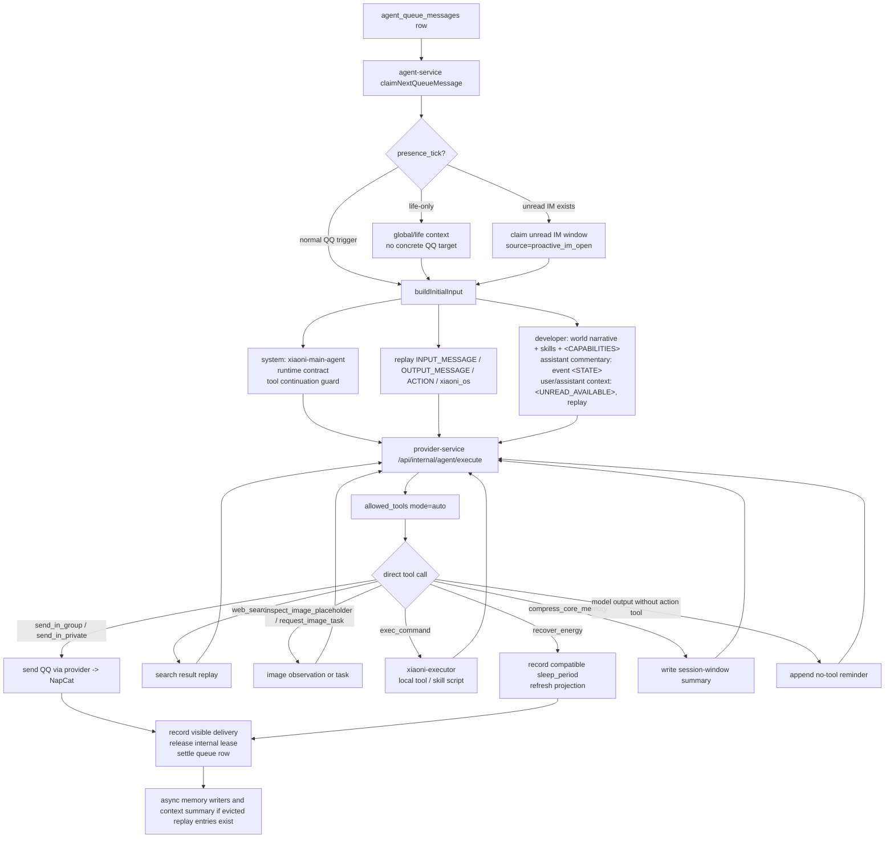
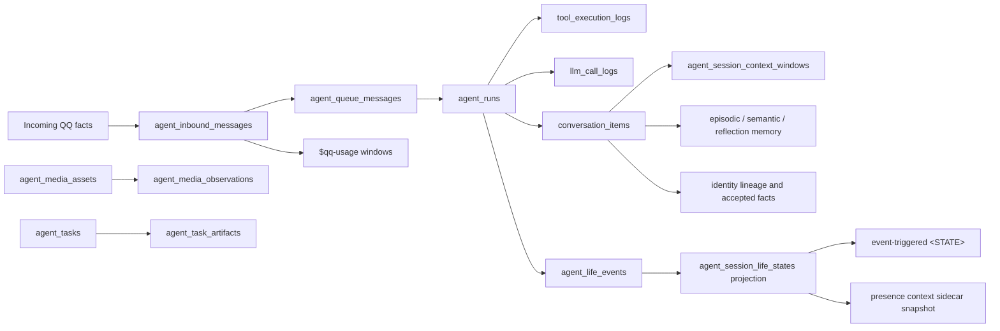

# 小腻完整运行态图

本页只放完整运行态图，方便快速定位当前小腻真实运行链路。
业务说明优先看 `docs/CURRENT_ARCHITECTURE.md`；main loop 细节看 `docs/AGENTS_AGENT_LOOP_RUNTIME.md`。

## 当前代码事实

- QQ 行为主链路：`NapCat -> provider-service -> agent-service -> provider-service -> NapCat`。
- 管理端链路：`admin-frontend -> admin-backend -> provider-service / agent-service / PostgreSQL`。
- `agent-service` 当前启动两条后台循环：queue worker 和 task worker。
- `exec_command` 当前通过 `agent-service -> xiaoni-executor` 执行，不在 `agent-service` 本容器内直接跑命令。
- 固定间隔自运行 `life_loop` 已删除；未来主动行动只能由 gated `presence_tick` evaluator 入队。
- `agent_runs` 只是 trace / delivery / retry / observability 边界，不是小腻的认知边界。
- 当前连续性落在 `conversation_items`、`agent_queue_messages`、`agent_life_events`、`agent_session_context_windows`、`xiaoni_os`、identity facts 和异步 memory 输出上。
- `agent_digital_actions` 只是历史兼容数据，不是当前自主行动主链路。

## 总运行态

```mermaid
flowchart TB
  QQ["QQ 群 / QQ 私聊"] --> NapCat["NapCat / OneBot<br/>docker-compose.napcat.yml<br/>ports 3000/3001/6099"]

  subgraph MainStack["docker-compose.yml / qq_bot_network"]
    Provider["provider-service<br/>:8090 in container / 127.0.0.1:8091<br/>NapCat webhook, inbox, policy, queue gate,<br/>provider execute, media, image, embedding, outbound"]
    Agent["agent-service<br/>:8092<br/>main loop, queue worker, task worker,<br/>qq-usage API"]
    Executor["xiaoni-executor<br/>127.0.0.1:8093 / internal :8093<br/>exec_command host, session poll/kill,<br/>audit log, git archive"]
    AdminBE["admin-backend<br/>:9080<br/>action-stream, conversations, queue,<br/>traffic, playground, image lab, runtime APIs"]
    AdminFE["admin-frontend<br/>nginx :3003 / 3904<br/>default page: /xiaoni-action-stream"]
    Expose["admin-expose-proxy<br/>Caddy :3903<br/>Cloudflare tunnel / Basic auth"]
    Embed["embedding-server<br/>:8080 internal<br/>embeddinggemma"]
    PG[("PostgreSQL 16<br/>qqbot_db")]
  end

  subgraph ExternalAI["External / local providers"]
    OpenAI["OpenAI / compatible APIs<br/>gpt-5.x, image provider"]
    CodexAuth["Codex local OAuth profiles<br/>/root/.qqbot-local/codex-auth-profiles"]
    Gemini["Gemini CLI OAuth"]
    WebSearch["Hosted web_search"]
  end

  subgraph Storage["Important persistent state"]
    Workspace[("workspace checkout<br/>/workspace/qq_bot<br/>/app compatibility symlink")]
    Settings[("group_chat_settings<br/>private_chat_settings")]
    Inbox[("agent_inbound_messages<br/>durable IM inbox, unread/read cursor")]
    Queue[("agent_queue_messages<br/>pending / processing / settled<br/>internal queue lifecycle")]
    Runs[("agent_runs<br/>internal execution lease<br/>trace / retry / delivery join key")]
    Tools[("tool_execution_logs<br/>tool calls and results")]
    LlmLogs[("llm_call_logs<br/>canonical / wire request-response")]
    Conv[("conversation_items<br/>INPUT / OUTPUT / ACTION / xiaoni_os replay")]
    Context[("agent_session_context_windows<br/>&lt;小腻近况&gt;, read cutoff,<br/>pending share")]
    Life[("agent_life_events<br/>canonical homeostasis / surface events")]
    LifeState[("agent_session_life_states<br/>projection/cache only")]
    Sidecar[("agent_presence_state_sidecars<br/>presence/context observability")]
    Media[("agent_media_assets<br/>agent_media_observations")]
    Tasks[("agent_tasks<br/>agent_task_artifacts")]
    Memory[("agent_memory_observations<br/>agent_memory_assertions<br/>agent_memory_reflections")]
    Identity[("xiaoni_identity_roots<br/>identity_lineage_events<br/>accepted_identity_facts<br/>runtime_identity_activation_traces")]
    Traffic[("http_traffic_logs<br/>logs/qqbot-traffic<br/>CLIProxyAPI logs")]
    ExecRuntime[("~/.qqbot-local/xiaoni-runtime<br/>sessions, exec logs, git archives")]
    HostDocker[("host Docker socket<br/>/var/run/docker.sock")]
    DigitalCompat[("agent_digital_actions<br/>historical compatibility only")]
    Playground[("prompt / playground / image_lab tables")]
  end

  NapCat -->|"OneBot webhook<br/>/webhook or /api/onebot/events"| Provider
  Provider -->|"buildNapcatInboundContext"| Inbox
  Provider -->|"persist media placeholders"| Media
  Provider -->|"check receive / auto_reply policy"| Settings
  Provider -->|"participation event<br/>hard boundary only"| Runs
  Provider -->|"group @ or authorized direct<br/>claim IM window"| Queue
  Provider -->|"unmentioned group / unauthorized DM"| Inbox
  Provider -->|"continuous learning / transcript side effects"| Context

  Agent -->|"claimNextQueueMessage"| Queue
  Agent -.->|"future gated evaluator: presence_tick"| Queue
  Agent -.->|"materialized active IM: proactive_im_open"| Queue
  Agent -->|"select unread thread / claim window"| Provider
  Provider -->|"/api/inbox/conversations<br/>/api/inbox/messages/claim"| Inbox

  Agent -->|"build initial input"| Conv
  Agent -->|"read &lt;小腻近况&gt; / read cutoff"| Context
  Agent -->|"read identity facts"| Identity
  Agent -->|"read life projection and costs"| LifeState
  Agent -->|"optional media context"| Media
  Agent -->|"submit canonical request<br/>/api/internal/agent/execute"| Provider
  Provider -->|"provider-debug-service<br/>executeAgentRequest"| OpenAI
  Provider --> CodexAuth
  Provider --> Gemini
  Provider --> WebSearch
  Provider -->|"log provider/runtime calls"| LlmLogs
  Provider -->|"trace spans / traffic fallback"| Traffic

  Agent -->|"tool log start/end"| Tools
  Agent -->|"claim/release internal execution lease"| Runs
  Agent -->|"append transcript / rawRequest / rawResponse"| Conv
  Agent -->|"append surface_visit / qq_message_seen / speak / silence / compatible sleep_period"| Life
  Agent -->|"refresh deterministic projection"| LifeState
  Agent -->|"record presence context snapshot"| Sidecar

  Agent -->|"send_in_group / send_in_private"| Provider
  Provider -->|"/api/internal/send_group<br/>/api/internal/send_private"| NapCat
  NapCat --> QQ

  Agent -->|"web_search tool"| Provider
  Agent -->|"inspect_image_placeholder"| Provider
  Provider -->|"/api/internal/media/inspect"| OpenAI
  Provider -->|"media observation result"| Media
  Agent -->|"request_image_task"| Tasks
  Agent -->|"task worker claims"| Tasks
  Agent -->|"/api/internal/image/generate or edit"| Provider
  Provider -->|"image provider"| OpenAI
  Agent -->|"write artifacts / optional group image delivery"| Tasks
  Agent --> Provider

  Agent -->|"exec_command<br/>/api/internal/exec-command"| Executor
  Executor -->|"workspace mount<br/>/app -> /workspace/qq_bot"| Workspace
  Executor -->|"session snapshots / audit / git archive"| ExecRuntime
  Executor -->|"docker socket when needed"| HostDocker
  Agent -->|"qq-usage reads thread list/window<br/>and marks read"| Inbox
  Agent -->|"POST /api/internal/qq-usage"| Agent

  Agent -->|"evicted replay entries after compaction threshold"| Memory
  Agent -->|"core_memory_pressure<br/>tool_choice=compress_core_memory"| Agent
  Agent -->|"compress_core_memory text"| Context
  Agent -->|"identity activation / candidates"| Identity

  AdminFE -->|"/api/*"| AdminBE
  Expose --> AdminFE
  AdminBE -->|"DB queries"| PG
  AdminBE -->|"proxy inbox"| Provider
  AdminBE -->|"probe /activity-feed / tasks / media"| Agent
  AdminBE -->|"provider status / traffic replay / image lab / playground"| Provider
  AdminBE --> Traffic
  Provider -->|"embedding proxy / v1 surface"| Embed

  PG --- Settings
  PG --- Inbox
  PG --- Queue
  PG --- Runs
  PG --- Tools
  PG --- LlmLogs
  PG --- Conv
  PG --- Context
  PG --- Life
  PG --- LifeState
  PG --- Sidecar
  PG --- Media
  PG --- Tasks
  PG --- Memory
  PG --- Identity
  PG --- Traffic
  PG --- DigitalCompat
  PG --- Playground
```

## Main Loop 细图

## 数据状态图

## 排障入口

- 不发言：先看 `agent_queue_messages`，再看 `agent_runs` 这层内部 execution lease，最后看是否调用了 `recover_energy`、是否已有 `visible_delivery_committed` 事件，或是否仍在 no-tool continuation。
- 上下文断裂：看 `conversation_items`、`raw_response.xiaoni_os`、`agent_session_context_windows.context_summary`。
- 主动 presence 行为：看 `presence_tick` / `proactive_im_open` queue row、`agent_life_events`、`agent_session_life_states`、`raw_response.xiaoni_os`。
- QQ 未读导航：看 `agent_inbound_messages` 和 `$qq-usage` 输出。
- `exec_command` 异常：看 `qqbot-xiaoni-executor`、`/home/liahua/.qqbot-local/xiaoni-runtime` 和 `docs/AGENTS_XIAONI_EXECUTOR.md`。
- 重复发送：看 `agent_runs.delivery_phase`、delivery commit count、outbound tool fingerprint。
- 图任务：看 `agent_tasks`、`agent_task_artifacts`、provider image endpoints、group image delivery logs。
