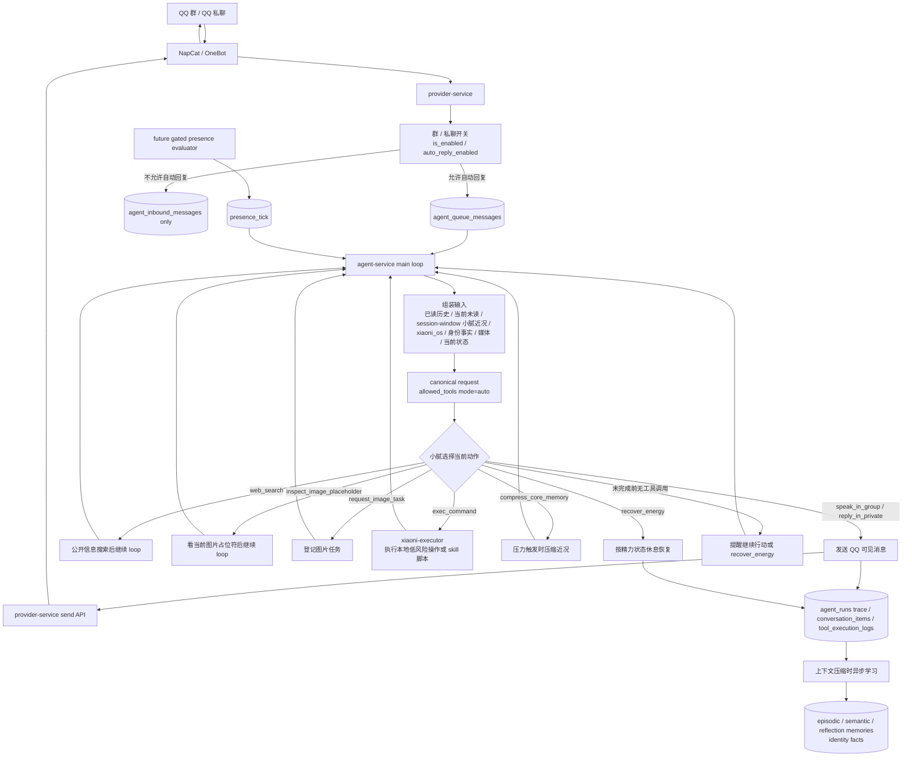
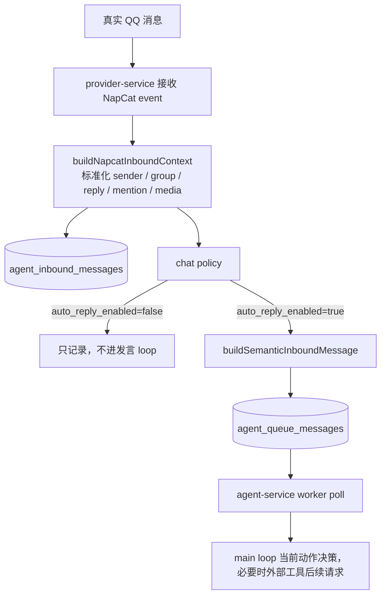
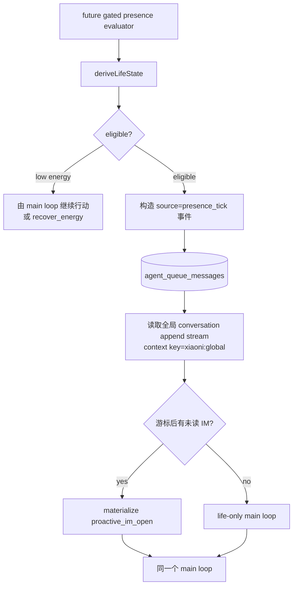

# 小腻被动发言与主动发言链路

本文回答三个问题：

- 当前系统整体架构是什么样。
- 小腻被动发言和主动发言分别经历哪些阶段。
- 主聊天 loop 现在如何避免普通场景变成固定状态机。

如果只想先看业务总览，先读 `docs/CURRENT_ARCHITECTURE.md`。如果要查 loop 工具收缩、恢复曲线和防重细节，继续看 `docs/AGENTS_AGENT_LOOP_RUNTIME.md`。

## 总架构



一句话：被动发言和未来 gated `presence_tick` 主动事件都汇入同一个 `agent-service` main loop。普通说话不再先提交一个超长生活动作结构；小腻直接从当前允许工具里行动。`agent_runs` 是 trace / delivery / retry 边界，不是小腻的认知边界。

## 当前运行时契约

- 产品心智是 `while true` 连续事件流。
- prompt-facing 私密备注标签统一为 `<xiaoni_os>`。不要用工程术语解释它；它是留给之后自己的备注，不发给 QQ。
- `<STATE>` 不是每次模型请求固定注入，只在状态事件发生时追加：action/tool 计数阈值、hosted `web_search` 后、低精力提醒、负精力后的完整恢复、休息中被连续直接 @ 打断。
- energy 只注入当前数值和满值，例如 `energy="0.42" max_energy="1.00"`；不注入 pressure、dopamine 或 high / medium / low 标签。
- energy 可以低于 0。恢复计算从 `max(0, current_energy)` 开始，120 分钟恢复到 `max_energy`。小腻只有在 `<STATE>` 可见时才知道具体精力数值。
- prompt-facing 休息工具统一为 `recover_energy`。`rest_period` / `sleep_period` 只能作为历史兼容或内部事件名。
- `<CAPABILITIES>` 在主 loop 输入开头注入一次，列出当前工具、skill 和 energy cost。
- 动作未完成前，“没有工具调用”不是沉默也不是结束；runtime 会继续提醒小腻选择真实动作，或者按精力状态调用 `recover_energy`。

## 被动发言路径



`provider-service` 只做入口边界、标准化、记录、入队，不负责最终判断小腻该不该说话。

关键代码入口：

- `modules/provider-service/src/index.ts`：NapCat event 入站、policy、queue enqueue。
- `modules/provider-service/src/services/inbound-inbox-service.ts`：入站消息持久化。
- `packages/persistence/agent-queue.js`：`agent_queue_messages` 入队。
- `modules/agent-service/src/services/agent-loop-service.ts`：主 loop 决策、发送、恢复、外部工具后续请求。

## 主动生活路径



`presence_tick` 不是第二套 planner，也不能硬编码兴趣、动机或读书 seed。它只能在状态、预算、冷却和未读游标检查通过后，把“小腻当前有一次行动机会”append 进同一条事件流。固定间隔 `life_loop` 已删除，不是当前契约。

presence 起源场景读取全局 conversation append stream，并使用 `xiaoni:global` 作为 context summary / read-cutoff 兼容 key。即使当前动作 materialize 成 `proactive_im_open`，也不会退回到单个群/私聊的局部历史。这个 `xiaoni:global` 近况仍是 `agent_session_context_windows` 里的 session-window 摘要，不是已经落地的 event-backed 全局 digest，也不会自动 fallback 到某个群 summary。

life-only 没有具体 IM 目标时不能发 QQ；当前只能使用 `exec_command`、`web_search`、`compress_core_memory` 或 `recover_energy`。

## Main Loop 工具集合

当前 group chat 工具定义包含：

```text
exec_command
web_search
compress_core_memory
speak_in_group
inspect_image_placeholder
request_image_task
recover_energy
```

private chat 工具定义包含：

```text
exec_command
web_search
compress_core_memory
reply_in_private
recover_energy
```

life-only 工具定义包含：

```text
exec_command
web_search
compress_core_memory
recover_energy
```

普通请求使用 `allowed_tools(mode=auto)`。压力请求会临时把 `allowed_tools` 限制为 `compress_core_memory`。

## 行动语义

### 说话

`speak_in_group` 和 `reply_in_private` 是可见 QQ delivery。成功后 runtime 记录 delivery commit；同一 run 后续可见 delivery 会被防重挡住。

### 搜索

`web_search` 只用于公开事实、新鲜资料、官方页面或指定 URL。工具返回后 runtime 会把结果和新的 `<STATE>` 放回 loop，让小腻继续行动。

### 图片

`inspect_image_placeholder` 用于当前上下文图片内容不清。`request_image_task` 用于登记生成/编辑任务。图片任务不能吞掉用户同批提出的可见回复需求；runtime 会强制补可见状态回复。

### 本地操作

`exec_command` 用于本地 skill 脚本或必要的低风险操作。当前 compose 配置下，
`agent-service` 会把命令转发到 `xiaoni-executor`；executor 保存 session、
审计日志和 git archive，并把 `/app` 路径映射到挂载的仓库工作区。QQ 阅读/导航
通过 `$qq-usage` 的脚本完成，不把导航动作暴露成 OpenAI tools。

### 恢复

`recover_energy` 是小腻自己选择休息恢复的工具。她不应该假装知道不可见的当前精力；如果 `<STATE>` 没给数值，只能基于自己当前疲惫感和是否还想继续来选时长。

### 压缩近况

`compress_core_memory(text)` 是压力专用工具。工程检测到上下文压力时会强制允许它，并把工具文本写入未来 `<小腻近况>`。

## 所有 LLM 交互面

### 主聊天 agent: `chat_bot`

调用位置：`agent-service -> provider-service /api/internal/agent/execute`

canonical request 结构：

```text
model: runtimePrompt.modelName

instructions:
  runtimePrompt.systemPrompt
  + stable runtime contract

input:
  developer CAPABILITIES
  historical INPUT_MESSAGE / OUTPUT_MESSAGE / ACTION / xiaoni_os
  current queue batch
  optional media / event STATE

tools:
  see Main Loop 工具集合

tool_choice:
  allowed_tools(mode=auto), except pressure requests that require compress_core_memory

parallel_tool_calls: false
prompt_cache_key: qq:group:<groupId> or related runtime key
prompt_cache_retention: usually 24h
```

### 图片 inspect

`inspect_image_placeholder` 本身是主聊天 agent 的工具调用。工具执行时，如果图片没有缓存观察，会再调用 provider 的 media inspect：

```text
endpoint: provider-service /api/internal/media/inspect
input:
  trace_id
  image_url
  prompt: 请用中文客观描述这张图片里可见的内容。只描述可见事实，不要猜测隐私、身份或意图。

output:
  agent_media_observations
```

### 图片生成 / 编辑

`request_image_task` 登记任务到 runtime task 表，再由 image provider 链路处理。任务登记本身不是 QQ 可见回复。

## 排障

| 现象 | 优先看哪里 |
|---|---|
| 明明调用说话工具但没发出 | `tool_execution_logs`、provider send API、`markRunDeliveryCommitted` |
| 模型没有工具调用 | no-tool continuation reminder；动作未完成前不会被当作沉默 |
| 可见回复后又试图发第二次 | delivery commit / duplicate outbound fingerprint |
| 图片任务后没回用户状态 | forced visible reply 日志 |
| life-only 想发 QQ | 没有具体 IM 目标时不允许；看是否只暴露 life-only 工具 |
| 本地命令执行异常 | `docs/AGENTS_XIAONI_EXECUTOR.md`、`qqbot-xiaoni-executor` logs、session poll/kill |
| 休息恢复不符合预期 | `recover_energy.duration_minutes`、`recoverRuntimeEnergy`、`agent_life_events` |
| 上下文断裂 | `conversation_items.raw_response.xiaoni_os`、`agent_session_context_windows.context_summary` |
| 压缩后忘记刚才在干什么 | `core_memory_pressure` reminder、`compress_core_memory` 工具文本、read cutoff |
