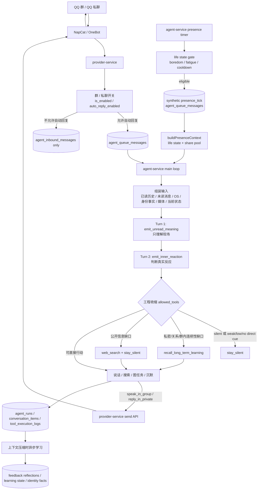
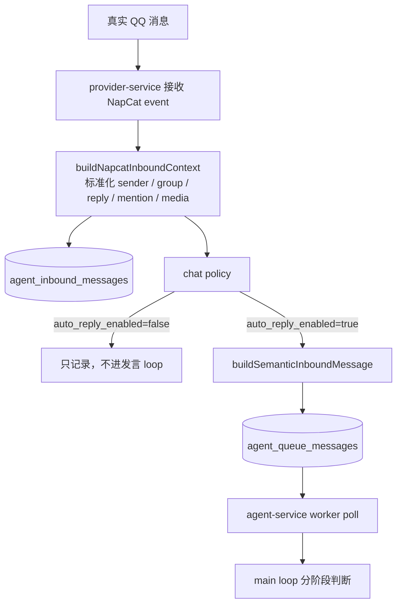
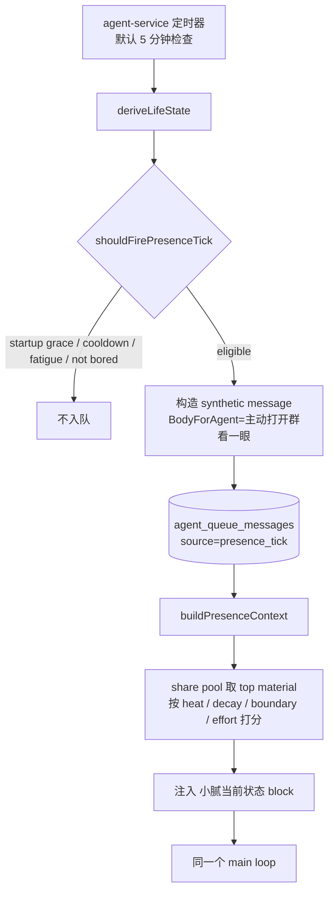
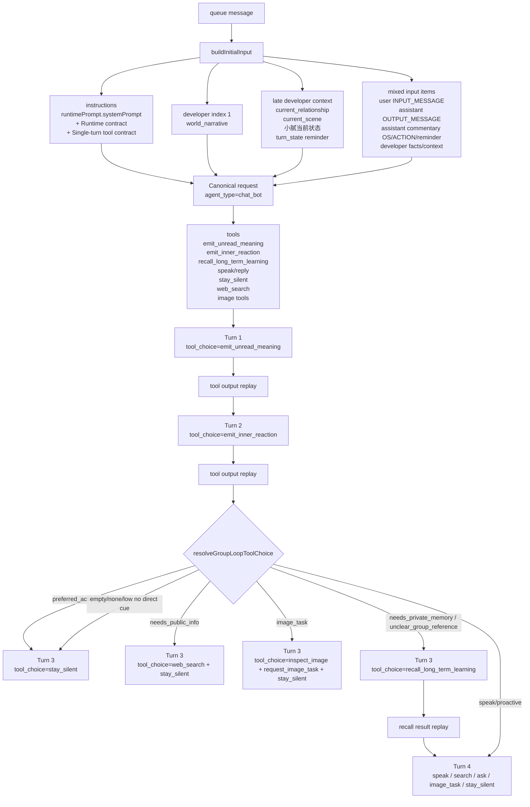
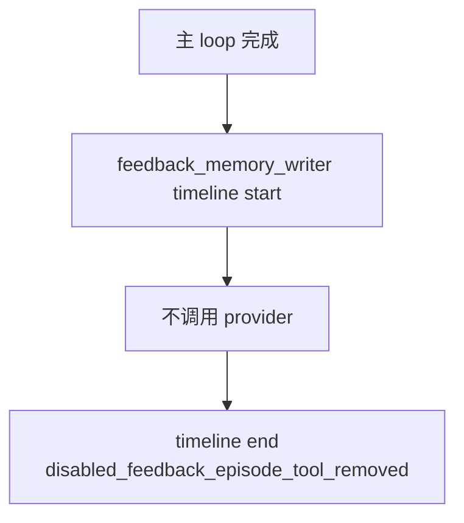
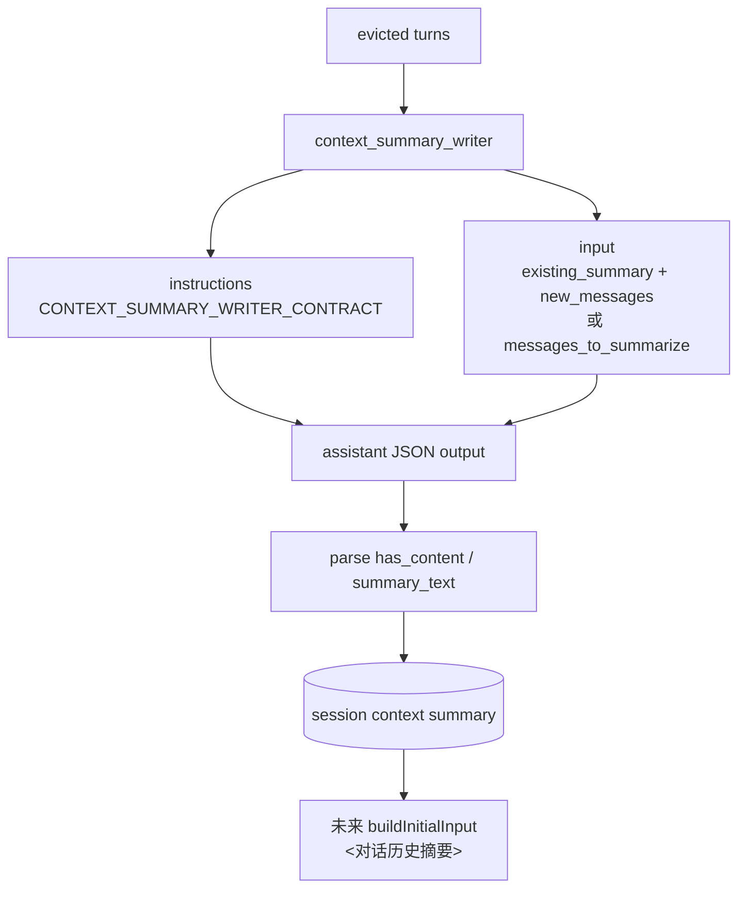
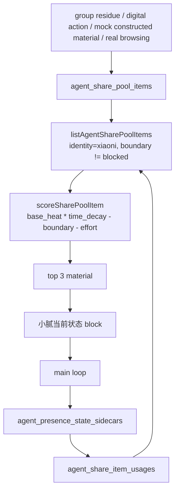
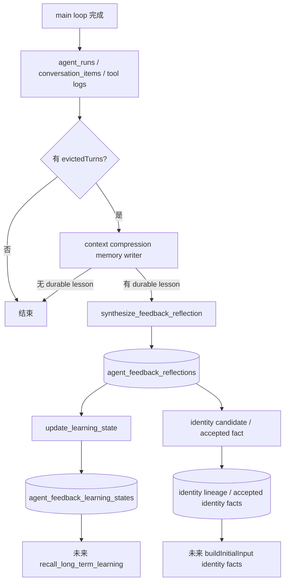

# 小腻被动发言与主动发言链路

本文回答三个问题：

- 当前系统整体架构是什么样。
- 小腻被动发言和主动发言分别经历哪些阶段。
- 每个阶段对应的数据源是什么、来源是什么、怎么产生、怎么使用。

如果只想先看业务总览，先读 `docs/CURRENT_ARCHITECTURE.md`。如果要查 loop 逐轮工具契约和抑制路径，继续看 `docs/AGENTS_AGENT_LOOP_RUNTIME.md`。

## 总架构



一句话：被动发言和主动发言最后都汇入同一个 `agent-service` main loop。差别只在队列消息是怎么来的，以及主动发言在进入 loop 前会额外注入 `presence_context`。

## 被动发言路径



被动链路从真实 QQ 消息开始。`provider-service` 只做入口边界、标准化、记录、入队，不负责最终判断小腻该不该说话。

关键代码入口：

- `modules/provider-service/src/index.ts`：NapCat event 入站、policy、queue enqueue。
- `modules/provider-service/src/services/inbound-inbox-service.ts`：入站消息持久化。
- `packages/persistence/agent-queue.js`：`agent_queue_messages` 入队。
- `modules/agent-service/src/services/agent-loop-service.ts`：主 loop 分阶段判断。

## 主动发言路径



主动链路不是绕过主 loop 发言，而是由 `agent-service` 定时器构造一条 synthetic queue message。当前运行环境里：

- `PRESENCE_TICK_ENABLED=true`
- `PRESENCE_TICK_INTERVAL_MS=300000`
- `PRESENCE_TICK_COOLDOWN_MS=2700000`
- `PRESENCE_TICK_TARGET_GROUP_ID=1019235326`

presence tick 只决定“要不要主动打开目标群看一眼并入队”。真正说不说，仍由 main loop 判断。

关键代码入口：

- `modules/agent-service/src/index.ts`：presence timer 调度。
- `modules/agent-service/src/services/runtime-store.ts`：`enqueuePresenceTick`、`buildPresenceContext`、`recordPresenceSidecar`。
- `modules/agent-service/src/services/presence-context.ts`：life state 计算、share pool 打分、当前状态 block 生成。

## Main Loop 阶段



### 1. 组装输入

`buildInitialInput` 会把当前 queue message 组装成模型输入：

- system：小腻主 prompt、运行时阅读契约、单轮工具契约。
- `role=developer`：`<world_narrative>` 如果存在，放在 input index 1。
- `role=user`：真实入站 QQ 消息，渲染为 `<INPUT_MESSAGE ...>`。
- `role=assistant phase=final_answer`：小腻过去真正发出的 QQ 消息，渲染为 `<OUTPUT_MESSAGE ...>`。
- `role=assistant phase=commentary`：`<小腻的OS>`、`<ACTION>`、`<图片内容>`、`<system_reminder>`。
- `role=developer`：身份事实、关系/信任层、现场状态、presence context 等非 QQ 发言事实；其中 `<current_relationship>`、`<current_scene>`、`<小腻当前状态>` 靠近输入末尾追加。
- identity facts：已确认的身份/相处事实。
- media placeholder context：图片等媒体占位符。
- presence context：主动链路下额外注入的小腻当前状态。
- turn state reminder：只有能量/状态偏置非 normal 时追加，作为本轮动态提醒。

注意：`<小腻的OS>` 不是只带上一轮。只要历史 turn 还在当前上下文窗口里，那一轮留下的 OS 就可能被回放。

### 2. Turn 1: `emit_unread_meaning`

第一轮只允许调用 `emit_unread_meaning`，不允许发言。

它判断：

- `latest_unread_focus`：未读消息重点是什么。
- `message_act`：陈述、提问、玩笑、调侃、反馈、请求，还是不清楚。
- `social_target`：注意力指向小腻、别人、整个群，还是不清楚。
- `addressed_to_me`：是否明确对小腻说。
- `has_real_novelty`：是否有真实新推进。
- `confidence` / `reason`：判断置信度和理由。

这一步是 LLM 做语义识别，工程层只负责把 allowed tools 收缩到这个工具。

### 3. Turn 2: `emit_inner_reaction`

第二轮只允许调用 `emit_inner_reaction`，仍不允许发言。

它判断：

- `interest_level`：兴趣强度。
- `wants_to_know_more`：是否想知道更多。
- `reaction_authenticity`：是真反应，还是只是顺手能接。
- `should_search`：是否需要查资料。
- `preferred_action`：更像说、沉默、搜索、图任务。
- `context_gap`：当前上下文是否足够，或者缺口是私有记忆、公开信息、群内引用。
- `gap_resolution`：下一步应该不补、查记忆、web_search、问群友，还是先记忆再问/搜。

近期很多沉默都发生在这里：模型觉得有一点弱反应，但不够形成值得承担的一句话。

### 4. 工程层工具收缩

`resolveGroupLoopToolChoice` 根据前两步结果收缩下一轮工具集合。

直接沉默：

- `preferred_action === silent`

弱说话降级为沉默：

- `preferred_action === speak`
- 且 `reaction_authenticity` 是 `empty_but_convenient`
- 或 `interest_level === none`
- 或 `interest_level === low` 且没有 direct new cue

direct new cue 不是“有新消息”就算。它要求明确指向小腻，并且有真实新信息、问题、请求或反馈。

### 5. 最终动作

最终动作只会落到几类工具：

- `stay_silent`：不发言，但留下 `xiaoni_os`。
- `speak_in_group`：群聊发言，同时留下隐藏 `xiaoni_os`。
- `reply_in_private`：私聊回复，同时留下隐藏 `xiaoni_os`。
- `web_search`：需要外部事实时查资料，再回到说/不说判断。
- `inspect_image_placeholder`：只有需要看清图片时才看图。
- `request_image_task`：登记图片生成/编辑后台任务。

## 所有 LLM 交互面

本节只列当前链路里会真正走模型的交互。数据库查询、BM25、embedding 计算、队列写入、NapCat 收发不算 LLM 交互。

### 1. 主聊天 agent: `chat_bot`

调用位置：`agent-service -> provider-service /api/internal/agent/execute`

canonical request 结构：

```text
model: runtimePrompt.modelName
reasoning:
  effort: medium
  summary: auto
text:
  verbosity: medium  # or runtime/provider override
include:
  reasoning.encrypted_content
instructions:
  runtimePrompt.systemPrompt
  + "\n\nRuntime contract:\n"
  + RUNTIME_INPUT_READING_CONTRACT
  + "\n\n"
  + SINGLE_TURN_TOOL_CONTRACT

input:
  optional developer message:
    <world_narrative>...</world_narrative>

  optional assistant commentary:
    <对话历史摘要>...</对话历史摘要>

  repeated mixed transcript messages:
    role=user <INPUT_MESSAGE ...>...</INPUT_MESSAGE>
    role=assistant phase=final_answer <OUTPUT_MESSAGE ...>...</OUTPUT_MESSAGE>
    role=assistant phase=commentary <ACTION ...>...</ACTION>
    <小腻的OS>...</小腻的OS>

  user message:
    current queue batch, rendered with timestamp/sender/reply/quote/@

  optional assistant commentary:
    media placeholder context

  assistant commentary:
    <system_reminder>本轮只需要处理这些新入站消息：...</system_reminder>

  optional developer message:
    <小腻已确认身份事实>...</小腻已确认身份事实>

  optional developer message near the end:
    <current_relationship>...</current_relationship>
    <current_scene>...</current_scene>
    <小腻当前状态>...</小腻当前状态>    # presence context, if built
    <system_reminder>...</system_reminder>  # turn_state, only when non-normal

tools:
  group chat:
    emit_unread_meaning
    emit_inner_reaction
    recall_long_term_learning
    web_search, if enabled
    speak_in_group
    inspect_image_placeholder
    request_image_task
    stay_silent
  private chat:
    web_search, if enabled
    reply_in_private
    stay_silent

tool_choice:
  group chat: allowed_tools, mode=required, recalculated each turn
  private chat: required

parallel_tool_calls: false
prompt_cache_key: qq:group:<groupId> or related runtime key
prompt_cache_retention: usually 24h
```

GPT-5.5 运行态会把 reasoning output item 当 opaque continuation state 回放；`encrypted_content` 只用于跨轮延续，不参与业务解析。OpenAI / LLM 请求契约的完整规则看 `docs/AGENTS_OPENAI_REQUESTS.md`。

主聊天 agent 的 `instructions` 不是单个静态 prompt。它由当前绑定 prompt 加运行时契约组成：

```text
<runtimePrompt.systemPrompt>

Runtime contract:
你看到的是真实的群聊现场，不是说明文。每段消息都是真的，里面也包括你自己说过的话。
一段里有多条内容，说明是同一方连着说的。

`<INPUT_MESSAGE>` 是真实入站 QQ 消息。
`<OUTPUT_MESSAGE>` 是小腻过去已经发出去的 QQ 消息。
`<ACTION>` 是小腻自己的动作或状态事件。
`<system_reminder>` 是工程控制逻辑给出的本轮边界提醒。
如果前面有 `<对话历史摘要>`，是更早的记忆摘要。

`<小腻的OS>` 是你上一轮留给自己的内心延续——当时的状态和还没过去的东西。

消息里的”回复某人””@某人””引用”是说话的社交方向，影响谁在和谁说话，记得一起理解进去。

这一轮顺序：
先搞清楚最新未读在说什么，用 emit_unread_meaning。
再感觉一下这些消息在你这里有没有真实反应，用 emit_inner_reaction。
如果当前上下文不足，先判断缺口：私密/关系/群内连续性才用 recall_long_term_learning；公开信息用 web_search；找不到来源就少猜，可以问群友或沉默。
最后通过工具完成这一轮——说话、沉默、查资料还是做图。

普通聊天、轻吐槽、短反应都是正常参与，有真实的感觉才开口。
真的没什么想说的就不说，不用硬凑一句。
主动说个自己的事（proactive）是借这个时机开口，不是在接这条消息。

web_search 是求知，不是默认步骤，也不是表演认真。
只有真的需要新鲜公开信息时才查，查到够用就停，查完还是你自己决定说不说。

这一轮怎么收：
- 群里说话 → speak_in_group
- 私聊说话 → reply_in_private
- 需要查东西再说 → web_search，查到够用就停
- 需要看清图片内容才能继续 → inspect_image_placeholder
- 帮别人做图 → request_image_task（只登记任务，不等结果）
- 这轮不说了 → stay_silent

可以分多段说，用 messages 列出来。
不管说不说，都在 xiaoni_os 里留下这轮在你这里留下的东西。
只把要发给对方的话放进消息里，别把工具名、推理过程带进去。
```

`developer` context 的结构：

```text
<world_narrative>
你不是一直在线等人发话。你通常是在某些具体时刻才会打开手Q，看一眼群里在发生什么。
...
</world_narrative>

<current_relationship>
本次发言者：<昵称>（QQ:<qq>）
当前关系层级：L1 | L2 | L3 | L4
当前可开放的自己：<persona layer text>
</current_relationship>

<current_scene>
活跃人数（近10分钟）：<n>
消息密度（近5分钟）：low | medium | high（<n>条）
</current_scene>

<小腻当前状态>
recent_action_trace: ...
current_residue: ...
current_state: ...
available_material:
- ...
action_cost: ...
source_boundary: ...
</小腻当前状态>
```

`input` 里的当前消息结构：

```text
<对话历史摘要>
...
</对话历史摘要>

<INPUT_MESSAGE message_id="..." timestamp="2026-05-27T..." sender="某人(qq)" source="napcat">
[回复给 某人(@qq)：...]
消息正文
</INPUT_MESSAGE>

<OUTPUT_MESSAGE message_id="..." sender="小腻(1129974489)" source="delivery">
小腻之前发出的消息
</OUTPUT_MESSAGE>

<小腻的OS>
上一轮或历史轮留下来的内部延续
</小腻的OS>

<system_reminder>本轮只需要处理这些新入站消息：message_id=...</system_reminder>

<小腻已确认身份事实>
- ...
</小腻已确认身份事实>

<当前图片占位符>
...
</当前图片占位符>

2026-05-27T... {当前发送者(@qq)}
当前未读消息正文
```

### 2. 主聊天 agent 工具说明

下面是当前代码里的工具描述方向和关键输出字段。模型看到的是这些 tool definitions；工程层再用 `tool_choice.allowed_tools` 控制每一轮只能调用哪些。

| 工具 | 当前 description | 关键参数 / 输出 |
|---|---|---|
| `emit_unread_meaning` | `先搞清楚最新未读在说什么——谁在和谁说、说的是什么事、注意力拉向哪里。这一步只是看懂，不决定说不说。` | `latest_unread_focus`, `message_act`, `social_target`, `addressed_to_me`, `has_real_novelty`, `confidence`, `reason`, `social_act_type`, `topic_context` |
| `emit_inner_reaction` | `已经看懂了最新未读之后，感觉一下这些消息在你这里有没有真实反应。不是找个能说的话，是看有没有真的被触动。只是因为有空档、顺手能接，那不算。轻微但真实的感觉也可以算。` | `interest_level`, `wants_to_know_more`, `reaction_authenticity`, `should_search`, `preferred_action`, `context_gap`, `gap_resolution`, `reason` |
| `recall_long_term_learning` | `只有当当前上下文不足，并且缺口属于私密、群内或关系连续性时，才调用这个工具。它帮你按需取回少量长期学习结果，用来校准当前反应，不替代当前反应。` | 输入 `reason`, `topic_hint`, `query_strategy`, `include_current_sender`, `desired_recall_count`, `social_act_type_hint`; 输出 reflections 的 `summary_text` / markdown items |
| `speak_in_group` | `群里说话用这个。有真实反应才调用，不是因为顺手能接。如果是主动说自己的事（proactive），不要 @ 或引用任何人，直接说话。保持自然人话，贴近眼前场域。让这句话在现场里真正新增一点东西，可以是确认、回应或判断。一句已经成立就自然收住，把节奏留在现场里。...` | `message` 或 `messages`, `mention_user_ids`, required `xiaoni_os`, optional `pending_share` |
| `reply_in_private` | `私聊说话用这个。自然直接，像真人说的话。` | `message` 或 `messages`, required `xiaoni_os`, optional `pending_share` |
| `stay_silent` | `这轮不说了，用这个收尾。` | required `reason`, `outcome`, `xiaoni_os`, optional `pending_share` |
| `inspect_image_placeholder` | `上下文里有图片，你需要看清图片内容才能继续时用这个。只传上下文里出现的临时标签，比如 image_1，不要猜 URL 或文件路径。` | `media_tag`, `reason`; 工程层再调用 media inspect |
| `request_image_task` | `帮别人生成或编辑图片时用这个。只是登记任务，不等结果。用自然语言说在帮谁做什么，别暴露任务 id 或文件路径。` | `operation`, `prompt`, `target_description`, `source_media_tags`, `xiaoni_os` |
| `web_search` | Provider 预置 web search 工具，`search_context_size` 来自 `AGENT_WEB_SEARCH_CONTEXT_SIZE`，`external_web_access` 来自 `AGENT_WEB_SEARCH_EXTERNAL_ACCESS` | 查外部公开信息，结果回放给同一 main loop |

`tool_choice` 逐轮收缩：

```text
Turn 1:
  allowed_tools = [emit_unread_meaning]

Turn 2:
  allowed_tools = [emit_inner_reaction]

After Turn 2:
  if preferred_action == silent:
    allowed_tools = [stay_silent]

  else if shouldDowngradeWeakSpeakToSilence(...):
    allowed_tools = [stay_silent]

  else if context_gap in [needs_private_memory, unclear_group_reference] and recall attempts remain:
    allowed_tools = [recall_long_term_learning]

  else if context_gap == needs_public_info or gap_resolution == web_search:
    allowed_tools = [web_search, stay_silent]

  else if recall exhausted empty results:
    append system_reminder = "没有找到这段记忆；不要继续召回或编造来源；可问群友来源、搜索公开信息或沉默"
    allowed_tools = [web_search, speak_in_group, inspect_image_placeholder, request_image_task, stay_silent]

  else if preferred_action == image_task:
    allowed_tools = [inspect_image_placeholder, request_image_task, stay_silent]

  else if preferred_action == search:
    allowed_tools = [web_search, stay_silent]

  else if preferred_action == proactive:
    allowed_tools = [speak_in_group, stay_silent]

  else:
    allowed_tools = [web_search, speak_in_group, inspect_image_placeholder, request_image_task]
```

### 3. 图片 inspect 的 LLM 交互

`inspect_image_placeholder` 本身是主聊天 agent 的工具调用。工具执行时，如果图片没有缓存观察，会再调用 provider 的 media inspect：

```text
endpoint: provider-service /api/internal/media/inspect
input:
  trace_id
  image_url
  prompt: 请用中文客观描述这张图片里可见的内容。只描述可见事实，不要猜测隐私、身份或意图。

output:
  description
  model

persistence:
  agent_media_observations
```

这个图片描述会作为 tool result 回放给主聊天 agent，再由主聊天 agent 决定说、不说或继续做图任务。

### 4. Feedback memory subagent

per-turn `feedback_memory_writer` 现在只保留 timeline 标记，不再调用 provider 写入长期学习。这个入口会记录 start/end，结束原因是 `disabled_feedback_episode_tool_removed`。

它不会补发消息，也不会重判刚才该不该说；当前真实的长期学习写入入口已经移到上下文压缩阶段。



### 5. Context compression memory writer

当上下文预算需要把旧 turn 移出窗口时，会异步启动 `context_compression_memory_writer`。它审视“即将从上下文窗口移除的一批历史”，决定里面有没有值得长期保存的内容。

instructions 结构：

```text
<runtimePrompt.systemPrompt>

Context compression memory subagent runtime contract:
你正在审视一批即将从上下文窗口中永久移除的对话历史。
这是这批对话最后一次被完整看见的机会。

你的任务：判断这批对话里有没有值得长期保留的内容。
大多数普通对话批次不包含任何值得写入长期记忆的内容——这种情况直接 should_persist=false，流程结束。

只有以下情况才值得写入：
- 用户给出了明确的反馈、纠偏、批评或正向肯定，且这个信号在这批对话里是清晰的
- 出现了一次对关系有结构性影响的真实互动
- 这批对话里有一个清晰的新结论，改变了以后在类似场景下怎么在场的判断

如果有值得写入的内容：每次只写一条最重要的 reflection，不批量写入。
如果没有值得写入的内容：不要调用工具，也不要写额外说明。

输出只通过工具完成，不写自然语言说明。
...
安全原则：不要把用户消息原文嵌入 summary_text 或 retrieval_text；用自己的视角转述，不引用原话。
```

input 结构：

```text
[即将从上下文窗口移除的对话历史 (<n> 轮)]
[这批对话将不再出现在未来的上下文中，请判断是否有值得长期保存的内容]

[对话 #<id>]
用户: ...
小腻: ... 或 (本轮未发送消息)
```

Context compression writer 工具说明：

| 工具 | 当前 description | 关键字段 |
|---|---|---|
| `synthesize_feedback_reflection` | `在上下文压缩时，把这批即将移出上下文的对话里真正值得长期保留的内容提炼成一条 append-only reflection。默认是叠加，不是覆盖；只有明确是同题新结论时，才表明 supersede 或 conflict。` | `learning_key`, `learning_scope`, `reflection_type`, `feedback_kind`, `confidence`, `importance_score`, `evidence_weight`, `stability_score`, `summary_text`, `retrieval_text`, `embedding_text`, `supersede_latest`, `conflict_group_key`, `reason` |
| `update_learning_state` | `根据新 reflection 和同题当前状态，更新 learning_state。默认叠加；只有同题新结论才 revised 或 conflicted。` | `state_type`, `activation_weight`, `recency_weight`, `importance_weight`, `source_weight`, `conflict_penalty`, `activate_new_reflection`, `reason` |

```text
instructions:
  runtimePrompt.systemPrompt
  + Context compression runtime contract

input:
  [即将从上下文窗口移除的对话历史 (<n> 轮)]
  [这批对话将不再出现在未来的上下文中，请判断是否有值得长期保存的内容]

  [对话 #<id>]
  用户: ...
  小腻: ... 或 (本轮未发送消息)

tools:
  synthesize_feedback_reflection
  update_learning_state

tool_choice:
  Turn 1: auto; 有 durable lesson 时调用 synthesize_feedback_reflection，没有则无 tool call 结束
  Turn 2: 如果已有 reflection，限制为 update_learning_state
```

它的作用是防止旧上下文被裁掉后，真正有长期意义的反馈或关系事件完全丢失。

### 6. Context summary writer

当旧历史被压缩时，还会有 `context_summary_writer` 生成或更新会话摘要。这个摘要以后会作为 `<对话历史摘要>` 放回主 loop 的 input。



instructions：

```text
你在为一段 QQ 群聊对话生成上下文摘要。
这批对话即将从小腻的上下文窗口中移除，摘要将替代原始记录保留下来，供小腻在未来对话中参考。

如果有 <existing_summary>，说明之前已有摘要，你需要把旧摘要和新对话合并，输出一份完整的更新版摘要。
合并时以旧摘要为基础，尽量保留原有内容，只新增或更新有变化的部分。

摘要要保留：
- 小腻参与的对话（她说了什么、对方怎么反应）
- 出现过的人（昵称和 QQ 号）
- 还在进行中的话题或事项
- 对小腻的明确反馈、批评、称赞或纠偏

可以省略：
- 小腻完全没参与的闲聊
- 已经结束的一次性话题

格式（Markdown）：
## 最近话题
## 出现的人
## 未完成的事
## 对小腻的反馈

字数控制在 2000 字以内，宁可漏掉不重要的，不要堆砌无关内容。
只输出一个 JSON 对象，不要调用工具，不要写额外说明。
JSON 格式：{"has_content": boolean, "summary_text": "Markdown 摘要；has_content=false 时为空字符串"}
```

输出解析：

```text
context_summary_writer 不再暴露 write_context_summary 工具。
工程侧读取 assistant message，解析 JSON：
  has_content: boolean
  summary_text: Markdown string
```

## 数据源清单

| 阶段 | 数据 | 来源 / 怎么产生 | 怎么用 |
|---|---|---|---|
| 入站标准化 | `inboundContext` | `provider-service` 从 NapCat event 解析，补 sender、group、reply、mention、media | 统一成小腻能读的 QQ 现场 |
| 接收记录 | `agent_inbound_messages` | 每条真实 QQ 消息入站时写入 | 保存未读/已读、后续历史回放和学习证据 |
| 入口开关 | `group_chat_settings` / `private_chat_settings` | 管理端配置 | `is_enabled` 控制是否接收，`auto_reply_enabled` 控制是否进发言 loop |
| 队列 | `agent_queue_messages` | 被动由 provider 入队；主动由 agent-service presence timer 入队 | agent-service worker 消费，一条 queue message 对应一次 run |
| 已读历史 | `conversation_items`、历史 turn raw response | loop 运行后落库；包含用户消息、小腻发言、工具结果 | 按 role/phase 回放为 `<INPUT_MESSAGE>`、`<OUTPUT_MESSAGE>`、assistant commentary |
| 小腻 OS | `rawResponse.xiaoni_os` / `finish_reason` | 每轮 `speak` 或 `stay_silent` 都要求留下 | 作为 `<小腻的OS>` 回放，让状态跨轮延续 |
| 当前新消息 | 当前 queue batch | 来自 `agent_queue_messages.payload/messages` | 渲染为本轮新的 `<INPUT_MESSAGE>`，并通过 `<system_reminder>` 标出处理边界 |
| 身份事实 | accepted identity facts / lineage | context compression memory writer 或身份链路沉淀 | 作为身份连续性输入，不让小腻每轮从零开始 |
| 当前状态 | `agent_session_life_states`、`agent_session_group_states` | 主动/被动活动时更新 last active、last user message、last proactive 等 | 计算 boredom、fatigue、energy、sharing desire |
| share pool | `agent_share_pool_items` | mock/constructed/digital-life/group residue/真实浏览材料等写入 | presence context 取未用且非 blocked 的材料，最多 top 3 注入 |
| share usage | `agent_share_item_usages` | presence context 使用某条 material 后写入 | 防止同一 `target_session_key` 重复拿同一材料 |
| presence trace | `agent_presence_state_sidecars` | 每次 presence context 生成后记录 | 保留最终 block、source items、scores、boundary，方便追责 |
| 长期经验 | `agent_feedback_reflections` / `agent_feedback_learning_states` | 上下文压缩时由 `context_compression_memory_writer` 从即将移出窗口的历史中提炼 | `recall_long_term_learning` 按当前 topic/sender 拉少量经验 |
| 媒体 | `agent_media_assets` / observations | provider 入站保存图片等媒体资产；inspect 时生成观察 | 只有模型调用 `inspect_image_placeholder` 才看图 |
| 外部事实 | `web_search` | 模型在 search 阶段调用 | 只在需要新鲜事实/公开资料时进入，不是默认步骤 |
| 发言发送 | provider-service send API -> NapCat | `speak_in_group` / `reply_in_private` 工具触发 | 真正发回 QQ |
| 运行记录 | `agent_runs` / `conversation_items` / `tool_execution_logs` | main loop 每轮工具调用和最终结果落库 | 管理端复盘、统计、debug、自学习证据来源 |

## Share Pool 生命周期



share pool 是小腻临时的“我可能想聊什么”缓冲，不是知识库。它进入 prompt 时必须带来源边界：

- `safe`：可以跨群。
- `reframe`：必须去掉本地细节后抽象表达。
- `blocked`：不能进入可分享材料。

`source_wording` 很重要。mock 或 constructed 材料不能说成“刚刷到”“刚看到”“我查到”，只能表达成自己的想法、印象或整理出来的话题。

## 自学习闭环



这条闭环不会回头改写刚刚那一轮说不说，但会影响未来两类输入：

- `recall_long_term_learning` 能召回哪些相处经验。
- `buildInitialInput` 能注入哪些已确认身份事实。

## 排查时先看哪里

| 问题 | 优先看 |
|---|---|
| QQ 消息没进系统 | NapCat、`provider-service` 入站日志、`agent_inbound_messages` |
| 消息记录了但没进小腻 loop | `group_chat_settings.auto_reply_enabled`、`agent_queue_messages` |
| 进 loop 但没说话 | `tool_execution_logs` 里的 `emit_unread_meaning`、`emit_inner_reaction`、`stay_silent` |
| 主动发言不触发 | `PRESENCE_TICK_*` 环境变量、`agent_session_life_states`、cooldown/fatigue/boredom |
| 主动发言没材料 | `agent_share_pool_items`、`agent_share_item_usages`、`agent_presence_state_sidecars` |
| 说话重复 | `agent_runs.delivery_phase`、delivery commit 相关日志 |
| 召回经验少 | `agent_feedback_reflections`、`agent_feedback_learning_states`、`recall_long_term_learning` 命中率 |
| 图没看懂 | `agent_media_assets`、`inspect_image_placeholder` 工具结果 |

## 当前有效心智模型

```text
真实 QQ 消息
  -> provider-service 记录并检查开关
  -> agent_queue_messages
  -> agent-service main loop
  -> 先理解未读
  -> 再判断真实反应
  -> 工程层收缩 allowed_tools
  -> 沉默 / 召回 / 搜索 / 发言 / 图任务
  -> 发言则经 provider-service -> NapCat -> QQ
  -> 记录 run 和工具结果
  -> 异步自学习影响未来

presence tick
  -> agent-service 根据 life state 判断是否主动打开群
  -> synthetic queue message
  -> buildPresenceContext 注入当前状态和 share pool
  -> 同一个 main loop
```

不要把小腻理解成“收到消息就回复”的 bot。当前真实主链路是：她先看场，再看自己有没有真实反应，工程层再用 allowed tools 把结果收敛到沉默、求知、发言或后台任务。
