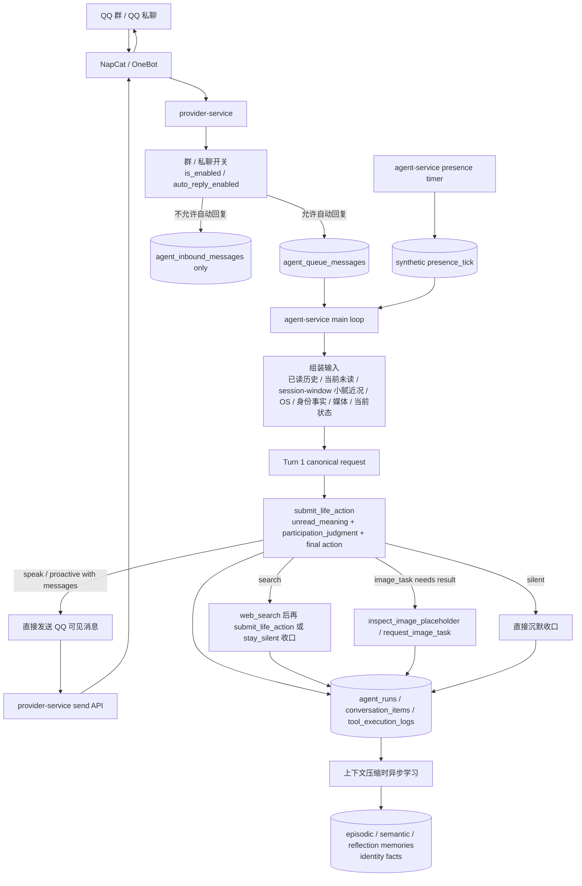
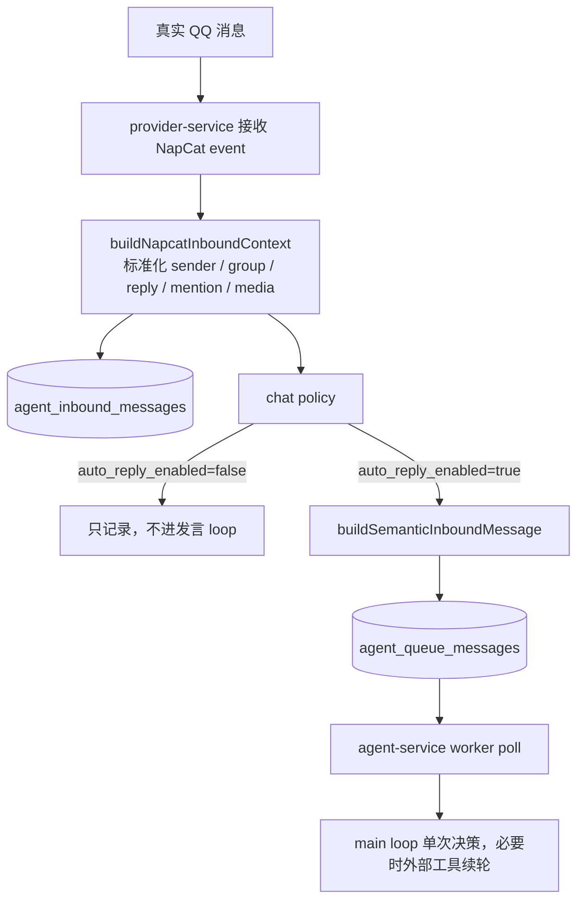
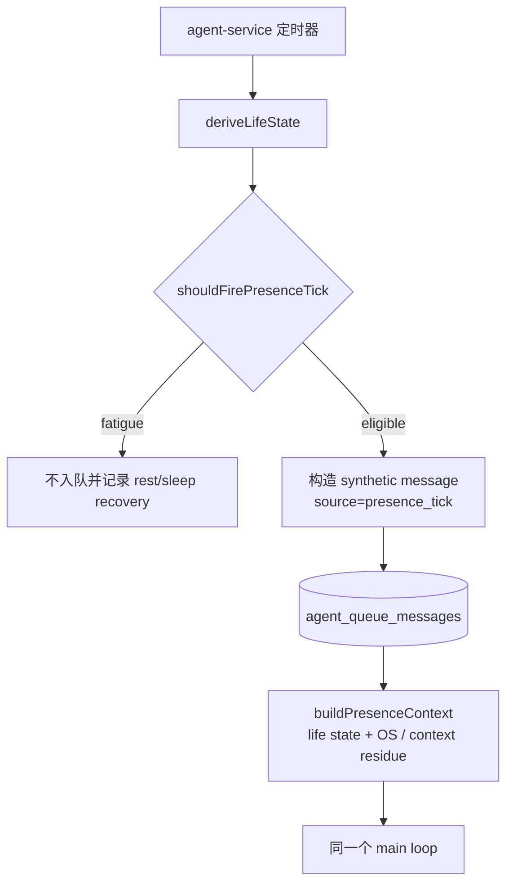

# 小腻被动发言与主动发言链路

本文回答三个问题：

- 当前系统整体架构是什么样。
- 小腻被动发言和主动发言分别经历哪些阶段。
- 主聊天 loop 现在如何避免普通场景变成三段式 turn。

如果只想先看业务总览，先读 `docs/CURRENT_ARCHITECTURE.md`。如果要查 loop 逐轮工具契约和抑制路径，继续看 `docs/AGENTS_AGENT_LOOP_RUNTIME.md`。

## 总架构



一句话：被动发言、presence 主动发言最后都汇入同一个 `agent-service` main loop。普通说话、主动说一句和沉默现在都在第一轮 `submit_life_action` 内完成；只有真正需要外部结果时才进入后续工具轮。

## 被动发言路径



`provider-service` 只做入口边界、标准化、记录、入队，不负责最终判断小腻该不该说话。

关键代码入口：

- `modules/provider-service/src/index.ts`：NapCat event 入站、policy、queue enqueue。
- `modules/provider-service/src/services/inbound-inbox-service.ts`：入站消息持久化。
- `packages/persistence/agent-queue.js`：`agent_queue_messages` 入队。
- `modules/agent-service/src/services/agent-loop-service.ts`：主 loop 决策、发送、沉默和工具续轮。

## 主动发言路径



presence tick 只决定“要不要把小腻从自己的生活里抬头看一眼这件事 append 进同一个事件流”。无聊、冷却、分享欲和启动宽限不再是硬门禁；疲劳超过恢复阈值时会先记录 `rest_period` 或 `sleep_period`，本轮不打开消息列表。处理时如果 inbox 有游标后的未读，会选择一个未读会话 claim 成 `proactive_im_open`；如果没有游标后的未读，也会作为 life-only `presence_tick` 进入同一个 main loop。未读来源是 DB 持久化状态，但每个群/私聊以上次已读最后一条为游标，IM 窗口只 materialize 游标之后的未读，旧 backlog 不能被当成当前现场。presence 起源的 tick 会读取全局 conversation append stream，并使用 `xiaoni:global` 作为 context summary / read-cutoff 兼容 key；即使本轮 materialize 成 `proactive_im_open`，也不会退回到单个群/私聊的局部历史。这个 `xiaoni:global` 近况仍是 `agent_session_context_windows` 里的 session-window 摘要，不是已经落地的 event-backed 全局连续性，也不会自动 fallback 到某个群 summary。life-only tick 不能发 QQ，但可以按当前事件流、压缩近况和 `<小腻的OS>` 选择内部 `submit_life_action`、`web_search` 或 `stay_silent`。如果内部行动产生“想回头分享”的内容，它会进入 `xiaoni_os`，后续通过普通上下文或 `<小腻近况>` 压缩延续。

已经移除 self-action 旁路数字生活 tick。代码里不能硬编码兴趣、动机或读书 seed；群聊/私聊里的建议本来就在事件流里，presence 起源的 tick 未压缩时从全局 conversation append stream 读取，压缩后当前通过 `xiaoni:global` 的 `<小腻近况>` / `<小腻的OS>` 延续。

`/xiaoni-activity` 展示 Xiaoni 层面的生活事件和安全 trace 摘要。旧 `agent_digital_actions` 只作为历史观测兼容展示，不再作为新自主行动主链路。

## Main Loop 当前契约

`buildInitialInput` 会把当前 queue message 组装成模型输入：

- system：小腻主 prompt、运行时阅读契约、单轮工具契约。
- `role=developer`：稳定世界叙事、身份事实、presence context。
- `role=user`：真实入站 QQ 消息，渲染为 `<INPUT_MESSAGE ...>`。
- `role=assistant phase=final_answer`：小腻过去真正发出的 QQ 消息，渲染为 `<OUTPUT_MESSAGE ...>`。
- `role=assistant phase=commentary`：`<小腻近况>`、`<小腻的OS>`、`<ACTION>`、`<图片内容>`、`<system_reminder>`。

当前 group chat 第一轮工具集合包含：

```text
submit_life_action
web_search, if enabled
speak_in_group
inspect_image_placeholder
request_image_task
stay_silent
```

第一轮 `tool_choice` 强制收缩为：

```text
allowed_tools = [submit_life_action]
```

`submit_life_action` 不是旧的 proposal-only 中间态。它现在一次性提交：

- `unread_meaning`：当前未读在说什么、说给谁、是否有新推进。
- `participation_judgment`：有没有具体可说点，还是只是直接请求或没有可说点。
- `action_type`：`speak`、`silent`、`search`、`image_task`、`proactive`。
- `message` / `messages`：`speak` 或 `proactive` 时要发给 QQ 的可见文本。
- `xiaoni_os`：本轮之后留给下一次运行的内部连续性。
- `context_gap` / `gap_resolution`：只有需要外部信息、看图或问来源时才进入后续工具轮。

普通路径：

```text
submit_life_action(action_type=speak, messages=[...])
-> runtime 立即调用 provider-service send API
-> run finished, total_turns=1

submit_life_action(action_type=silent)
-> run finished, no_reply=true, total_turns=1
```

外部工具路径：

```text
submit_life_action(action_type=search)
-> web_search
-> submit_life_action 或 stay_silent 收口

submit_life_action(action_type=image_task, 缺少直接登记所需信息)
-> inspect_image_placeholder / request_image_task
-> submit_life_action 或 stay_silent 收口
```

`emit_unread_meaning` 只作为历史 replay / 旧日志兼容处理保留，不再是新 group loop 的第一轮工具，也不再要求普通请求走 `emit_unread_meaning -> submit_life_action -> speak/stay_silent`。

## 抑制规则

沉默不是失败，是一种收口结果。当前工程层会在这些情况下把 `submit_life_action` 收成沉默：

- `action_type=silent`。
- `participation_judgment.status=no_sayable_point`。
- `participation_judgment.status=direct_request`，但当前 `unread_meaning` 没有 direct new cue。
- `action_type=speak` 但 `reaction_authenticity=empty_but_convenient`。
- `action_type=speak` 且 `interest_level=none`。
- `action_type=speak` 且 `interest_level=low`，没有直接把小腻拉进来的新理由。
- 当前状态偏低时，`weak_but_real` 且兴趣不到 high。

direct new cue 要求消息明确指向小腻，并且有真实新信息、问题、请求或反馈；不是“有新消息”就算。

## 所有 LLM 交互面

### 主聊天 agent: `chat_bot`

调用位置：`agent-service -> provider-service /api/internal/agent/execute`

canonical request 结构：

```text
model: runtimePrompt.modelName
instructions:
  runtimePrompt.systemPrompt
  + Runtime contract
  + Single-turn tool contract

input:
  developer/system/runtime context
  historical INPUT_MESSAGE / OUTPUT_MESSAGE / ACTION / 小腻的OS
  current queue batch
  optional media / identity / presence context

tools:
  group chat:
    submit_life_action
    web_search, if enabled
    speak_in_group
    inspect_image_placeholder
    request_image_task
    stay_silent
  private chat:
    web_search, if enabled
    reply_in_private
    stay_silent

tool_choice:
  group chat first turn: allowed_tools([submit_life_action])
  group chat external follow-up: allowed_tools based on action_type / tool result
  private chat: required

parallel_tool_calls: false
prompt_cache_key: qq:group:<groupId> or related runtime key
prompt_cache_retention: usually 24h
```

### 图片 inspect

`inspect_image_placeholder` 本身是主聊天 agent 的工具调用。工具执行时，如果图片没有缓存观察，会再调用 provider 的 media inspect：

```text
endpoint: provider-service /api/internal/media/inspect
input:
  trace_id
  image_url
  prompt: 请用中文客观描述这张图片里可见的内容。只描述可见事实，不要猜测隐私、身份或意图。

output:
  description
  model

persistence:
  agent_media_observations
```

### 上下文压缩学习

主 loop 收口后，如果有历史 turn 被移出当前窗口，会异步调度：

```text
scheduleContextCompressionMemoryWriter
-> write_episodic_observations
-> write_semantic_assertions
-> write_memory_reflections

scheduleContextSummaryWriter
-> 生成新的纯文本 <小腻近况>
```

当前压缩事实：

- count-based compaction 触发点是 retained history 超过 `HISTORY_COMPACT_AT=200`，压缩后保留 `HISTORY_COMPACT_KEEP=30` 个最近 turns。
- `<小腻近况>` 写入 `agent_session_context_windows.context_summary`，key 是普通 run 的 `payload.sessionKey`，或 presence-originated run 的 `xiaoni:global`。
- 这份摘要不是 `agent_life_events` projection，也不是 OpenAI 官方 compaction item。

长期记忆三层含义：

- episodic observations：具体发生过什么、谁在场、小腻的位置。
- semantic assertions：客观事实、当前状态、计划、claim；保留 owner、directed_to、scope 和 evidence_summary。
- reflections：至少两条已落库 observation 支撑的跨时间模式。

## 排障入口

| 现象 | 第一站 |
|---|---|
| QQ 消息没进 loop | `provider-service` policy、`agent_queue_messages` |
| 进 loop 但普通场景还是多轮 | `agent-loop-service.ts` 的 `selectGroupLoopToolDefinitions`、`resolveGroupLoopToolChoice`、`commitLifeAction` |
| 明明 `submit_life_action` 发言但没发出 | `commitLifeAction`、provider send API、`markRunDeliveryCommitted` |
| 沉默太多 | `tool_execution_logs` 里的 `submit_life_action`，重点看 `participation_judgment`、`interest_level`、`reaction_authenticity` |
| 做图/看图路径卡住 | `request_image_task`、`inspect_image_placeholder`、`agent_media_observations` |
| 历史压缩后失忆 | `context_summary_writer` 写出的 `<小腻近况>` 和三层 memory writer |
