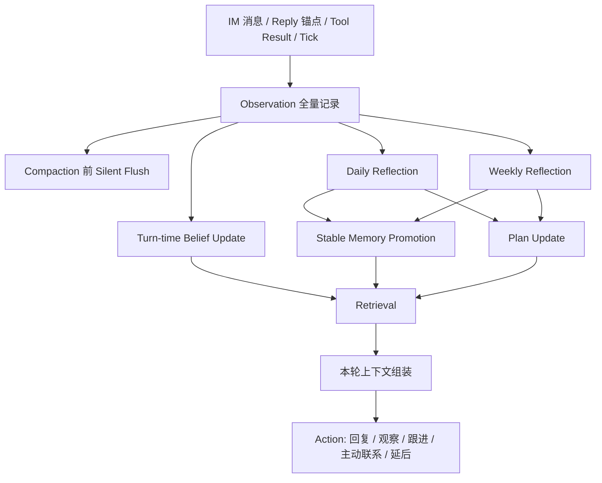

# 小腻 V1 认知架构（单代理虚拟行走）

## 文档定位

- 本文档是小腻 V1 的正式认知架构与实施路线图，不是 brainstorming 记录。
- 本文档替代已废弃的 `HUMAN_LIKE_PROCESSOR_FLOW*.md` 路线，作为后续 Phase 1 到 Phase 4 的单一事实源。
- 本文档只建模小腻，不模拟其他人。外界他人都视为真实人类发出的信息流，小腻通过 IM 与工具接触这些真实流。

## Summary

- 只建模小腻，不模拟其他人。外界他人都视为真实人类发出的信息流，小腻通过 IM 与工具接触这些真实流。
- V1 的目标不是“会聊天”，而是让小腻作为一个单一持续存在的代理，具备稳定自我、世界信念、关系记忆、计划能力和主动行动能力。
- 世界模型定义为：`IM 社会场域 + 物理世界的 IM/工具投影 + 小腻的内部信念状态`。
- 行动边界定义为：只能通过 IM 消息和 IM 提供的工具与外界交互；不直接模拟他人、不直接操作物理世界。
- 记忆原则固定为：`Observation 全量记录，Belief 持续修正，Long-term Memory 延迟升格`。

## 核心认知闭环

- 回合内固定做 `Observation` 和轻量 `Belief Update`。
- compaction 前只做 flush，不直接重写 stable memory。
- 长期记忆升格只来自：明确事实、明确承诺、重复信号、daily reflection、weekly reflection。
- 每回合固定上下文段落：
  - `Self Model`
  - `Current Internal State`
  - `Active Plans`
  - `Retrieved Stable Memories`
  - `Recent Evidence`

## Key Changes

- 认知对象固定为 5 类：
  - `Observation`：每条入站消息、出站消息、reply 锚点、工具结果、定时 tick。
  - `Belief`：小腻对世界当前状态的理解，带 `confidence`、`last_evidence`、`status(active|revised|stale)`。
  - `RelationshipMemory`：小腻对具体人的关系判断、互动偏好、边界策略。
  - `SelfModel`：小腻的稳定自我叙事、长期兴趣、阶段目标、行为边界。
  - `Plan`：`weekly_focus`、`day_plan`、`followup_queue`、`micro_intention`。
- 不实现多代理社会仿真；不为其他人维护独立 agent state。对他人的建模仅作为小腻的 `belief` 和 `relationship memory` 存在。
- “虚拟行走”建模为 `社交场域图谱`：
  - 节点：私聊、群聊、线程、工具入口。
  - 边：信息流动、可达性、关系入口。
  - 作用：决定小腻今天在哪些场域出现、旁观、跟进、主动接触。
- 写入链路固定为三阶段：
  - 回合内：所有事件写 `Observation`，并做轻量 `Belief update`。
  - 临近 compaction：执行 silent flush，把本回合中可能丢失的 durable context 写入日记型记忆。
  - 日终 / 周终：执行 reflection，把 observation 提炼为长期记忆、关系变化、自我更新和计划更新。
- 长期记忆只允许升格 4 类：
  - 稳定事实
  - 稳定偏好
  - 稳定关系判断
  - 未完成承诺 / 长期计划
- 召回链路固定为 5 段上下文：
  - `Self Model`
  - `Current Internal State`
  - `Active Plans`
  - `Retrieved Stable Memories`
  - `Recent Evidence`
- Prompt 组装规则固定：
  - 每回合都注入 `Self Model + Current Internal State + Active Plans`
  - `Retrieved Stable Memories` 控制在 4-8 条
  - `Recent Evidence` 控制在 2-4 条
  - 不把 observation dump 进 prompt
- 主动性规则固定：
  - 可主动私聊/跟进
  - 由策略自动决策
  - 后台可暂停、限流、审计
  - 不允许“随机社交”；所有主动行为必须来自 `followup_queue`、`weekly_focus` 或明确 `belief/relationship trigger`
- 数据模型新增：
  - `agent_observations`
  - `agent_beliefs`
  - `agent_relationship_memories`
  - `agent_self_model`
  - `agent_plans`
  - `agent_reflections`
  - `agent_action_logs`
  - `agent_memory_evidence`
- 作用域规则固定：
  - `field_scope = private_chat | group_chat | thread | tool_channel`
  - `memory_scope = local_field | person_global | self_global`
  - 群聊中的信息默认只写 `local_field`，只有 reflection 或人工提升后才升到 `person_global`
- 后台最少提供三类控制面：
  - 记忆/信念查看与纠偏
  - 计划与主动行为队列
  - 当前内部状态与限流/暂停开关

## Interfaces / Types

- `ObservationRecord`
  - `source_type`, `field_scope`, `counterparty_ids`, `content`, `tool_payload_ref`, `occurred_at`
- `BeliefRecord`
  - `subject_type`, `subject_id`, `claim`, `confidence`, `last_evidence_id`, `status`
- `RelationshipMemory`
  - `target_user_id`, `relationship_summary`, `interaction_style`, `boundary_notes`, `confidence`
- `SelfModelSnapshot`
  - `identity_summary`, `core_traits`, `long_term_goals`, `current_concerns`, `availability`, `energy`
- `AgentPlan`
  - `plan_type`, `time_horizon`, `target_field_scope`, `goal`, `trigger_condition`, `status`
- `MicroIntention`
  - `why_now`, `target_field_scope`, `target_user_id?`, `action_type(reply|observe|followup|initiate|defer)`

## 仓库落点

### `qqbot-core`

- [modules/qqbot-core/src/services/context-manager.ts](/home/liahua/IdeaProject/qq_bot/modules/qqbot-core/src/services/context-manager.ts)
  - 承接 5 段上下文拼装。
  - Phase 2 开始接入 `Retrieved Stable Memories` 与 `Recent Evidence`。
  - Phase 3 开始接入 `Self Model`、`Current Internal State`、`Active Plans`。
- [modules/qqbot-core/src/services/database.ts](/home/liahua/IdeaProject/qq_bot/modules/qqbot-core/src/services/database.ts)
  - 承接 observation、belief、memory、reflection、plan、action log、evidence 的数据访问。
- [modules/qqbot-core/src/services/schedule-dispatcher.ts](/home/liahua/IdeaProject/qq_bot/modules/qqbot-core/src/services/schedule-dispatcher.ts)
  - 承接 tick、followup、主动行为调度。
- [modules/qqbot-core/src/index.ts](/home/liahua/IdeaProject/qq_bot/modules/qqbot-core/src/index.ts)
  - 承接消息入站/出站 observation 写入、回合内 belief update、上下文构建、action log。

### `admin-panel/backend`

- [modules/admin-panel/backend/src/index.ts](/home/liahua/IdeaProject/qq_bot/modules/admin-panel/backend/src/index.ts)
  - 注册 cognition API 路由。
- 后续新增 memory / belief / plan / state / proactivity 管理接口。

### `admin-panel/frontend`

- [modules/admin-panel/frontend/src/App.tsx](/home/liahua/IdeaProject/qq_bot/modules/admin-panel/frontend/src/App.tsx)
  - 承接认知管理入口页路由。
- 后续新增三类页面：
  - memory / belief 查看与纠偏
  - plan / followup / reflection 查看
  - internal state / proactivity 控制

### `database`

- 后续 migration 将落：
  - `agent_observations`
  - `agent_beliefs`
  - `agent_relationship_memories`
  - `agent_self_model`
  - `agent_plans`
  - `agent_reflections`
  - `agent_action_logs`
  - `agent_memory_evidence`

## 分阶段实现路线

### Phase 0 文档与引用清理

- 新建认知架构文档与实施进度文档。
- 删除已废弃的 `HUMAN_LIKE_PROCESSOR_FLOW*.md`。
- 更新 `docs/ROADMAP.md` 与 `modules/qqbot-core/CLAUDE.md` 的引用链。

### Phase 1 Observation + Belief

- 目标：在不改变现有回复主链的前提下，先把认知底座接上。
- 交付内容：
  - 新增 observation / belief 数据模型与 DB 访问
  - 在消息入站、出站、reply、tool result、tick 位置写 observation
  - 回合内执行轻量 belief update
  - 新增只读 cognition API
  - 新增只读 memory / belief 管理入口

### Phase 2 Reflection + Stable Memory

- 目标：把 observation 升格成长期记忆。
- 交付内容：
  - daily / weekly reflection job
  - stable memory、reflection、evidence 数据访问
  - 上下文注入 `Retrieved Stable Memories`
  - 管理后台支持 evidence 与状态查看

### Phase 3 Self Model + Plan + Proactivity

- 目标：让小腻具备持续自我和主动跟进能力。
- 交付内容：
  - self model、internal state、plans、followup queue
  - `ScheduleDispatcher` 上挂 tick 与 followup 调度
  - 主动行为支持暂停、限流、审计

### Phase 4 Retrieval Enhancement

- 目标：加入混合召回增强，但不改变 V1 核心原则。
- 交付内容：
  - 预留 embedding 接口接入 stable memory / evidence 检索
  - 引入 hybrid retrieval、rerank、temporal decay
- 当前约束：
  - 现有 [embedding-service.ts](/home/liahua/IdeaProject/qq_bot/modules/qqbot-core/src/services/embedding-service.ts) 已经是 OpenAI-compatible `/v1/embeddings`
  - embedding 相关能力在 Phase 4 之前只做 schema 与服务接线预留，不阻塞 Phase 1 到 Phase 3

## 参考实现映射

| 来源 | 借鉴内容 | 落地方式 |
| --- | --- | --- |
| Generative Agents | `Observation -> Retrieval -> Reflection -> Planning -> Action` | 作为认知骨架，定义小腻的主循环 |
| Generative Agents | 高阶记忆升格与反思节奏 | daily / weekly reflection 与 stable memory promotion |
| OpenClaw | compaction 前 flush | flush 只写日记型 durable context，不直接重写 stable memory |
| OpenClaw | 少量稳定记忆常驻 | 每回合固定注入少量 stable memories，而不是 dump 全量历史 |
| OpenClaw | 大块历史按需检索 | `Recent Evidence` 与后续 hybrid retrieval 作为按需召回层 |
| 当前仓库 | 现有消息链、上下文链、调度链 | 作为 Phase 1 到 Phase 4 的承接底座 |

- 本方案不是复刻 OpenClaw，也不是直接照搬论文。
- 论文提供认知闭环，OpenClaw 提供工程化记忆策略，当前仓库提供可直接扩展的运行底座。

## 相关文档

- [docs/ATTENTION_FIRST_AGENT_LOOP.md](/home/liahua/IdeaProject/qq_bot/docs/ATTENTION_FIRST_AGENT_LOOP.md)
- [docs/LLM_TOOL_EXECUTION_DESIGN.md](/home/liahua/IdeaProject/qq_bot/docs/LLM_TOOL_EXECUTION_DESIGN.md)
- [docs/ROADMAP.md](/home/liahua/IdeaProject/qq_bot/docs/ROADMAP.md)

## Test Plan

- Observation:
  - 入站消息、出站消息、reply、工具结果、heartbeat/tick 都能落 observation。
- Belief:
  - 新证据能提升/降低 belief confidence。
  - 冲突证据会把旧 belief 标记为 `revised` 或 `stale`。
- Memory Promotion:
  - 单次闲聊不会升长期记忆。
  - 重复偏好、明确承诺、稳定关系变化能在 reflection 后升格。
- Planning:
  - 日终生成 `day_plan` 更新。
  - 周期生成 `weekly_focus`。
  - 主动行为只能来自有效计划或跟进队列。
- Context Injection:
  - 每回合固定 5 段上下文均可组装。
  - observation 不会直接淹没 prompt。
- Proactivity:
  - 可自动主动联系，但受暂停/限流约束。
  - 没有有效理由时不会主动打扰。
- Regression:
  - 当 belief/memory/plan 为空时，系统仍可作为普通 IM 代理运行，不影响现有消息处理链。

## Assumptions

- V1 是单代理架构，唯一持续建模对象是小腻。
- 外部“真实世界”只通过 IM 信息流和工具结果进入系统，不做未观测世界的自由模拟。
- “虚拟行走”优先实现为社交场域图谱，不做地理地图和多人物理位置系统。
- reflection 以日终/周终为主，不在每回合执行重型抽象。
- 首发不引入多代理社会传播、他人意图模拟、完整物理世界模拟。
