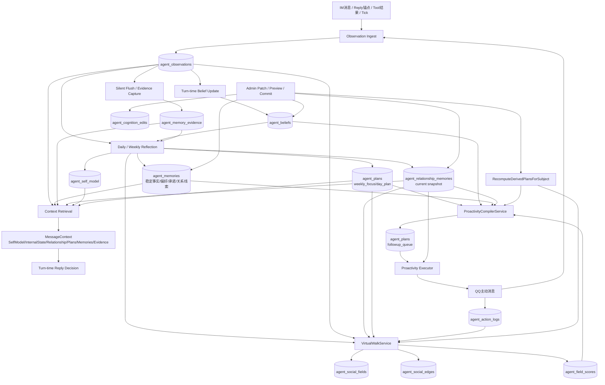
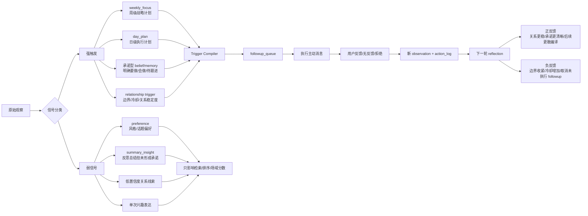

# 小腻 V2 虚拟行走落地方案

**Summary**
- V2 把当前分散的 observation / belief / memory / plan 基础设施，收口成 1 条完整闭环：`观察 -> 记忆/信念 -> 反思 -> 关系/计划/场域 -> trigger compiler -> followup_queue -> 执行 -> 新观察`。
- 强触发固定 4 类：`weekly_focus`、`day_plan`、承诺型 `belief/memory`、`relationship trigger`。
- 弱信号固定为辅助输入，不直接编译成主动消息：`preference`、`summary_insight`、低置信度关系线索、单次兴趣表达。
- 对应论文映射：
  - Memory Stream: `agent_observations` + `agent_memories` + `agent_memory_evidence`
  - Retrieval: 上下文组装 + field score + compiler 取源
  - Reflection: daily / weekly reflection 产出高层判断
  - Planning: `weekly_focus` / `day_plan` + compiler
  - Reacting: 回合内回复与 `followup_queue` 执行

**Component Diagram**

**Flow Notes**
- 记忆分层：
  - `agent_observations` 保存原始经历。
  - `agent_memories` 保存稳定记忆，仍保留 `relationship` 类型作为关系推理输入。
  - `agent_relationship_memories` 保存“当前关系快照”，是关系事实源。
- 反思产物：
  - self model：我是谁、当前关切、长期目标。
  - relationship snapshot：我和这个人的关系、互动风格、边界。
  - strategy plans：`weekly_focus`、`day_plan`。
- 正反馈机制：
  - 适当的 followup 被用户接住后，新 observation 会增强 relationship snapshot、提升相关 commitment 的置信度、提高同场域权重。
- 负反馈机制：
  - 无响应、明确拒绝、admin 改 `boundary_strategy`、冷却未到期，都会抑制 compiler，并取消未执行的 queued followup。

**Implementation Changes**
- 数据层：
  - 扩展 `agent_relationship_memories` 为 current snapshot 模型，增加 `is_current`、`boundary_strategy`、`source_reflection_id`、`last_evidence_id`、`last_observed_at`、`notes_json`。
  - 新增 `agent_cognition_edits`、`agent_social_fields`、`agent_social_edges`、`agent_field_scores`。
  - 扩展 `agent_plans`，增加 `source_plan_id`、`plan_metadata_json`，保存来源解释链。
- Core：
  - 新增 relationship memory service，负责 reflection 写回、上下文注入、patch 后快照切换。
  - 新增 cognition correction service，支持 belief/memory/relationship 的 preview + commit + audit，`operator_id` 固定为 `qqbot-admin`。
  - 新增 virtual walk service，生成 field graph 和分数。
  - 新增 proactivity compiler，只编译 4 类强触发。
  - 补全 `micro_intention` 生命周期：reply 成功 `completed`，过滤/跳过/超时/失败 `cancelled`。
- Admin：
  - backend 新增 `relationships`、`edits`、`fields`、patch routes。
  - frontend 将 cognition 重构为 `Memory & Belief`、`Relationships & Fields`、`Plans & Proactivity` 三工作流。
  - patch UI 固定两段式：preview -> confirm。
- 路演：
  - 固定 3 条主线：关系纠偏即时收敛、场域解释性、`weekly_focus -> followup_queue -> action_log`。
  - 增加种子脚本、重置脚本、只读 demo mode。

**Test Plan**
- 单元测试覆盖：
  - relationship snapshot 写回与 current 切换
  - boundary hard gate 与 queued followup 取消
  - compiler 的 4 类强触发、去重、metadata 来源链
  - weak signal 只影响排序不直接产出 followup
  - `micro_intention` 的 completed / cancelled 闭环
- 后端测试覆盖：
  - relationships / edits / fields / patch preview / commit
  - patch 后 derived plan recompute 和 field score 刷新
- 前端验证覆盖：
  - relationships tab、fields tab、preview-confirm dialog
  - 路演 3 条主线的 UI 可解释链
- 部署验收：
  - 重建并重部署 `qqbot-core`、`admin-panel/backend`、`admin-panel/frontend`
  - 本地和部署环境都能稳定重放 demo

**Assumptions**
- `boundary_strategy` 锁定三态：`allow_proactive | observe_only | do_not_contact`。
- `relationship trigger` 锁定为平衡模式：既能抑制，也能在关系稳定且冷却结束后重新生成 followup。
- 弱信号只参与检索、反思、field score，不直接主动外呼。
- 旧 `UserRelationshipService` 不进入 V2 主链，不再作为关系事实源。
