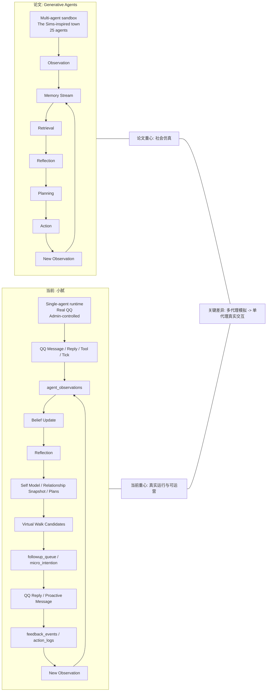

# 小腻当前实现 vs Generative Agents 论文

## 结论先行

小腻当前实现不是对 `Generative Agents: Interactive Simulacra of Human Behavior` 的直接复刻，而是把论文里的认知闭环迁移到单代理 QQ 运行体中，并在真实消息链、主动跟进、运营控制和可观测性上做了明显的工程化改造。

这意味着两者共享同一个高层骨架: `observation / memory / reflection / planning / action`，但目标函数已经不同。

- 论文的目标是: 在多代理沙盒中生成“可信的人类式社会行为”。
- 当前小腻的目标是: 在真实 QQ 环境中，让单一代理持续观察、沉淀关系与记忆，并在可控边界内回复或主动跟进。

## 维度对比

| 维度 | Generative Agents 论文 | 当前小腻实现 |
| --- | --- | --- |
| 运行环境 | 论文把 agents 放进一个受控的交互式小镇沙盒，场景受 `The Sims` 启发，论文实例里有 25 个 agents。 | 小腻运行在真实 QQ 消息流里，输入来自私聊、群聊、reply 锚点、tool 结果和 scheduler tick，不是仿真环境。 |
| agent 数量与世界模型 | 论文核心是多代理社会仿真。agent 彼此观察、交互、传播信息，并出现 emergent social behavior。 | 当前系统只持续建模“小腻”一个代理；其他人不维护独立 agent state，只以 observation、belief、relationship 的形式进入小腻的世界模型。 |
| 记忆表示 | 论文以自然语言的 memory stream 记录经历，再在其上做 retrieval、reflection 和 planning。 | 当前实现把长期与短期认知拆成显式结构: `agent_observations`、`agent_beliefs`、`agent_memories`、`agent_memory_evidence`、`agent_relationship_memories`。 |
| 反思机制 | reflection 是论文主架构核心，用于把经验升格为更高层抽象。 | 当前实现已经把 reflection 工程化为 daily / weekly job，结果写回 stable memory、relationship snapshot、self model 和 plans。 |
| 规划机制 | 论文的 planning 更偏向 agent 的日常安排、下一步活动和社会行为组织。 | 当前实现除了 `day_plan` / `weekly_focus`，还加入 `followup_queue`、`micro_intention`、virtual walk candidate compiler、去重和边界 gate。 |
| 行动机制 | 行动发生在沙盒世界里，行动结果继续回流到 memory stream。 | 行动发生在真实 QQ 链路里；主动行为受 `followup_queue`、relationship boundary、cooldown、allowlist、群白名单和审计约束，执行后进入 `agent_action_logs` 与 `agent_feedback_events`。 |
| 检索机制 | retrieval 是行为生成的关键支撑，动态拉取与当前决策相关的记忆。 | 当前实现使用 5 段上下文注入，并对 stable memory / evidence 做混合召回，含 embedding、BM25、temporal decay、relationship retrieval bias。 |
| 工程化与运营控制 | 论文偏研究演示，重点是 believable behavior 与 emergent behavior。 | 当前实现增加 admin patch、preview / commit、proactivity 开关、候选场域解释链、followup 审计、反馈抑制和线上可观测性。 |

## 一句话拆解差异

- 论文更像“多角色社会仿真引擎”。
- 当前小腻更像“单代理、真实消息驱动、可运营的社交运行体”。
- 当前实现继承了论文的认知顺序，但把社会仿真问题改写成了真实 IM 环境中的持续运行问题。

## 并排对照图

## 当前实现里哪些地方明显不是论文原样

下面这些能力不应被写成“论文实现”，而应明确视为当前仓库额外叠加的工程层:

1. 显式数据库化认知模型
   当前实现不是单一 memory stream 文本堆栈，而是把 observation、belief、memory、evidence、relationship、plan、feedback 分表存储，方便查询、纠偏和审计。

2. relationship snapshot 作为主决策事实源
   论文强调社会行为与记忆、反思、规划的组合；当前小腻进一步把“关系快照”收口成 retrieval、planning、drafting 和 proactivity gate 的正式输入。

3. virtual walk candidate 层
   论文里没有一个与 `agent_walk_candidates` 等价的“候选场域物化层”。当前实现多了一层 `field -> candidate -> compiler -> followup_queue` 的工程编排，用来把社交注意力分配做成可解释的中间状态。

4. 真实外呼护栏
   论文里的行为是在沙盒里行动；当前系统面对真实用户，因此必须额外引入 cooldown、boundary strategy、allowlist、group allowlist、pause、max-per-run、negative feedback suppression。

5. 运营纠偏闭环
   当前实现有 admin patch、preview / confirm、derived plan recompute 和可视化工作台；这属于生产系统的“运营控制面”，不是论文的研究主轴。

6. 混合检索与检索偏置
   论文强调动态 retrieval；当前实现把 retrieval 工程化成 embedding + lexical + temporal + relationship bias 的混合排序，并控制 `Retrieved Stable Memories` 与 `Recent Evidence` 的 prompt 注入数量。

## 为什么说当前小腻“继承了论文骨架”

如果只看最高层闭环，两者仍然是同一认知范式:

- 先接收并记录观察。
- 再从观察中沉淀记忆与高层判断。
- 在当前情境里召回相关认知材料。
- 根据这些材料组织计划与动作。
- 动作结果再反馈回下一轮观察。

当前仓库文档也直接把论文的 `Observation -> Retrieval -> Reflection -> Planning -> Action` 作为小腻的认知骨架，而不是把它当作可有可无的灵感来源。

## 为什么说当前小腻“不是论文复刻”

核心原因不是“实现细节不同”，而是“问题定义已经换了”:

- 论文解决的是“如何让一组 agents 在沙盒里表现得像人，并出现社会性涌现”。
- 当前小腻解决的是“如何让一个代理在真实 QQ 关系网络里持续运行、持续记忆、持续克制地主动行动，并且可被后台运营与纠偏”。

所以当前实现的很多复杂度，其实不是来自论文，而是来自真实部署:

- 要区分私聊和群聊。
- 要处理 reply 锚点和 tool result。
- 要允许主动但不能骚扰。
- 要让运营人员看到“为什么现在没说话”。
- 要支持 patch 后的派生重算，而不是等下一轮自然收敛。

这也是为什么当前小腻会自然长出 `followup_queue`、`agent_feedback_events`、`agent_proactivity_controls`、candidate explainability 和 admin patch 这些论文中不存在的层。

## 写给工程讨论的最终判断

如果用一句工程判断来概括:

> 小腻当前实现不是把 Generative Agents 搬到 QQ 上，而是把论文的认知闭环改造成了一个单代理、真实消息驱动、带强运营控制面的社交系统。

因此，评价当前实现时，不能只问“像不像论文”，还要问:

- 它是否把论文的认知顺序保住了。
- 它是否在真实 IM 环境里增加了必要的护栏和解释层。
- 它是否把“社会仿真”正确转译成了“可运营的单代理持续交互”。

从当前代码和文档状态看，答案是: 保住了论文骨架，但已经明显演化成另一类系统。

## 事实源

### 论文侧

- arXiv: [Generative Agents: Interactive Simulacra of Human Behavior](https://arxiv.org/abs/2304.03442)
- Google Research: [Generative Agents: Interactive Simulacra of Human Behavior](https://research.google/pubs/generative-agents-interactive-simulacra-of-human-behavior/)

### 当前实现侧

- [docs/XIAONI_V1_COGNITIVE_ARCHITECTURE.md](./XIAONI_V1_COGNITIVE_ARCHITECTURE.md)
- [docs/XIAONI_V2_IMPLEMENTATION_COMPONENT_PLAN.md](./XIAONI_V2_IMPLEMENTATION_COMPONENT_PLAN.md)
- [docs/XIAONI_VIRTUAL_WALK_TASKLIST.md](./XIAONI_VIRTUAL_WALK_TASKLIST.md)
- [modules/qqbot-core/src/services/agent-memory-service.ts](../modules/qqbot-core/src/services/agent-memory-service.ts)
- [modules/qqbot-core/src/services/context-manager.ts](../modules/qqbot-core/src/services/context-manager.ts)
- [modules/qqbot-core/src/services/cognition-tool-runtime.ts](../modules/qqbot-core/src/services/cognition-tool-runtime.ts)
- [modules/qqbot-core/src/services/schedule-dispatcher.ts](../modules/qqbot-core/src/services/schedule-dispatcher.ts)

## 可直接核实的代码落点

- `ContextManager.buildMessageContext`
  会组装 `selfModel`、`relationshipContext`、`activePlans`、`retrievedStableMemories`、`recentEvidence`，对应当前实现里的 5 段认知上下文注入。

- `AgentMemoryService.runScheduledReflectionsIfDue`
  会调度 daily / weekly reflection，并在之后执行 `ensureDerivedCognitionState` 与 `materializeVirtualWalkState`，说明反思、派生状态和候选层已经进入主链。

- `AgentMemoryService.runReflection`
  会把 active beliefs 升格为 memories，并写入 `agent_reflections`，随后调用 `writeSelfModelSnapshot`、`syncRelationshipMemories`、`syncFollowupPlans`。

- `AgentMemoryService.syncFollowupPlans`
  会把 latest walk candidates、relationship snapshot、strategic plans 汇总成 `followup_queue`，说明当前实现不是停在“有计划”，而是已经落到“可执行主动跟进队列”。

- `AgentMemoryService.getRetrievedMemoriesForMessage` / `getRecentEvidenceForMessage`
  会对记忆与证据做 embedding、lexical、temporal、relationship bias 混合排序，说明 retrieval 已经是工程化混合召回，而不是纯概念层。

- `CognitionToolRuntime`
  提供 `relationship_insight`、`virtual_walk_planner`、`virtual_walk_feedback` 三个结构化工具 prompt，说明当前实现已把 reflection、planning、feedback 分成可审计的 LLM 子任务。

- `ScheduleDispatcher.tick`
  会记录 `tick_scan` observation，并在 tick 中触发后台任务，说明 scheduler 已被纳入 observation 和 cognition 闭环，而不是外围定时器。

## 使用边界

- 本文只对比“实现方式差异”，不是论文综述。
- 本文不把 OpenClaw 当作单独对照对象，但当前实现中明显存在一些超出论文本体的工程策略，这些都明确归到“仓库额外工程化层”。
- 当前实现部分优先以代码和已完成任务清单为准，不把尚未落地的设计目标写成既成事实。
