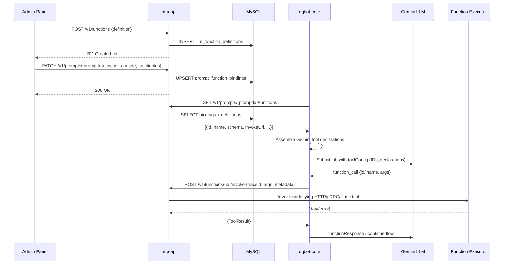

# LLM Function Calling Registry Design

## 背景与目标
- 将 FC（Function Calling）函数的结构化定义集中在 `http-api` 服务暴露的接口中管理，取代在 Prompt 配置中冗余存储 JSON 定义的方式。
- 让 Prompt 只保留函数引用（ID + 调用模式），`qqbot-core` 在运行期按需从注册中心拉取结构并组装 Gemini 所需的工具声明。
- 统一函数调用的执行入口，通过 `http-api` 转发到具体业务函数或静态工具，实现审计、限流和灰度能力。
- 为管理端提供函数注册、检索、绑定 Prompt 的能力，保持用户体验与现有流程兼容。

## 范围
- **包含**：函数注册中心 API 与表结构、Prompt 与函数映射方案、`qqbot-core` 组装调用逻辑、管理端 UI 调整。
- **不包含**：已有函数执行逻辑的具体实现改造（例如发送消息的底层实现）、跨服务鉴权体系改造（以现有网关/Token 机制为前提）。

## 现状简述
- Prompt 的 `advanced_config.toolsConfig` 包含完整函数声明，随着配置增多，维护和复用成本高。
- `qqbot-core` 仅能按 Prompt 字段生成 `toolConfig`，缺乏统一函数 registry。
- 静态消息函数在 `qqbot-core` 内部注册，无法被其他 Prompt 或服务重用，也不便于扩展更多类型函数。

## 目标架构概览
- `http-api` 作为函数注册中心，负责：
  - CRUD 函数定义（名称、描述、参数模式、执行端点等）。
  - 查询 Prompt 已绑定的函数列表。
  - 执行层转发（统一 `invoke` 接口）。
- `qqbot-core`：
  - 在加载 Prompt 时按 ID 调用 `http-api` 获取函数定义。
  - 行为器 `FunctionCallDispatcher` 在执行时调用 `http-api` 的 `invoke`。
  - 静态工具（发送消息等）改为在注册中心以系统函数存在。
- `admin-panel`：
  - Prompt 编辑页通过 `http-api` 拉取函数列表。
  - 保存时写回关联 ID + 模式，无需携带结构。

## 时序图

## 组件设计

### http-api 服务
- **Controller 层**
  - `FunctionController`：处理函数 CRUD、搜索、版本管理。
  - `PromptFunctionController`：处理 Prompt 绑定、批量查询。
  - `FunctionInvokeController`：暴露统一 `invoke` 入口。
- **Service 层**
  - `FunctionRegistryService`：封装业务规则、验证 schema、记录审计。
  - `PromptBindingService`：维护 Prompt 与函数的关系，提供聚合查询。
  - `FunctionExecutionService`：按 `invoke_url`、`invoke_method` 执行远程调用；支持 retries、超时；若 `execution_adapter` 指定为 `INTERNAL` 则调用内部 handler。
- **存储层**
  - Repository 与 DAO 使用现有 MySQL 连接模块。
  - 可选地为高频查询加 Redis 缓存（后续阶段）。
- **安全**
  - 继承现有 API 鉴权（JWT/API Key）。
  - `invoke` 端点要求内部 Token 或服务间白名单。

### qqbot-core
- 在 `AIService.buildToolsConfig` 后新增一步：若 `allowedFunctionIds` 非空，调用新的 `HttpFunctionRegistryClient`（封装 `http-api` 请求）获取完整定义。
- `FunctionCallDispatcher`：
  - 引入基于 `functionId` 的路由，与 `toolRegistry`（动态工具）兼容。
  - 调用 `http-api` `invoke` 接口，等待返回 `ToolResult`，再向 LLM 响应。
  - 支持缓存函数定义，监听配置更新事件以失效。
- `LLMJobWorker`：在创建 job 时使用函数 registry 结果填充 `tools` 数组与 `functionCallingConfig`。
- 静态消息函数：
  - 初始迁移脚本将其插入 `llm_function_definitions`，`managed_by_system = true`。
  - `FunctionCallDispatcher` 识别 `execution_adapter = INTERNAL`，转发到现有 `send*` 方法。

### admin-panel
- Prompt 编辑页：
  - 初始化时调用 `GET /v1/functions?enabled=true` 获取可选项，支持按标签/副作用过滤。
  - UI 控件改为勾选函数 ID、配置 mode（`AUTO`/`ANY`/`NONE`）。
  - 保存时调用 `PATCH /v1/prompts/{id}/functions`。
  - 展示当前绑定时拉取 `GET /v1/prompts/{id}/functions`。
- 可新建“函数管理”页面，提供列表、搜索、创建、编辑、启停功能（与 Prompt 编辑使用同一 API）。

## 数据库设计

### 表：`llm_function_definitions`
| 字段 | 类型 | 说明 |
| --- | --- | --- |
| `id` | char(36) | 函数 ID（UUID） |
| `name` | varchar(128) | 唯一名称（对 LLM 暴露） |
| `display_name` | varchar(128) | 管理端展示名称 |
| `description` | text | 功能描述 |
| `parameters_schema` | json | JSON Schema（符合 Gemini Function Declaration） |
| `side_effect` | tinyint(1) | 是否有副作用 |
| `expect_response` | tinyint(1) | 是否期望同步响应 |
| `category` | varchar(64) | 分类（如 messaging/reporting） |
| `tags` | json | 标签数组 |
| `invoke_method` | enum('HTTP','GRPC','INTERNAL') | 调用方式 |
| `invoke_url` | varchar(512) | 当方法为 HTTP/GRPC 时的目标地址 |
| `http_method` | varchar(16) | HTTP 方法（POST/PUT/...） |
| `auth_type` | enum('NONE','SERVICE_TOKEN','BASIC','CUSTOM') | 调用鉴权方式 |
| `timeout_ms` | int | 超时时间 |
| `retry_policy` | json | 重试配置 |
| `managed_by_system` | tinyint(1) | 是否系统内置 |
| `enabled` | tinyint(1) | 是否启用 |
| `created_at` / `updated_at` | datetime | 创建/更新 |
| `created_by` / `updated_by` | varchar(64) | 审计 |

### 表：`prompt_function_bindings`
| 字段 | 类型 | 说明 |
| --- | --- | --- |
| `id` | bigint PK | 自增 |
| `prompt_id` | bigint | 外键 -> `agent_prompts.id` |
| `function_id` | char(36) | 外键 -> `llm_function_definitions.id` |
| `calling_mode` | enum('AUTO','ANY','NONE') | Prompt 层对该函数的模式（可复用 `allowedFunctionIds` 列） |
| `priority` | int | 执行优先级（预留） |
| `metadata` | json | 其它绑定信息（如仅限特定场景） |
| `created_at` / `updated_at` | datetime | |
| `created_by` / `updated_by` | varchar(64) | |

### 表：`function_execution_logs`（可选）
记录调用轨迹，便于审计。

## 配置与逻辑流程
1. **函数注册**：管理员通过管理端或直接用 API 写入定义（包含参数、调用端点等）。
2. **Prompt 绑定**：选择函数列表 + 调用模式，后端写入 `prompt_function_bindings`。`agent_prompts.advanced_config` 中的 `toolsConfig` 精简为仅包含 `mode`、`allowedFunctionIds`。
3. **配置加载**：
   - `qqbot-core` 获取 Prompt 时查询 `http-api`：`GET /v1/prompts/{promptId}/functions`。
   - 得到 `{function, binding}` 聚合结果后，生成 Gemini `tools` 与 `functionCallingConfig.allowedFunctionNames`（使用 `function.name`）。
   - 缓存策略：按 Prompt + updatedAt 维度缓存 30s，可通过 `ETag`/`If-None-Match`。
4. **执行阶段**：
   - Gemini 返回 `function_call` 时，结构中 `name` 等于注册中心的 `name`，Dispatcher 反查 ID。
   - 通过 `POST /v1/functions/{id}/invoke` 将参数、Trace、上下文传回 `http-api`。
   - `http-api` 根据 `invoke_method`：
     - `HTTP`：构造请求，追加认证信息，发送至对应服务。
     - `GRPC`：调用 gRPC 客户端。
     - `INTERNAL`：调度内部 handler（如发送消息）。
   - 返回 `ToolResult`（字段与现有静态工具保持一致）。如失败，可由 `qqbot-core` 决定重试或返回错误。

## 接口设计

### 函数管理
- `GET /v1/functions`
  - Query：`search`, `tags[]`, `sideEffect`, `category`, `enabled`, `page`, `limit`
  - Response：`{ items: FunctionSummary[], total }`
- `POST /v1/functions`
  - Request：`{ name, displayName, description, parametersSchema, invokeMethod, invokeUrl, httpMethod, auth, timeoutMs, ... }`
  - Response：`{ id }`
- `GET /v1/functions/{id}`
- `PATCH /v1/functions/{id}`
- `POST /v1/functions/{id}/enable` / `.../disable`

### Prompt 绑定
- `GET /v1/prompts/{id}/functions`
  - Response：`{ promptId, callingMode, functions: [ { id, name, description, parametersSchema, ... } ] }`
- `PATCH /v1/prompts/{id}/functions`
  - Request：`{ callingMode, functionIds: [], allowedFunctionIds?: [] }`
  - Response：`{ promptId, callingMode, functionIds }`
- （可选）支持批量：`POST /v1/prompts/functions/batch`。

### 函数调用
- `POST /v1/functions/{id}/invoke`
  - Headers：`X-Trace-Id`, `Authorization`
  - Request：`{ traceId, jobId, arguments, context: { sourceKey, userId, groupId, metadata }, requestMode }`
  - Response：`{ success, data?, error?, suppressAutoReply?, durationMs }`
  - Error：标准化错误码（如 404 函数不存在、422 参数校验失败、504 超时）。

## 逻辑设计细节
- **参数校验**：在 `http-api` 注册/更新时使用 JSON Schema 验证（AJV）；调用时再次校验请求参数。
- **映射关系**：Prompt 绑定记录 `callingMode`（决定是否允许函数），`allowedFunctionIds` 直接从 `prompt_function_bindings` 聚合。
- **缓存策略**：
  - `http-api` 可缓存函数定义（memory/Redis），监听 `updated_at` 变化自动失效。
  - `qqbot-core` 缓存 Prompt → 函数定义 30s + 可手动刷新（例如管理端保存后触发急速刷新事件）。
- **故障处理**：
  - `http-api` 调用失败时，记录日志与 `function_execution_logs`。
  - `qqbot-core` 按现有策略决定是否 fallback 或返回错误给 LLM（如 `FunctionCallDispatcher` 返回 `shouldContinue: false`）。
- **静态工具迁移**：
  - 初始化脚本向 `llm_function_definitions` 插入发送消息函数，`invoke_method` = `INTERNAL`。
  - `FunctionExecutionService` 为 `INTERNAL` 方法调用 `StaticToolAdapter`，复用现有逻辑。

## 迁移计划
1. 创建新数据表与 DAO；补充种子数据（迁移静态消息函数）。
2. 扩展 `http-api` 的 Controller/Service/Route；在 Swagger/文档中更新说明。
3. 在 `qqbot-core` 新增 `HttpFunctionRegistryClient`，改写配置解析流程，保留向后兼容开关（feature flag）。
4. 管理端切换到新 API；保留旧实现的回退能力。
5. 编写数据库迁移脚本，将既有 Prompt 的 `advanced_config.toolsConfig` 解析成绑定数据，逐步清空冗余字段。
6. 联调与 E2E 验证；灰度启用 feature flag。
7. 清理旧逻辑（移除 Prompt 中的函数结构、旧 SQL 脚本）。

## 测试策略
- **单测**：`http-api` Service/Controller、`qqbot-core` 新 client + dispatcher 逻辑。
- **集成测试**：模拟注册函数 → 绑定 Prompt → 触发 LLM job → 函数调用路径。
- **前端测试**：Prompt 编辑页交互、函数管理页。
- **回归测试**：确保未绑定函数的 Prompt 流程不受影响；`AUTO/NONE` 模式兼容。

## 后续规划
- 函数版本管理（在 definitions 表新增 `version`、`active_version_id`）。
- 操作审计与告警（执行失败告警、成功率报表）。
- 更细粒度的权限（按团队/业务隔离函数访问）。
- 函数沙箱和测试环境支持。
