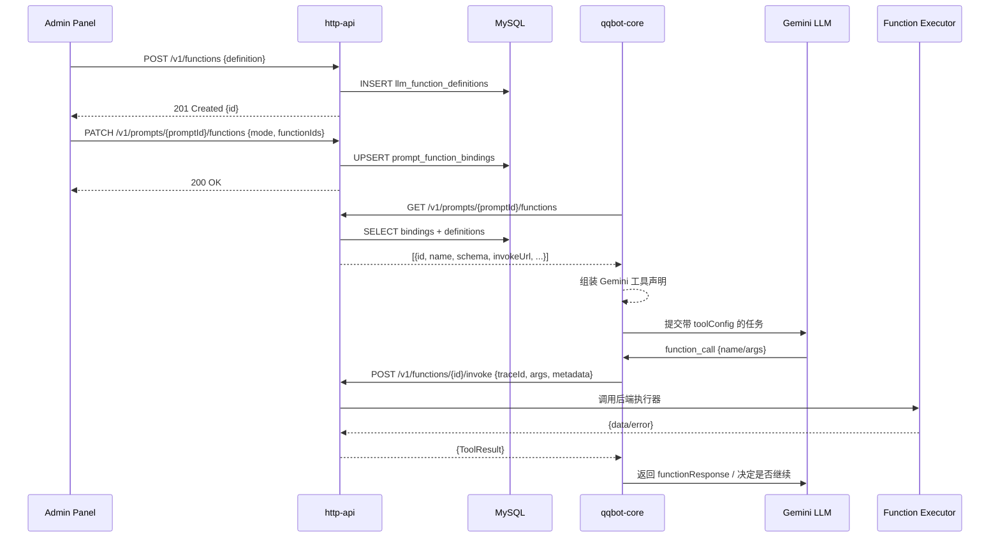

# LLM 函数调用注册中心设计

## 背景与目标
- 将 FC（Function Calling）函数的结构化定义统一托管在 `http-api` 服务暴露的接口中，避免在 Prompt 配置里重复存放 JSON 定义。
- Prompt 仅保存函数引用（ID + 调用模式），`qqbot-core` 在运行期按需从注册中心获取详细结构，拼装 Gemini 所需的工具声明。
- 统一函数调用执行入口，通过 `http-api` 转发到实际业务函数或静态工具，便于审计、限流与灰度控制。
- 为管理端提供函数注册、检索、绑定 Prompt 的能力，保持与现有操作流程的连续性。

## 范围
- **包含**：函数注册中心 API 与数据库表设计、Prompt 与函数绑定方案、`qqbot-core` 组装与执行逻辑、管理端界面改造。
- **不包含**：既有函数的底层业务实现调整（例如消息发送的底层调用）、跨服务鉴权体系的全面改造（沿用现有网关 / Token 机制）。

## 现状概述
- Prompt 的 `advanced_config.toolsConfig` 中直接嵌入完整函数定义，配置增多后维护与复用成本高。
- `qqbot-core` 只能依据 Prompt 字段生成 `toolConfig`，缺少统一的函数注册中心能力。
- 静态消息函数在 `qqbot-core` 内部注册，无法被其他 Prompt 或服务复用，也不利于扩展更多函数类型。

## 目标架构概览
- `http-api` 作为函数注册中心，负责：
  - 维护函数定义的 CRUD（名称、描述、参数 Schema、执行端点等）。
  - 提供 Prompt 已绑定函数的查询能力。
  - 暴露统一的 `invoke` 接口承接执行层转发。
- `qqbot-core`：
  - 加载 Prompt 时按函数 ID 调用 `http-api` 获取定义。
  - `FunctionCallDispatcher` 执行函数时调用 `http-api` 的 `invoke`。
  - 静态工具（如发送消息）以系统函数形式注册在中心。
- `admin-panel`：
  - Prompt 编辑页从 `http-api` 获取函数列表。
  - 保存时仅写入函数 ID + 模式，不再携带结构定义。

## 时序图

## 组件设计

### http-api 服务
- **Controller 层**
  - `FunctionController`：处理函数 CRUD、搜索、版本管理。
  - `PromptFunctionController`：处理 Prompt 与函数的绑定、批量查询。
  - `FunctionInvokeController`：暴露统一的 `invoke` 接口。
- **Service 层**
  - `FunctionRegistryService`：封装业务规则、验证 Schema、记录审计信息。
  - `PromptBindingService`：维护 Prompt 与函数的绑定关系，提供聚合查询。
  - `FunctionExecutionService`：根据 `invoke_method` / `invoke_url` 执行远程调用，支持重试、超时；当 `execution_adapter` 为 `INTERNAL` 时调用内置 handler。
- **存储层**
  - DAO 复用现有 MySQL 访问组件。
  - 高频查询可选配 Redis 缓存（后续阶段引入）。
- **安全策略**
  - 继承既有 API 鉴权（JWT / API Key）。
  - `invoke` 端点仅对内部 Token 或服务白名单开放。

### qqbot-core
- 在 `AIService.buildToolsConfig` 之后新增逻辑：若 `allowedFunctionIds` 非空，则调用 `HttpFunctionRegistryClient`（封装 `http-api` 请求）获取完整函数定义。
- `FunctionCallDispatcher`：
  - 引入基于 `functionId` 的路由机制，与现有 `toolRegistry`（动态工具）兼容。
  - 调用 `http-api` 的 `invoke` 接口，等待 `ToolResult` 返回，再向 LLM 回传。
  - 支持函数定义缓存，监听配置更新事件以失效。
- `LLMJobWorker`：创建任务时使用注册中心返回的函数定义填充 `tools` 数组与 `functionCallingConfig`。
- 静态消息函数：
  - 通过初始化脚本写入 `llm_function_definitions`，`managed_by_system = true`。
  - `FunctionCallDispatcher` 识别 `execution_adapter = INTERNAL` 时转发到现有 `send*` 方法。

### admin-panel
- Prompt 编辑页：
  - 初始化时调用 `GET /v1/functions?enabled=true` 拉取可选函数，可按标签/副作用筛选。
  - UI 控件改为勾选函数 ID 并设置 mode（`AUTO` / `ANY` / `NONE`）。
  - 保存时调用 `PATCH /v1/prompts/{id}/functions`。
  - 展示已绑定函数时读取 `GET /v1/prompts/{id}/functions`。
- 可新增“函数管理”页面，提供列表、搜索、创建、编辑、启停等能力（共用同一 API）。

## 数据库设计

### 表：`llm_function_definitions`
| 字段 | 类型 | 说明 |
| --- | --- | --- |
| `id` | char(36) | 函数 ID（UUID） |
| `name` | varchar(128) | 对 LLM 暴露的唯一名称 |
| `display_name` | varchar(128) | 管理端展示名称 |
| `description` | text | 功能描述 |
| `parameters_schema` | json | JSON Schema（符合 Gemini Function Declaration） |
| `side_effect` | tinyint(1) | 是否存在副作用 |
| `expect_response` | tinyint(1) | 是否期望同步响应 |
| `category` | varchar(64) | 分类（如 messaging / reporting） |
| `tags` | json | 标签数组 |
| `invoke_method` | enum('HTTP','GRPC','INTERNAL') | 调用方式 |
| `invoke_url` | varchar(512) | HTTP / gRPC 调用地址 |
| `http_method` | varchar(16) | HTTP 方法（POST / PUT / ...） |
| `auth_type` | enum('NONE','SERVICE_TOKEN','BASIC','CUSTOM') | 调用鉴权方式 |
| `timeout_ms` | int | 超时时间 |
| `retry_policy` | json | 重试策略 |
| `managed_by_system` | tinyint(1) | 是否系统内置函数 |
| `enabled` | tinyint(1) | 是否启用 |
| `created_at` / `updated_at` | datetime | 创建 / 修改时间 |
| `created_by` / `updated_by` | varchar(64) | 审计字段 |

### 表：`prompt_function_bindings`
| 字段 | 类型 | 说明 |
| --- | --- | --- |
| `id` | bigint PK | 自增主键 |
| `prompt_id` | bigint | 外键 -> `agent_prompts.id` |
| `function_id` | char(36) | 外键 -> `llm_function_definitions.id` |
| `priority` | int | 执行优先级（预留） |
| `metadata` | json | 绑定附加信息（如场景限制） |
| `created_at` / `updated_at` | datetime | 创建 / 修改时间 |
| `created_by` / `updated_by` | varchar(64) | 审计字段 |

### 表：`function_execution_logs`（可选）
用于记录调用轨迹，支持审计与追踪。

## 配置与逻辑流程
1. **函数注册**：管理员通过管理端或直接调用 API 写入定义（包含参数与执行信息）。
2. **Prompt 绑定**：选择函数列表，后端写入 `prompt_function_bindings`。`agent_prompts.advanced_config` 的 `toolsConfig` 负责保存 `functionCalling.mode` 与 `allowedFunctionIds`。
3. **配置加载**：
   - `qqbot-core` 获取 Prompt 配置时请求 `GET /v1/prompts/{promptId}/functions`。
   - 合并 `{function, binding}` 后生成 Gemini `tools` 与 `functionCallingConfig.allowedFunctionNames`（取函数 `name`）。
   - 缓存策略：按 Prompt + `updatedAt` 缓存 30 秒，可结合 `ETag` / `If-None-Match`。
4. **执行阶段**：
   - Gemini 返回 `function_call`，其中 `name` 等于注册中心的 `name`，Dispatcher 据此找到函数 ID。
   - 通过 `POST /v1/functions/{id}/invoke` 将参数、Trace、上下文转发给 `http-api`。
   - `http-api` 按 `invoke_method` 执行：
     - `HTTP`：构造请求，附加鉴权信息后调用外部服务。
     - `GRPC`：使用 gRPC 客户端发起调用。
     - `INTERNAL`：调用内部 handler（如消息发送）。
   - 返回 `ToolResult`（与现有静态工具保持一致）。如失败，`qqbot-core` 决定是否重试或向 LLM 返回错误。

## 接口设计

### 函数管理
- `GET /v1/functions`
  - 查询参数：`search`、`tags[]`、`sideEffect`、`category`、`enabled`、`page`、`limit`
  - 返回：`{ items: FunctionSummary[], total }`
- `POST /v1/functions`
  - 请求：`{ name, displayName, description, parametersSchema, invokeMethod, invokeUrl, httpMethod, auth, timeoutMs, ... }`
  - 返回：`{ id }`
- `GET /v1/functions/{id}`
- `PATCH /v1/functions/{id}`
- `POST /v1/functions/{id}/enable` / `POST /v1/functions/{id}/disable`

### Prompt 绑定
- `GET /v1/prompts/{id}/functions`
  - 返回：`{ promptId, functions: [ { id, name, description, parametersSchema, ... } ] }`
- `PATCH /v1/prompts/{id}/functions`
  - 请求：`{ functionIds: [] }`
  - 返回：`{ promptId, functionIds }`
- （可选）`POST /v1/prompts/functions/batch` 支持批量绑定。

### 函数调用
- `POST /v1/functions/{id}/invoke`
  - 请求头：`X-Trace-Id`、`Authorization`
  - 请求体：`{ traceId, jobId, arguments, context: { sourceKey, userId, groupId, metadata }, requestMode }`
  - 响应：`{ success, data?, error?, suppressAutoReply?, durationMs }`
  - 错误码：`404`（函数不存在）、`422`（参数校验失败）、`504`（执行超时）等。

## 逻辑设计细节
- **参数校验**：`http-api` 在注册/更新时通过 JSON Schema（AJV）校验，调用时再次校验请求参数。
- **映射关系**：Prompt 绑定只存函数 ID，`callingMode` 由 `agent_prompts.advanced_config.toolsConfig.functionCalling` 提供。
- **缓存策略**：
  - `http-api` 可对函数定义做内存 / Redis 缓存，并基于 `updated_at` 自动失效。
  - `qqbot-core` 对 Prompt → 函数定义进行 30 秒缓存，支持在管理端保存后触发刷新。
- **异常处理**：
  - `http-api` 调用失败时记录日志与 `function_execution_logs`。
  - `qqbot-core` 可根据结果 fallback 或终止流程（例如 `FunctionCallDispatcher` 返回 `shouldContinue: false`）。
- **静态工具迁移**：
  - 初始化脚本将发送消息等函数写入注册中心，`invoke_method = INTERNAL`。
  - `FunctionExecutionService` 对 `INTERNAL` 调用委托给 `StaticToolAdapter`，复用现有逻辑。

## 迁移计划
1. 创建新数据表与 DAO，补充系统预置函数数据（迁移静态消息函数）。
2. 扩展 `http-api` 的 Controller / Service / Route，并更新 Swagger / 文档。
3. 在 `qqbot-core` 引入 `HttpFunctionRegistryClient`，改写配置解析链路，保留兼容开关（feature flag）。
4. 管理端接入新 API，提供回退机制。
5. 编写数据库迁移脚本，将现有 Prompt 的 `advanced_config.toolsConfig` 解析为绑定数据，逐步清理冗余。
6. 联调与端到端验证，灰度开启 feature flag。
7. 清理旧逻辑（移除 Prompt 中的函数结构定义、旧 SQL 脚本）。

## 测试策略
- **单元测试**：`http-api` Service / Controller、`qqbot-core` 新客户端与 Dispatcher。
- **集成测试**：模拟注册函数 → 绑定 Prompt → 触发 LLM Job → 函数调用路径。
- **前端测试**：Prompt 编辑页交互、函数管理页操作。
- **回归测试**：确保未绑定函数的 Prompt 不受影响，`AUTO` / `NONE` 模式兼容。

## 后续规划
- 函数版本管理（在 definitions 表新增 `version`、`active_version_id`）。
- 操作审计与告警（执行失败告警、成功率报表）。
- 更细粒度的访问控制（按团队 / 业务划分权限）。
- 函数沙箱与专用测试环境支持。

## 环境变量与配置
- `FUNCTION_REGISTRY_BASE_URL`：指向 `http-api` 服务暴露的 `/v1` 根路径。`qqbot-core` 与管理端后台均从该变量读取函数注册中心地址，默认值 `http://http-api:8080/v1`。
- `ENABLE_FUNCTION_REGISTRY`：在 `qqbot-core` 中控制是否启用远程函数调用；缺省启用，将其设置为 `false` 可回退到 legacy advanced_config 行为。
- `FUNCTION_REGISTRY_TIMEOUT_MS`：`qqbot-core` 访问注册中心的 HTTP 超时时间，默认 5000ms。

## 初始化与种子数据
- 新增脚本 `database/migrations/manual/seed_basic_messaging_functions.sql`，用于在注册中心创建基础消息发送函数，并为 `basic_chat` Prompt 建立默认绑定。
- 执行顺序：先执行结构迁移 `012_create_llm_function_registry_tables.sql`，再运行该种子脚本。
- 旧版 `advanced_config` 中冗余的函数声明可在迁移完成后清理。
